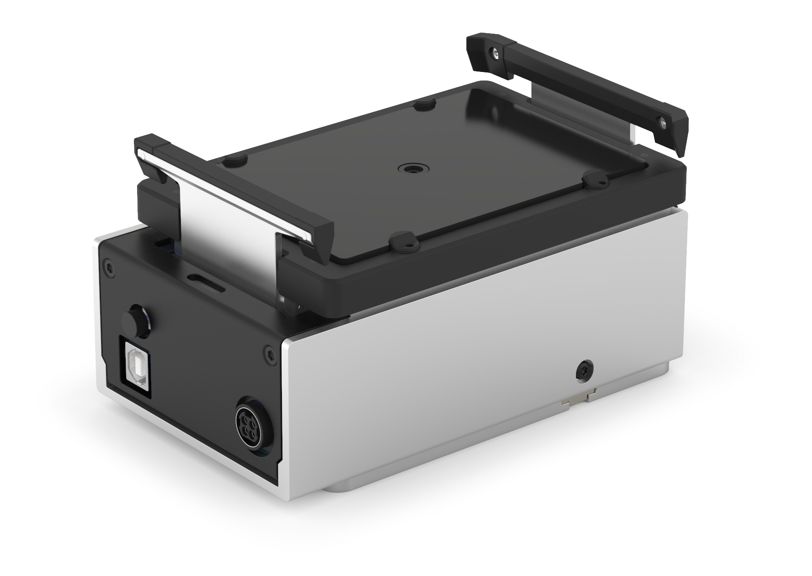
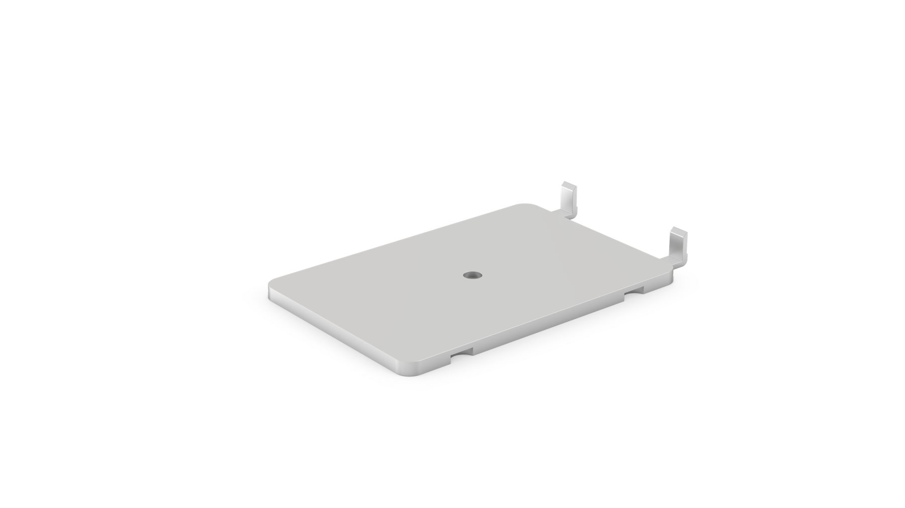
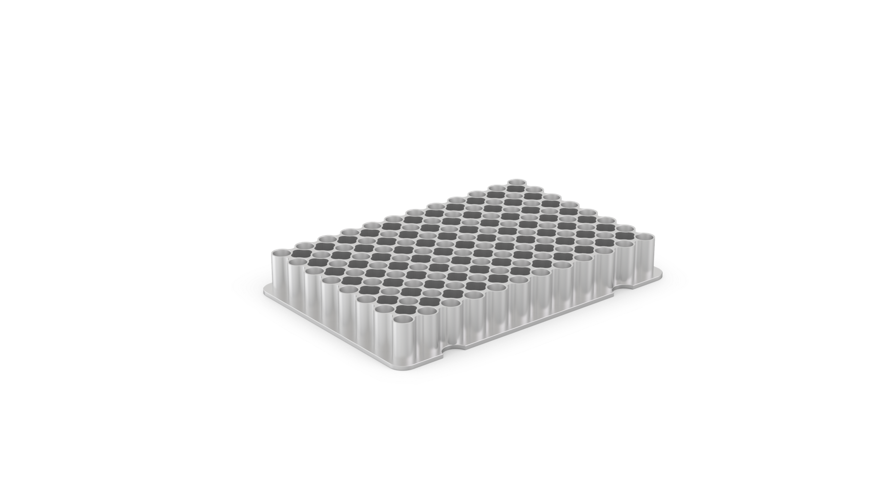
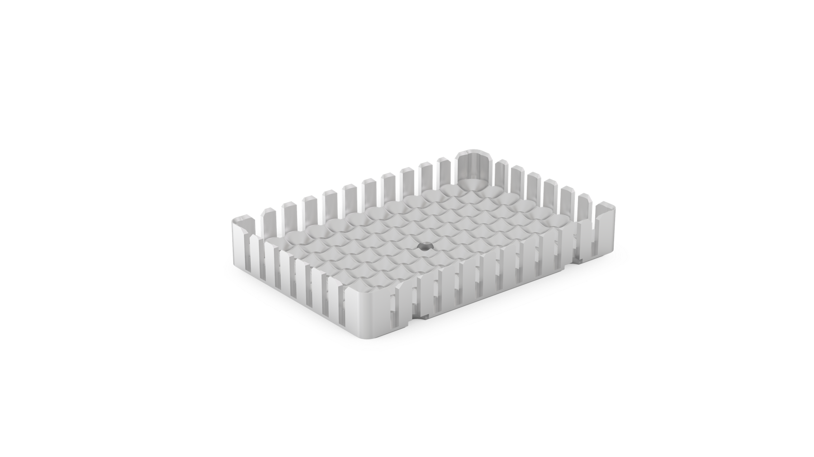
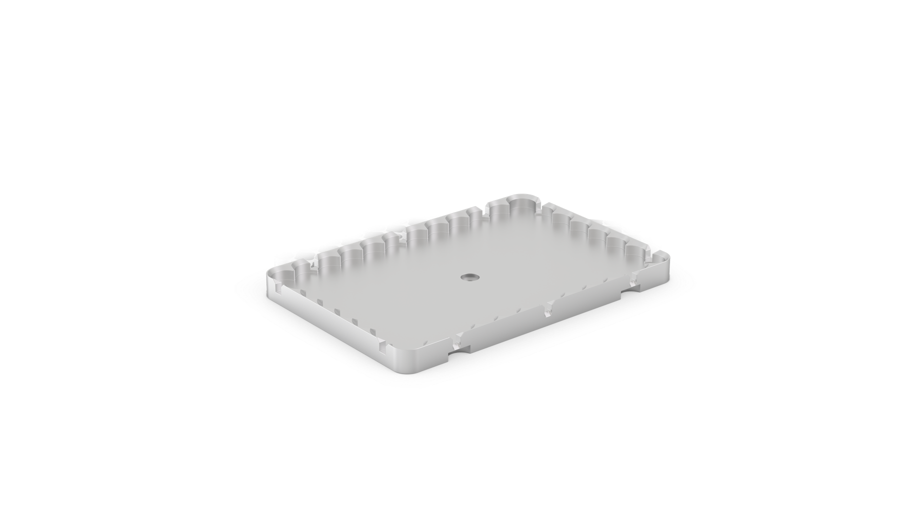

!!! info "Additional Documentation"
    For complete instructions on module installation and use, see the [Heater-Shaker Module Instruction Manual](../../heater-shaker/index.md).

## Heater-Shaker features

### Heating and shaking

The Heater-Shaker provides on-deck heating and orbital shaking. The
module can be heated to 95 °C, with the following temperature profile:

- Temperature range: 37–95 °C

- Temperature accuracy: ±0.5 °C at 55 °C

- Temperature uniformity: ±0.5 °C at 55 °C

- Ramp rate: 10 °C/min

The module can shake samples from 200 to 3000 rpm, with the following
shaking profile:

- Orbital diameter: 2.0 mm

- Orbital direction: Clockwise

- Speed range: 200–3000 rpm

- Speed accuracy: ±25 rpm

The module has a powered labware latch for securing plates to the module
prior to shaking.

### Thermal adapters

A compatible *thermal adapter* is required for adding labware to the Heater-Shaker. Currently available Thermal Adapters include:

<figure markdown>

<figcaption>Universal Flat Adapter </figcaption>
</figure>

<figure markdown>

<figcaption>PCR Adapter</figcaption>
</figure>

<figure markdown>

<figcaption>Deep Well Adapter</figcaption>
</figure>

<figure markdown>

<figcaption>96 Flat Bottom Adapter</figcaption>
</figure>

You can purchase adapters directly from Opentrons:

- [Universal Flat Adapter](https://opentrons.com/products/universal-flat-adapter/)
- [PCR Adapter](https://opentrons.com/products/pcr-adapter/)
- [Deep Well Adapter](https://opentrons.com/products/deep-well-adapter/)
- [96 Flat Bottom Adapter](https://opentrons.com/products/96-flat-bottom-adapter/)

### Software control

The Heater-Shaker is fully programmable in Protocol Designer and the Python Protocol API. The Python API additionally allows for other protocol steps to be performed in parallel while the Heater-Shaker is active. Read about [concurrent commands](../../python-api/modules/heater-shaker.md#heating-and-shaking) in the API documentation for details on adding parallel steps to your protocols.

Outside of protocols, the Opentrons App can display the current status of the Heater-Shaker and can directly control the heater, shaker, and labware latch.

## Heater-Shaker specifications

<table>
  <thead>
    <tr>
      <th>Specification</th>
      <th>Details</th>
    </tr>
  </thead>
  <tbody>
    <tr>
      <td><strong>Dimensions</strong></td>
      <td>152 × 90 × 82 mm (L/W/H)</td>
    </tr>
    <tr>
      <td><strong>Weight</strong></td>
      <td>1.34 kg</td>
    </tr>
    <tr>
      <td><strong>Module power input</strong></td>
      <td>36 VDC, 6.1 A</td>
    </tr>
    <tr>
      <td><strong>Power adapter input</strong></td>
      <td>100–240 VAC, 50/60 Hz</td>
    </tr>
    <tr>
      <td><strong>Mains supply voltage fluctuation</strong></td>
      <td>±10%</td>
    </tr>
    <tr>
      <td><strong>Overvoltage</strong></td>
      <td>Category II</td>
    </tr>
    <tr>
      <td><strong>Power consumption</strong></td>
      <td>
        Idle: 3 W Typical:
        <ul>
          <li>Shaking: 4–11 W</li>
          <li>Heating: 10–30 W</li>
          <li>Heating and shaking: 10–40 W</li>
        </ul>
        Maximum: 125–130 W
      </td>
    </tr>
    <tr>
      <td><strong>Environmental conditions</strong></td>
      <td>Indoor use only</td>
    </tr>
    <tr>
      <td><strong>Ambient temperature</strong></td>
      <td>20–25 °C</td>
    </tr>
    <tr>
      <td><strong>Relative humidity</strong></td>
      <td>Up to 80%, non-condensing</td>
    </tr>
    <tr>
      <td><strong>Altitude</strong></td>
      <td>Up to 2,000 m above sea level</td>
    </tr>
    <tr>
      <td><strong>Pollution degree</strong></td>
      <td>2</td>
    </tr>
  </tbody>
</table>