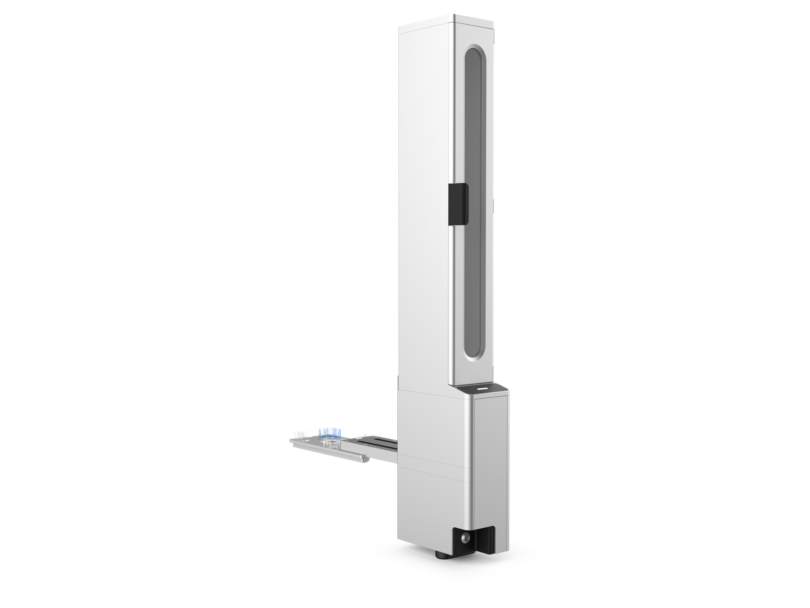

!!!info "Additional Documentation"
    For complete instructions on module installation and use, see the [Stacker Module Instruction Manual](../../stacker/index.md).

The Opentrons Flex® Stacker is an external module that provides automated, high-capacity storage for ANSI/SLAS compatible labware such as well plates, tip racks, and reservoirs. It also includes a shuttle that moves labware from the Stacker to the deck where it can be accessed manually or by the Flex Gripper. When attached, the Stacker increases your robot's labware storage capacity and throughput, allowing you to run longer, more complex protocols without interruption.

## Stacker features

### Deck locations

You attach each Stacker to the right side of a Flex with its deck slot adapter. The adapter fits in any available column 3 deck slot (A3 to D3). The adapter also provides labware storage in column 3, so you don't lose any deck space. You can attach up to four Stackers on a single Flex. See the instruction manual for [step-by-step installation instructions](../../stacker/installation.md).

### Supported Labware

The Stacker accepts Opentrons Flex tip racks, selected items in our [Labware Library](https://labware.opentrons.com/), and well plates and reservoirs that conform to ANSI/SLAS dimensional standards. The following table lists labware that has been tested and verified by Opentrons to work with the Stacker.

<table>
  <thead>
    <tr>
      <th>Labware category</th>
      <th>Stacker-compatible labware</th>
    </tr>
  </thead>
  <tbody>
    <tr>
      <td>Pipette tips</td>
      <td>Stores a maximum of six <a href="https://opentrons.com/products/categories/tips-&-labware">Opentrons Flex tip racks</a> in each Stacker. This includes: 
        <ul>
            <li>50 µL, 200 µL, or 1000 µL tips</li>
            <li>Filtered or unfiltered tips</li>
            <li>Tip racks with or without lids</li>
        </ul>
      </td>
    </tr>
    <tr>
      <td>Well plates</td>
      <td>
        <ul>
            <li>Opentrons Tough 96 Well Plate 200 µL PCR Full Skirt</li>
            <li>Bio-Rad 96 Well Plate 200 µL PCR</li>
            <li>Bio-Rad 384 Well Plate 50 µL</li>
            <li>Corning 24 Well Plate 3.4 mL Flat</li>
            <li>NEST 96 Deep Well Plate 2 mL</li>
            <li>NEST 96 Well Plate 100 µL PCR Full Skirt</li>
            <li>NEST 96 Well Plate 200 µL Flat</li>
            <li>ThermoFisher Armadillo PCR Plate, 384-Well, Clear Wells</li>
          </ul>
        </td>
    </tr>
  </tbody>
</table>

### Module compatibility

Any Flex with a [serial number version](../system-description/specs.md#model-and-serial-numbers) that includes **A10** or **A20** _requires_ a Stacker retrofit kit. Robots with serial number version **A30** (or higher) are fully compatible with the Stacker; the retrofit kit is not required. The kit adds new firmware and hardware to your Flex which:

- Allows early model robots to recognize and communicate with the Staker.
- Prevents the HEPA/UV module from operating if the Stacker is improperly installed.

For additional information, see the [HEPA/UV compatibility section](../../stacker/compliance.md#flex-stacker-and-hepauv-compatibility) of the Stacker instruction manual. You can also contact [Opentrons Sales](https://opentrons.com/contact) if you're unsure about a robot's manufacture date and/or have a model that needs to be upgraded.

### Software control

The Stacker is fully programmable in Protocol Designer and the Python Protocol API.

## Stacker specifications

| Specification | Details |
|----|----|
| **Tower and track dimensions** | 385.5 mm L x 106 mm W x 955.5 mm H (~15" L x 4" W x 37" H) |
| **Tower dimensions** | 194.5 mm L x 106 mm W x 955.5 mm H (~8" L x 4" W x 37" H). Measurements are taken from the base of the tower and exclude the track. |
| **Side clearance** | When attached, this module extends approximately 20 cm (8") from the side of the robot. You'll also need additional clearance for the Stacker's loading door, which requires slightly more space to open fully and to allow for easy labware loading. |
| **Weight** | 13.6 kg (~30 lbs). Installation may require the assistance of a lab partner. |
