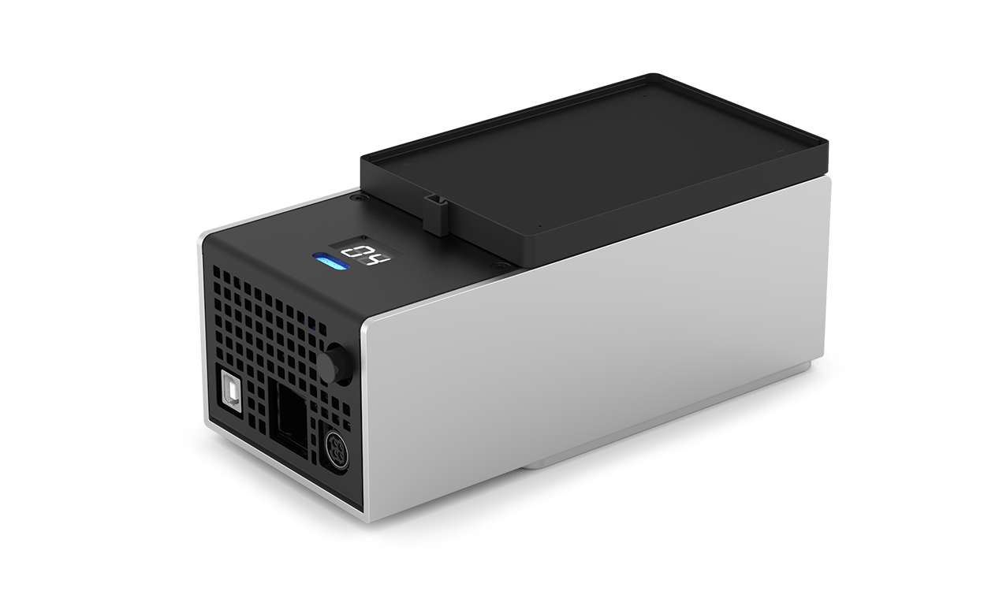
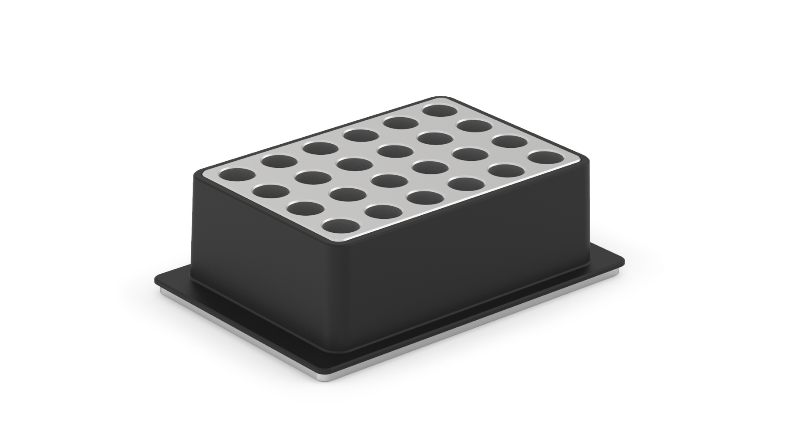
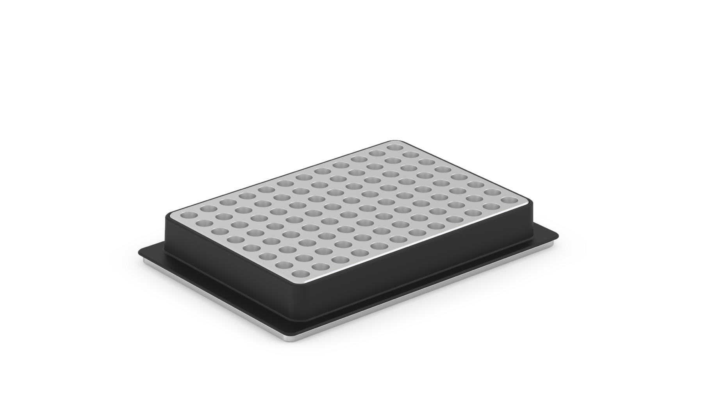
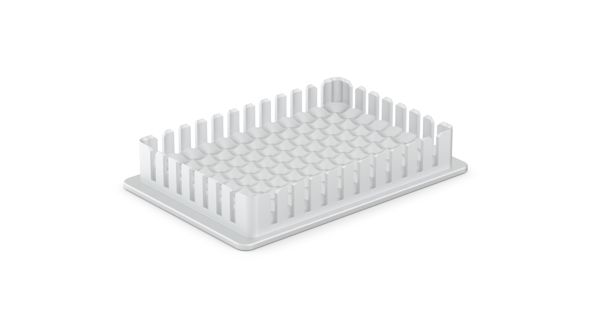
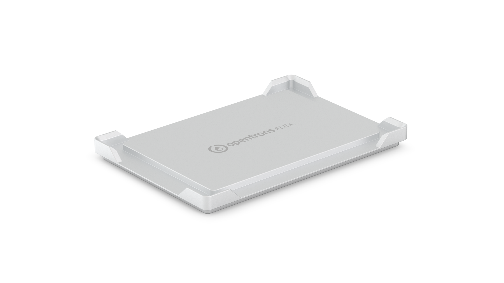

!!! info "Additional Documentation"
    For complete instructions on module installation and use, see the [Temperature Module Instruction Manual](../../temperature-module/index.md).

## Temperature Module features

### Heating and cooling

The Opentrons Temperature Module GEN2 is a hot and cold plate module. It is often used in protocols that require heating, cooling, or temperature changes. The module can reach and maintain temperatures ranging from 4 °C to 95 °C within minutes, depending on the module's configuration and contents.

### Thermal blocks { #thermal-blocks-flex }

The Temperature Module uses interchangeable aluminum *thermal blocks* to help hold labware at temperature.

At the time of purchase, each Temperature Module includes your choice of one (1) thermal block. You can select a 24-well block, a 96-well block, a deep well block, or a flat-bottom block. The blocks hold 1.5 mL and 2.0 mL tubes, 96-well PCR plates, PCR strips, deep well plates, and flat bottom plates.

<figure markdown>

<figcaption>24-well thermal block </figcaption>
</figure>

<figure markdown>

<figcaption>96-well thermal block</figcaption>
</figure>

<figure markdown>

<figcaption>Deep well thermal block</figcaption>
</figure>

<figure markdown>

<figcaption>Flat bottom thermal block for Flex</figcaption>
</figure>

### Software control

The Temperature Module is fully programmable in Protocol Designer and the Python Protocol API.

Outside of protocols, the Opentrons App can display the current status of the Temperature Module and can directly control the temperature of the surface plate.

## Temperature Module specifications

<table>
  <thead>
    <tr>
      <th><strong>Specification</strong></th>
      <th><strong>Details</strong></th>
    </tr>
  </thead>
  <tbody>
    <tr>
      <td><strong>Dimensions</strong></td>
      <td>194 × 90 × 84 mm (L/W/H)</td>
    </tr>
    <tr>
      <td><strong>Weight</strong></td>
      <td>1.5 kg</td>
    </tr>
    <tr>
      <td><strong>Module power</strong></td>
      <td>
        <ul>
          <li>Input: 100–240 VAC, 50/60 Hz, 4.0 A</li>
          <li>Output: 36 VDC, 6.1 A, 219.6 W max</li>
        </ul>
      </td>
    </tr>
    <tr>
      <td><strong>Environmental conditions</strong></td>
      <td>Indoor use only</td>
    </tr>
    <tr>
      <td><strong>Ambient temperature</strong></td>
      <td>&lt;22 °C (recommended for optimal cooling)</td>
    </tr>
    <tr>
      <td><strong>Relative humidity</strong></td>
      <td>Up to 60%, non-condensing</td>
    </tr>
    <tr>
      <td><strong>Altitude</strong></td>
      <td>Up to 2000 m above sea level</td>
    </tr>
    <tr>
      <td><strong>Pollution degree</strong></td>
      <td>2</td>
    </tr>
  </tbody>
</table>
