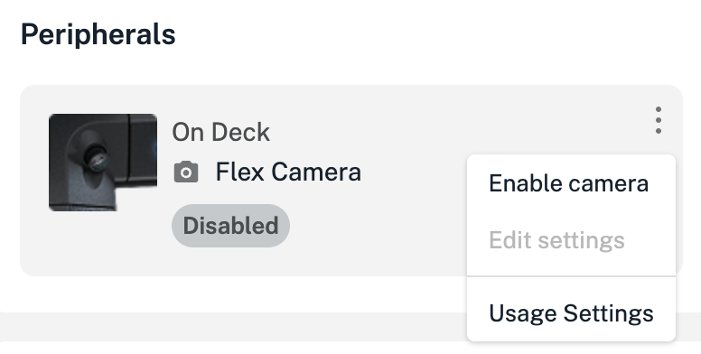
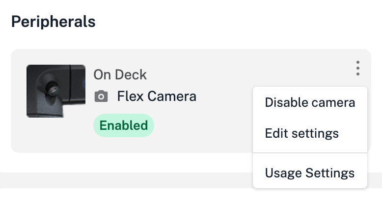
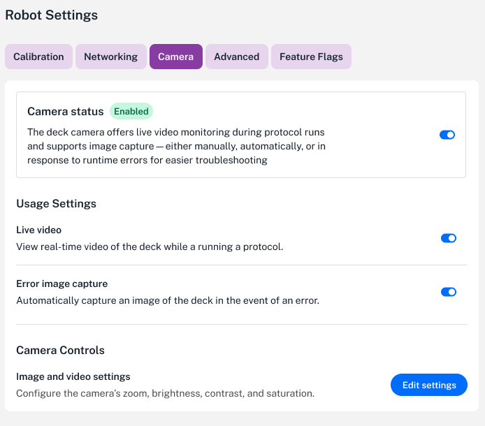
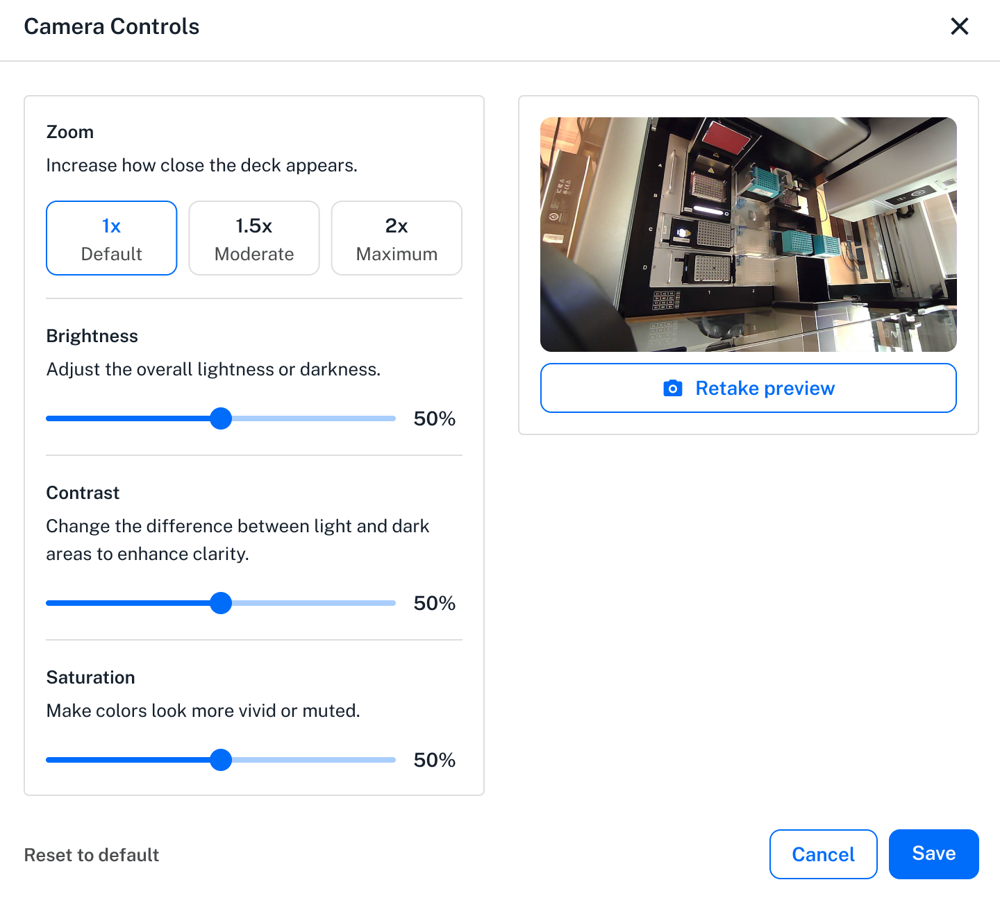
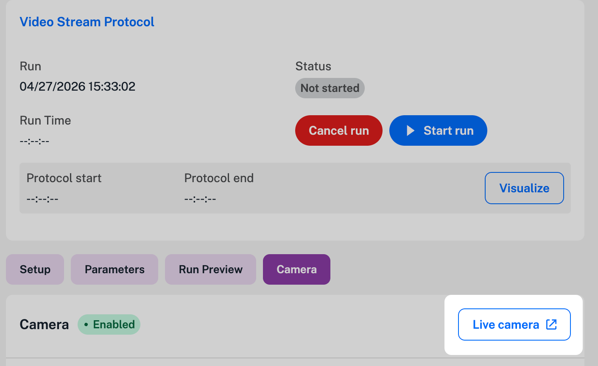

Every Flex comes equipped with a built-in high-resolution camera. Starting with robot software version 8.8, you can control the camera via the Opentrons App or the touchscreen.

When enabled, the camera provides:

- **Live streaming:** watch a real-time video feed of the deck during a protocol run.
- **Step-based image capture:** add still photography as a step in your protocol.
- **Troubleshooting assistance:** automatically record the deck state in response to a crash or error.
- **Image downloads:** access still images saved in the protocol run files.

## Turning the camera on and off

The camera is off by default. To turn the camera on and access its features:

1. From the Opentrons App, click **Devices** and locate your robot.
2. For your selected robot, click the three-dot menu (⋮) and then click **Robot Settings**.
3. Click the **Camera** tab to open the camera settings.
4. Click the **Camera Status** toggle to enable or disable the camera. Turning the camera on exposes other camera features and image controls.

You can also turn the camera on and off from the **Peripherals** section of the robot details page.

<figure class="screenshot side-by-side" markdown>

<figcaption>Enable or disable the camera and adjust image settings.</figcaption>
</figure>

## Other camera settings

These settings and controls are located under the **Camera** tab on the **Robot Settings** screen.

### Usage Settings

Starting with robot software version 9.0, these settings and image capture options allow you to:

- Stream real-time video from the deck while running a protocol.
- Automatically capture a deck image when an error occurs.

<figure class="screenshot" markdown>
{ width="80%" }
<figcaption>Available when the camera is enabled.</figcaption>
</figure>

### Camera Controls

These controls allow you to zoom in on the deck and provide image correction features to adjust brightness, contrast, and color saturation. Click **Edit settings** from the **Camera Controls** section to access these features.

<figure class="screenshot" markdown>
{ width="80%" }
</figure>

## Viewing the live camera feed

Live video streaming is available in the Opentrons App when the camera is enabled and the robot is running a protocol. To watch the feed, run your protocol and click the **Live camera** button. This opens a small window that streams live video as the robot works through the protocol steps. The video stream stops automatically when the protocol ends.

<figure class="screenshot" markdown>
{ width="80%" }
</figure>

!!! note
    Flex cannot save live video streamed during a protocol run.

## Capturing and downloading still images

To capture still images from a Flex, [add a camera step](../../protocol-designer/steps/camera.md) to your protocol in Protocol Designer or use the [`capture_image()` method](../../python-api/building-block-commands/utilities.md#capturing-images) in the Python API.

Still images taken during a protocol run are available for download from the [recent protocol run files](./protocol-transfer.md#recent-protocol-runs) in the Opentrons App.