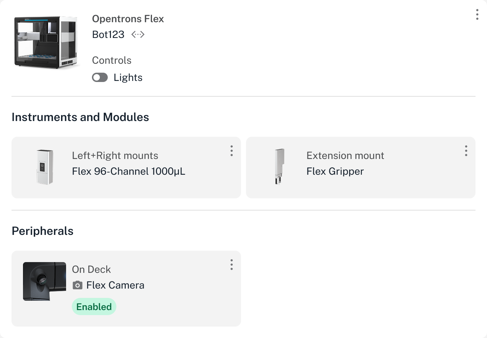

## Camera features and controls

Every Flex comes equipped with a built-in 2-megapixel camera that can capture full HD still images and provides video of the deck and working area. Starting in robot software version 8.8, you can control the camera in the Opentrons App and from the touchscreen. When enabled, the camera provides:

- Live, in-app monitoring during protocol runs.
- Automatic image capture at protocol-defined intervals.
- Automatic image capture in response to a crash or runtime error.
- The ability to download all still images in a single, compressed file (`.zip` format) after a protocol run.

### Controls

The camera is turned off by default. To turn on the camera and access its features:

1. From the Opentrons App, click **Devices** and locate your robot.
2. For your selected robot, click the three-dot menu (⋮) and then click **Robot settings**.
3. Click the **Camera** tab to open the camera settings.
4. Click the Camera slider to enable or disable the camera.

You can also see the camera's status, and turn it on and off, from the Peripherals section of the details page for your Flex. Click the three-dot menu (⋮) to enable or disable the camera. This example shows a Flex with its camera enabled.

<figure class="screenshot" markdown>
  
</figure>

### Downloading images

All protocol images are available for download in the Recent Protocol Runs section of the robot details page.