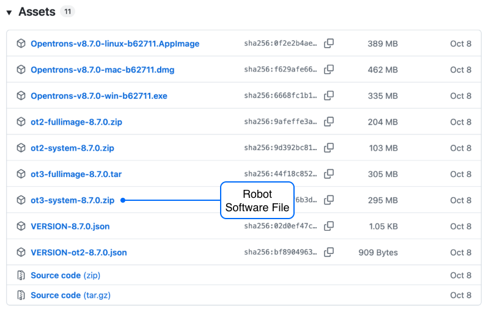

Downgrading Flex software should only be done at the direction of Opentrons Support for troubleshooting or software compliance purposes. The instructions in this section take you through the robot software downgrade process.

Previous versions of the Flex operating system (and App software) are available on Github at <https://github.com/Opentrons/opentrons/releases>.

!!! tip
    Make sure your Flex is idle before downgrading. Some required App features are not available while the robot is running a protocol.

<!-- Reviewer note: changed to H2 (from H3). Not sure why I used H3 originally, maybe looked to large? Silly. -->

## Part 1: Downloading an earlier software version

1. On the Github releases page, find an earlier version of the Flex software you want to use. We recommend only rolling back to the version closest to the latest release.

2. In the Assets section of a release, click the small triangle (&rtrif;) to expand a list of compressed software files available for download.

    <figure class="screenshot" markdown>
    
    </figure>

3. Click the compressed file named `ot3-system-<version number>.zip` to download and save it to your computer. For example, to get Flex software version 8.7, you'd click the file `ot3-system-8.7.0.zip`. In the file name, `ot3` refers to Flex.

## Part 2: Installing the earlier version

4. From the **Devices** tab in the App, find the robot you want to work with.

5. Click the three-dot menu (⋮) and then click **Robot Settings**.

6. Click the **Advanced** tab.

7. In the Advanced settings, find the section labelled "Update robot software manually with a local file."

    <figure class="screenshot" markdown>
    
    </figure>

8. Click **Browse file system** and navigate to the location where you saved the downloaded robot software.

9. Select the downloaded `.zip` file that contains the Flex software and then click **Open**. This starts the automatic software installation process, which can take about 15 minutes to complete.

## Part 3: After downgrading

The App will notify you when the downgrade installation is complete. You should also check the touchscreen on your Flex before using it. The touchscreen might show the robot going through additional firmware checks and updates that are not reflected in the App. Flex will restart after these firmware checks finish. After restarting, your Flex will be running on an earlier version of the robot operating system.
