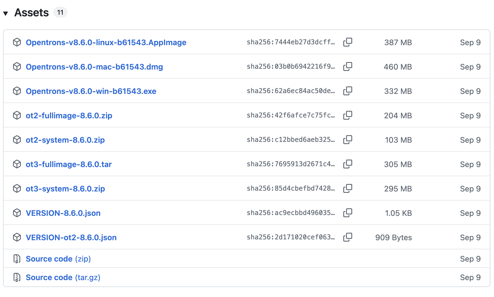

Start here for step-by-step instructions for downloading, installing, and maintaining the Opentrons App on a computer.

## App installation

Download the Opentrons App from <https://opentrons.com/ot-app/>. The latest version of the app requires Windows 10, macOS 11, or Ubuntu 22.04 or later. The app may run on other Linux distributions, but Opentrons does not officially support them.

### Windows

The Windows version of the Opentrons App is packaged as an installer. To use it:

1. Open the `.exe` file you downloaded from opentrons.com.

2. Follow the instructions in the installer. You can install the App for a single user or all users of the computer.

The app opens automatically once installed. Grant it security or firewall permissions, if prompted, to make sure the app can launch and communicate with Flex over your network.

### macOS

The macOS version of the Opentrons App is packaged as a disk image. To use it:

1.  Open the `.dmg` file you downloaded from opentrons.com. A window for the disk image will open in Finder.

2.  Drag the Opentrons icon onto the Applications icon in the window.

3.  Double-click on the Applications icon.

4.  Double-click on the Opentrons icon in the Applications folder.

Grant the App security or firewall permissions, if prompted, to make sure it can launch and communicate with Flex over your network.

### Ubuntu

The Ubuntu version of the Opentrons App is packaged as an AppImage. To use it:

1.  Move the `.AppImage` file you downloaded from opentrons.com to your Desktop or Applications folder.

2.  Right-click the `.AppImage` file and choose **Properties**.

3.  Click the **Permissions** tab. Then check **Allow executing file as a program**. Close the Properties window.

4.  Double-click the `.AppImage` file.

!!! note
    Do not use third-party AppImage launchers with the Opentrons App. They may interfere with App updates. Opentrons does not support using third-party launchers to control Opentrons robots.

## Updating App software

The App displays a notification when Opentrons releases new software versions. To update the App, simply click the link to view the update and automatically install the latest version.

## Downgrading App software

Previous versions of the App software (and Flex operating system) are available on Github at <https://github.com/Opentrons/opentrons/releases>.

Downgrading App software should only be done at the direction of Opentrons Support for troubleshooting or software compliance purposes. The instructions in this section take you through the App software downgrade process.

1. Uninstall the current version of the Opentrons App according to the process used by your computer's operating system.

2. On the Github releases page, find an earlier version of the App software you want to use. We recommend only rolling back to the version closest to the latest release.

3. In the Assets section of a release, click the small triangle (&rtrif;) to expand a list of compressed software files available for download.

    <figure class="screenshot" markdown>
    
    </figure>

4. Click the compressed file with an extension that corresponds to the operating system of your computer.

    | Operating system | File extension | File example |
    |----|----|----|
    | Windows | `.exe` | `Opentrons-v8.7.0-win-b62711.exe` |
    | macOS | `.dmg` | `Opentrons-v8.7.0-mac-b62711.dmg` |
    | Linux | `.AppImage` | `Opentrons-v8.7.0-linux-b62711.AppImage` |

5. Follow the instructions on your computer to complete the installation.

