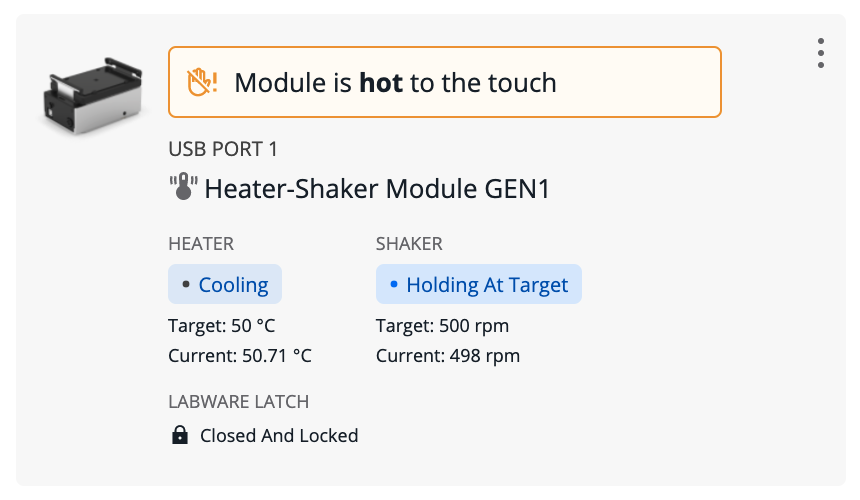

## Module status and controls

Use the Opentrons App to view the status of modules connected to your Flex and control them outside of protocols. Click **Devices** and then click on your Flex to view its robot details page. Under Instruments and Modules, there is a card for each attached module. The card shows the type of module, what USB port it is connected to, and its current status.

<figure markdown>

<figcaption>Module card for the Heater-Shaker Module.</figcaption>
</figure>

!!! note
    The Magnetic Block does not have a card in Instruments and Modules, since it is unpowered and does not connect to Flex via USB.

Click the three-dot menu (⋮) on the module card to choose from available commands. You can always choose **About module** to see the firmware version and serial number of the module. (This information is very useful when contacting Opentrons Support!) The other commands depend on the type of the module and its current status:

| Module type    | Commands |
| -------------- | -------- |
| **Heater-Shaker** | <ul><li>Set module temperature / Deactivate heater</li><li>Open labware latch / Close labware latch</li><li>Test shake / Deactivate shaker</li></ul> |
| **Temperature**   | <ul><li>Set module temperature / Deactivate module</li></ul>                            |
| **Thermocycler**  | <ul><li>Set lid temperature / Deactivate lid</li><li>Open lid / Close lid</li><li>Set block temperature / Deactivate block</li></ul> |