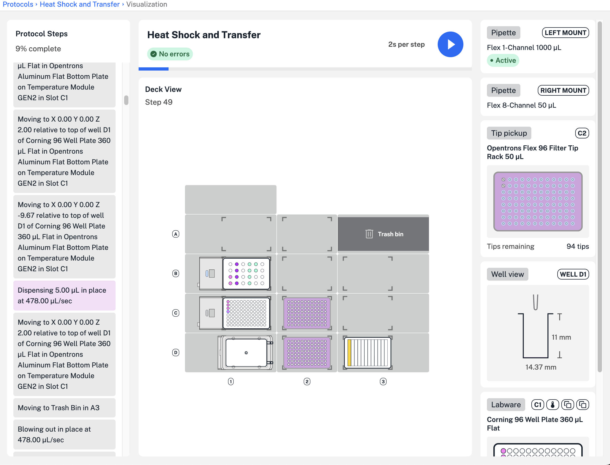
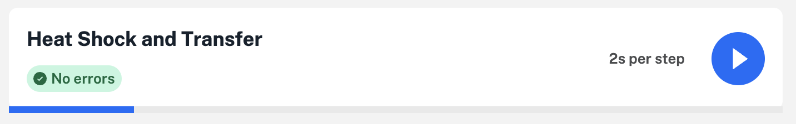
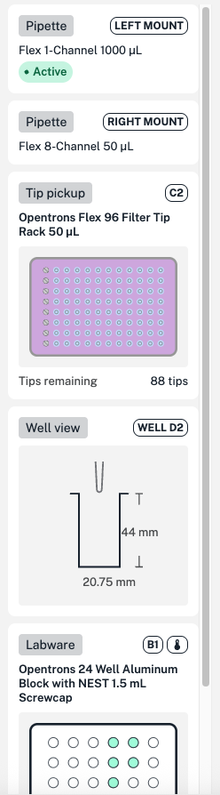
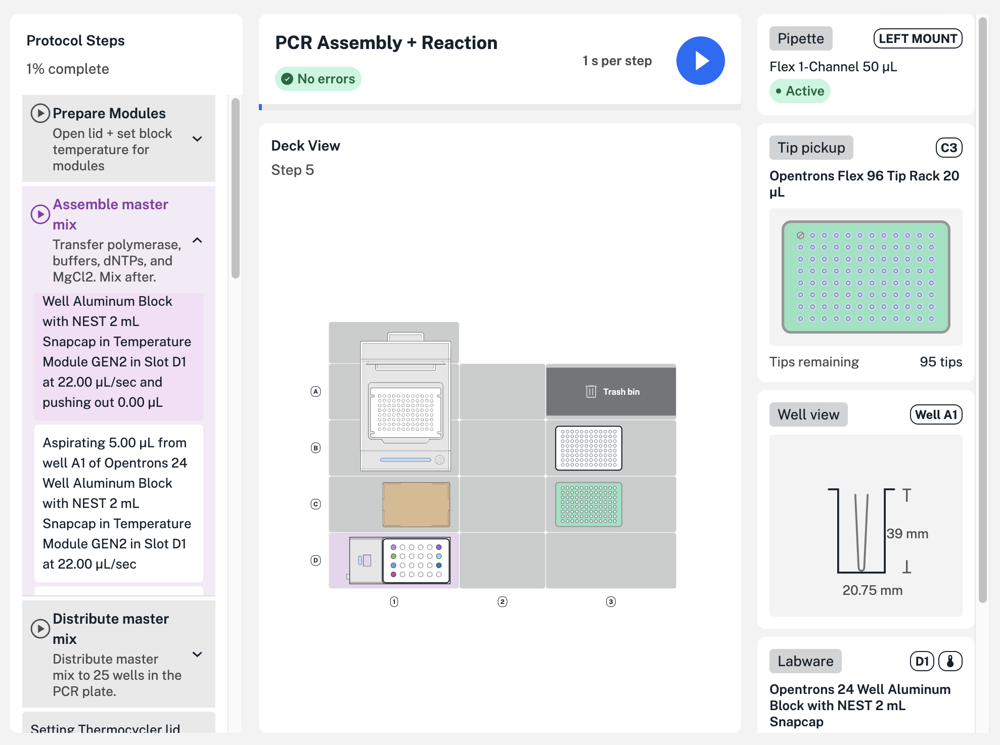
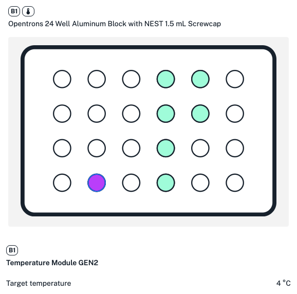
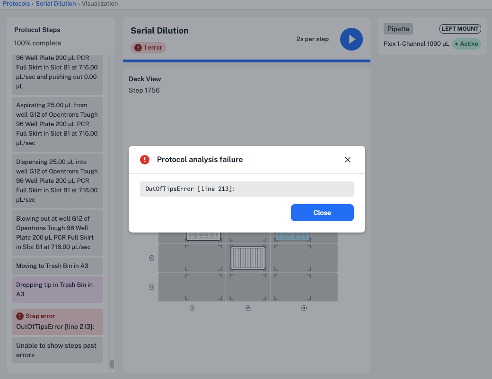

Test new protocols in the Opentrons App before running them on your Flex. Use *protocol visualization* to: 

- See protocol steps, including labware and liquid changes, even while offline and disconnected from your Flex.
- Detect and fix protocol errors before the first run.
- Assess new protocols created with Protocol Designer, OpentronsAI, or the Python Protocol API.

Click **Visualize** on any Flex protocol's details page to get started. You'll be able to see details for any protocol using API version 2.16 and newer.

<figure class="screenshot" markdown>

</figure>

The visualization screen shown above includes protocol steps on the left, a view of the Flex deck in the middle, and hardware and labware details on the right. The following sections take a closer look at using protocol visualization to preview, troubleshoot, and edit your Flex protocols. 

## Protocol steps

Choose how to visualize your Flex protocol's steps: 

- Click the play button :material-play-circle: at the top of the page to play your protocol, and choose a playback speed (seconds per step).
- Click and drag the blue bar to move through the protocol steps. 
- Scroll the timeline on the left and click on any protocol step to view it.

<figure class="screenshot" markdown>

</figure>

For each step of your protocol, the deck view changes to include liquid, labware, and pipette tip changes.

!!! note
    In the example protocol above, liquids are assigned a color in Protocol Designer, so wells containing liquids are colored and changes on the deck are more visible.

    You're not required to define or label liquids in protocols created using the Python Protocol API. In order to see liquid changes on the deck, we recommend using [optional liquid labels][labeling-wells-and-reservoirs] and colors for the best protocol visualization.

## Step details

For each step, additional protocol details appear on the right side of the screen:

- **Pipettes**: attached pipettes and their mounts, including the active pipette performing liquid handling actions.
- **Tip pickup**: a closer look at where tips will be picked up for this step, including the number of remaining tips in the rack.
- **Well view**: well dimensions, the position of the pipette's attached tip, and a side view of liquids in the well. Hover over liquid in the well to view volumes.
- **Labware**: top-down view liquid and well changes in labware like well plates and reservoirs.

<figure class="screenshot" markdown>

<figcaption> Examples of additional protocol details available on the right side of the screen.</figcaption>
</figure>

## Step groups

You can create [step groups](../../python-api/groups.md) in your Python protocols to make it easier to visualize long protocols, or protocols with multiple similar steps. Each group has a title (like "Prepare Modules") and an optional description. Not all steps in a protocol have to be contained in a group.

<figure class="screenshot" markdown>

<figcaption>A group of steps to assemble master mix reagents in the timeline on the left.</figcaption>
</figure>

Step groups appear in the protocol timeline on the left. In the example above, three groups combine related steps, like transferring all the required reagents to assemble a PCR master mix. Click the arrow to expand each group and view its steps. 

## Slot spotlights

At any point in your protocol, hover over labware on the deck to see labware names. For a closer look, click any slot to open a slot spotlight in a new window.

<figure class="screenshot" markdown>

<figcaption>A slot spotlight for C1, showing view changes for the Temperature Module and any labware and liquids inside. Hover over individual wells to view liquid volumes.
</figure>

Open a slot spotlight to see changes over the course of your protocol. For example, spotlight a slot with a tip rack and drag the blue bar to see how quickly tips from that rack are used. Or spotlight a slot with a module to see changes in temperature, lid position, or other status.

## Editing errors

When you import any protocol, the Opentrons App analyzes it for errors. You can still visualize a protocol with errors, but you won't be able to see step details past the error. 

<figure class="screenshot" markdown>

</figure>

In this example serial dilution protocol, the tip rack would run out of tips before the robot could complete the final transfer step. Scroll in the timeline on the left to view the step the error occurs in, and click to view error details. 