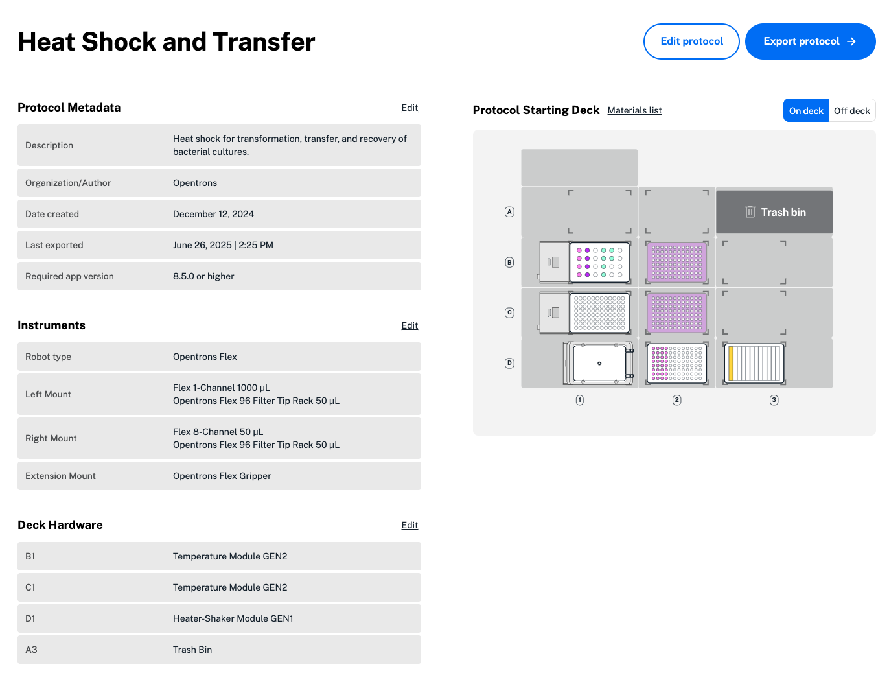

Protocol Designer is a web-based, no-code tool for developing protocols that run on Opentrons robots, including Opentrons Flex. You can use Protocol Designer to create protocols that:

- Aspirate, dispense, transfer, and mix liquids.

- Move labware around the deck with the gripper.

- Operate Opentrons Flex modules.

- Pause to let you verify progress or access samples.

!!! info "Additional Documentation"
    This section covers using Protocol Designer to create and edit a Flex protocol. For more details, see our [Protocol Designer Instruction Manual](../../protocol-designer/index.md).

All work in Protocol Designer takes place within your web browser. When
you're done creating or editing your protocol, you'll need to export it to
a Python file. Then upload that file to a robot and run it, as you would
with any protocol.

## Protocol Designer requirements

Protocol Designer is only supported for use in Google Chrome
and requires an internet connection. Newer versions of Protocol Designer require newer versions of the Opentrons App. 

## Designing a protocol

Protocols are all about informing the robot what hardware it will use to
take specific actions. This process is broken down into four steps in
Protocol Designer:

| Step | Description |
| -------- | --------------- |
| Protocol setup | Specify your robot, pipettes, modules, and other hardware (like the Flex Gripper). |
| Protocol overview | View protocol details like instruments, liquids, and the protocol starting deck at a glance. |
| Edit protocol | Edit the starting deck, define liquids, and create protocol steps. |
| Export protocol | Save your protocol file, which is ready to import into the Opentrons App and run on the Flex. |

## Part 1: Create a protocol

When you launch Protocol Designer, click to **Create a protocol**. Start by selecting pipettes and, if needed, a Flex Gripper. You can also customize modules and fixtures, like the waste chute, trash bin, and staging areas, to optimize deck space. Only modules and fixtures compatible with Flex are available. 

Protocol Designer protocols can control multiple Flex modules of the same type, except for the Thermocycler. At any time, you can edit the protocol to change your hardware configuration. 

After naming your protocol, review the details in the protocol overview. Protocol Designer shows metadata, like the title and authors, instruments, liquids, and protocol steps. Click **Edit** in the upper right of each section to make changes. You can hover over the protocol starting deck on the right to view current deck slot details. 

<figure class="screenshot" markdown>
  
  <figcaption>The protocol overview includes metadata, instruments and deck hardware, and the protocol starting deck. Liquids and protocol steps not shown.</figcaption>
</figure>

## Part 2: Edit a protocol

Click **Edit protocol** to add labware, liquids, and additional hardware to your protocol. The protocol starting deck view shows everything on the deck down to individual wells, even on 384-well plates. 

You can fully customize the Flex deck in Protocol Designer by adding compatible modules, staging areas, the waste chute, and custom labware. Click any open slot to add or edit hardware or labware. Click, drag, and drop to move labware and tips racks on the deck. 

Click **Liquids** in the upper right to add liquids in your protocol. You can also define your liquids as Opentrons-verified [liquid class](../../../python-api/liquid-classes/liquid-classes.md) to apply optimized pipetting settings. Then, click on any labware and choose **Edit labware** to assign liquid locations and volumes on the protocol starting deck. 

The protocol timeline on the left side of the screen shows the steps the Flex will perform. Click **Add step** to add transfer, move, mix, pause, or module-specific steps in your protocol.

* **Transfer steps** move liquid from one well or group of wells to another. First, specify the basics: source and destination, pipette nozzles and wells to use for the transfer, the pipette path, and transfer volume. Next, choose whether to apply liquid class settings in the transfer step. 

    You can further customize your transfer steps with advanced settings in Protocol Designer, including: 

    * **Partial tip pickup**: using less tips than a multi-channel pipette can use at once to complete the transfer.  
    * **Flow rate**: the speed at which the Flex aspirates or dispenses liquid.
    * **Tip position**: where the Flex aspirates or dispenses in your labware. 
    * **Additional advanced settings**: pre-wet, touch tip, mix, delay, blowout, and air gap.
    * **Manual tip tracking**: manually select tips to use in your transfer, including previously used tips.
    

* **Mix steps** mix liquid by repeatedly aspirating or dispensing. Mixing occurs in each well you select, one after the other, without moving any liquid between wells. 

    Choose how much liquid to mix with, the number of mixing repetitions, which wells will be mixed, and tip management settings for your workflow. You can also choose to apply other advanced settings, like Opentrons-verified liquid class settings, to the mix. 

* **Move steps** let you control the Flex Gripper or move labware around the deck manually. By default, move steps use a gripper if added in your protocol. You'll need to use the gripper to dispose of labware when moving it into the waste chute, or when moving the lid off the Absorbance Plate Reader Module. 

    A manual move is used to move labware off-deck. During a manual move step, the protocol pauses. Confirm your labware move to resume the protocol.

* **Module steps** let you control Flex modules during a protocol. Protocol Designer includes different customizable options for each module. 

    * **Absorbance Plate Reader**: Protocol Designer lets you create multiple steps to initialize the plate reader, read samples in a plate, or move the lid on and off the module. An option to **Read labware** is only available when a plate is inside the plate reader. After reading a plate, you can find a CSV file with absorbance measurement data in the Flex's recent protocol runs in the Opentrons App. 

    !!! note
        You'll need a Flex Gripper to add an Absorbance Plate Reader Module to your protocol starting deck. To prevent damage, only a Flex Gripper can move the lid on and off the Plate Reader.  

      * **Heater-Shaker**: Protocol Designer supports multiple Heater-Shaker adapters for use with deep well, flat bottom, or PCR plates. In the step menu, control the temperature, shake speed, and labware latch of the Heater-Shaker Module.

          You can set a custom time for your step, to begin after the Heater-Shaker reaches the target temperature or shake speed. Because reaching a target temperature takes more time than changing the shaking speed, your protocol can proceed while the Heater-Shaker reaches a target temperature.

      * **Temperature**: Set a target temperature or deactivate the Temperature Module. 

      * **Thermocycler**: Use the menu to add one of two mutually exclusive types of steps:

          - Change Thermocycler state: Set a block or lid temperature, or move the lid.
          - Program a Thermocycler profile: Add steps or a cycle to create a *profile*, a timed heating and cooling routine the Thermocycler will automatically repeat. Each step of the profile holds the block and labware inside at a certain temperature for a certain time. Profiles do not change the temperature of the lid. 

  * **Pause**: Stop your protocol for a certain amount of time. Define your pause with one of three options, and tell the Flex how to resume your protocol: 

      - Pause until told to resume: Click **Resume** on the Flex touchscreen or in the Opentrons App to resume your protocol. 
      - Delay for an amount of time: Use the timer to automatically pause your protocol for a custom duration. 
      - Pause until temperature is reached: Automatically pause your protocol while a module reaches your chosen temperature. 

      You can enter a message in Protocol Designer for your Flex touchscreen or Opentrons App to display for any pause step. 

!!! note
    You can add multiple Magnetic Blocks to the Flex deck. Because these modules are unpowered, you won't be able to add a specific module step in your Protocol Designer protocol. 

    To use a Magnetic Block, add a move step to move labware to the Magnetic Block manually or using the Flex Gripper. Then, use a pause step to keep labware on the block for the needed amount of time.

### Edit steps

Double click any step to make changes, or click and drag to reorder an individual step in the timeline. Changing the step order can cause protocol errors, so Protocol Designer will ask you to confirm your change each time.

Protocol Designer can help you save time and stay organized when your protocol uses multiple steps of the same type: 

- Double click any step and choose **Rename** to add a custom name and description.
- Select multiple transfer steps at once to batch edit transfer settings like: 
    - Aspirate and dispense flow rate
    - Well order and tip position
    - Pre-wet tip, delay, or blowout
    - Mix before aspirating or dispensing
- To quickly add multiple of the same step, click any step once. Then, click the three-dot menu in the step and choose **Duplicate step**. 

### Warnings and errors

To prevent errors, Protocol Designer displays hints, warnings, and error descriptions as you create and edit a protocol. Deleting a module or labware used in your protocol, running out of tips in a transfer step, or leaving a labware latch closed can all result in a Protocol Designer errors. 

Click on any step that appears in red in the protocol timeline and follow the text instructions to fix errors. We recommend resolving all warnings and errors to avoid problems in your workflow.

## Part 3: Export a protocol

When you've finished creating and editing your protocol, click **Done** in the upper right to return to the protocol overview. Click **Export protocol** to download your protocol file. 

To run your protocol, [import it into the Opentrons App][import-a-protocol]. Then, run your protocol from the app or send it to your Flex to run from the touchscreen. 

## Modify an existing protocol

You can modify any protocol created in Protocol Designer by clicking **Import** in the upper right. Once uploaded, you can edit any part of the protocol, including its name, description, hardware and labware configuration, and protocol steps. 

!!! note
    Importing a protocol will: 

    - Overwrite the current protocol you're working on.
    - Update your protocol to the latest version of Protocol Designer. Make a copy of your protocol before importing and editing. 
