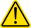
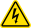
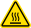
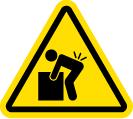
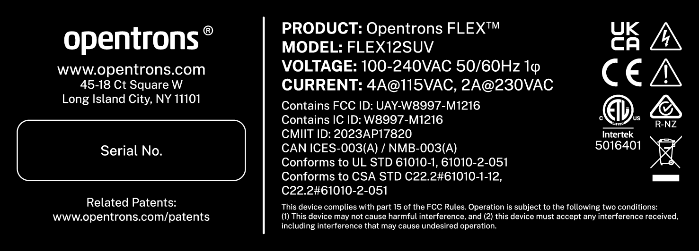
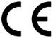
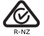

## Safety information

The Opentrons Flex liquid handling robot has been designed for safe operation. Refer to the specifications and compliance guidelines in this section to ensure safe usage of your Flex. These guidelines cover safe use of input and output connections for the product, including the power and data connections, as well as warning labels found on the Flex robot and related hardware. Using the device in a manner other than those specified in this manual may put the user and equipment at risk.

### Safety symbols

Various labels on the Flex and in this manual warn you about sources of
potential injury or harm.

| Symbol   | Description  |
| :------- | :----------- |
|  | **Warning:** Alerts users to <ul><li>Potentially hazardous conditions.</li><li>Actions that may result in personal injury or death.</li></ul>                             |
|   | **Caution:** Cautions users against <ul><li>Damage to the equipment.</li><li>Lost or corrupted data.</li><li>Unrecoverable interruption of the operation being performed.</li></ul> |
|   | **Electrical shock:** Identifies instrument components that might pose a risk of electrical shock if the instrument is handled improperly.                                |
|   | **Hot surface:** Identifies instrument components that pose a risk of personal injury due to high heat/temperatures if the instrument is handled improperly.              |
|   | **Pinch point:** Identifies instrument components that can pose a risk of personal injury when in motion.                                                                  |

You will find the following labels on the Flex:

- Intellectual property labels

- Regulatory compliance labels (e.g., [ETL](https://www.intertek.com/marks/etl/))

- Electrical hazard labels

- General warning labels

- Product labels

- Pinch point labels

- High voltage labels

- Power rating labels

### Electrical safety warnings

Always observe the following electrical safety warnings:

| Symbol   | Description  |
| :------- | :----------- |
|  | Plug the robot into a grounded, Class 1 circuit. See the [Power Connection section][power-connection] in the System Description chapter.                                                                                |
|  | Do not connect (plug in), disconnect (unplug), or use AC power cables if: <ul><li>The cable is frayed or damaged.</li><li>Other attached cables, cords, or receptacles are frayed or damaged.</li></ul> Using damaged power cords can cause an electric shock hazard resulting in serious injury or damage to the robot.                                                           |
|  | Do not replace the AC power cable unless at the direction of Opentrons Support.                                                                                            |

For more information on electrical requirements, see the [Power Consumption section][power-consumption-flex] of the Installation and Relocation chapter.

### Additional safety warnings

Always observe the following additional safety warnings:

| Symbol   | Description  |
| :------- | :----------- |
|  | Opentrons Flex has not been certified for use with explosive or flammable liquids. Do not load plates, tubes, or vials containing explosive or flammable liquids into the robot or otherwise operate the instrument with explosive or flammable liquids in the enclosure. |
|  | Use good laboratory practices and follow the manufacturer's precautions when working with chemicals. Opentrons is not responsible or liable for any damages because of, or as a result of, the use of hazardous chemicals.           |
|  | The Flex weighs 88.5 kg (195 lbs). As a result, moving or lifting it requires a team with sufficient personnel to ensure safe handling. See the [Relocation section](installation/relocation.md) in the Installation and Relocation chapter.                                                                        |
|  | The Flex should be placed on a surface capable of supporting its weight of 88.5 kg (195 lbs) with sufficient surface area to accommodate the robot plus its minimum clearance distance (20 cm/8 in). See the [Installation Requirements section](installation/requirements.md) in the Installation and Relocation chapter. |
|  | The Flex can emit vibrations while in operation. Place the robot on a surface that is sturdy, level, and water-resistant with cross-bracing or welded joints. See the [Installation Requirements section](installation/requirements.md) in the Installation and Relocation chapter.                |

### Safety cautions

To help protect the Flex from damage, follow these precautions:

| Symbol   | Description  |
| :------- | :----------- |
|  | Use labware that is ANSI/SLAS-compliant or approved by Opentrons. See the [Labware chapter](labware/index.md). |
|  | Keep corrosive materials, agents, or otherwise damaging materials away from the robot.|

### Biological safety

Treat specimens and reagents containing materials taken from humans as potentially infectious agents. Opentrons recommends using safe laboratory procedures as explained in [*Biosafety in Microbiological and Biomedical Laboratories (BMBL) 6th Edition*](https://www.cdc.gov/labs/bmbl/).

Under normal circumstances, the Flex does not create detectable aerosols from source liquids. However, under certain conditions, it is possible to generate aerosols from source liquids. When operating with biosafety level 2 or greater source liquids, consider taking precautions against aerosol exposure, in accordance with your local regulatory bodies. To minimize the potential risk of aerosol exposure from the robot, ensure that you:

- Perform maintenance as described in the [Maintenance and Service chapter](maintenance/index.md).

- Properly install and secure all instrument covers, pipettes, modules, and labware.

- Use proper pipetting technique to aid in the mitigation of aerosols.

### Toxic fumes

If you're working with volatile solvents or toxic substances, use an efficient laboratory ventilation system to remove any vapors that may be produced.

### Flammable liquids

The Flex has not been evaluated for use with flammable liquids and should not be used with flammable liquids.

## Regulatory compliance

Opentrons Flex complies with all applicable requirements of the following safety and electromagnetic certification and standards. You can also find compliance information on a sticker affixed to the back of Flex near the on/off switch.

<figure markdown>

<figcaption>Example of the Flex regulatory and compliance sticker.</figcaption>
</figure>

### Certification marks

The Flex carries various certification logos on its back panel sticker. These symbols serve as our verified declarations of conformity with international and regional directives and standards.

| Symbol | Market Area | Description |
|----|----|----|
|| European Economic Area (EEA) | Declares compliance with all applicable European Union (EU) directives (e.g., Low Voltage Directive, Machinery Directive, EMC Directive, etc.) |
|| Great Britain | This post-Brexit certification declares conformity with all applicable Designated Standards under United Kingdom statutory instruments. It excludes Northern Ireland and the EU. |
|| Australia and New Zealand | Declares compliance with shared trans-Tasman electromagnetic (EMC) baseline standards for commercial radio noise limits.|
|| Canada and United Stated | Certified and third-party listed by Intertek testing laboratories (ETL control number: 5016401). |

### Safety

| Rule ID | Title |
| :------ | :---- |
| **IEC/UL/CSA 61010-1** |Safety Requirements for Electrical Equipment for Measurement, Control, and Laboratory Use – Part 1: General Requirements |
| **IEC/UL/CSA 61010-2-051** | Particular requirements for laboratory equipment for mixing and stirring |

### Electromagnetic compatibility

| Rule ID | Title |
| :------ | :---- |
| **EN/BSI 61326-1** | Electrical Equipment for Measurement, Control, and Laboratory Use – EMC Requirements – Part 1: General Requirements |
| **FCC 47 CFR Part 15 Subpart B Class A** | Unintentional Radiators |
| **IC ICES-003** | Spectrum Management and Telecommunications – Interference- Causing Equipment Standard – Information Technology Equipment (Including Digital Apparatus) |

### FCC warnings and notes

**Warning:** Changes or modifications to this unit not expressly approved by Opentrons could void the user's authority to operate the equipment.

This device complies with Part 15 of the FCC rules. Operation is subject to the following:

- This device may not cause harmful interference.

- This device must accept any interference received, including interference that may cause undesired operation.

**Note:** This equipment has been tested and found to comply with the limits for a Class A digital device, pursuant to Part 15 of the FCC rules. These limits are designed to provide reasonable protection against harmful interference when the equipment is operated in a commercial environment. This equipment generates, uses, and can radiate radio frequency energy and, if not installed and used in accordance with the instruction manual, may cause harmful interference to radio communications. Operation of this equipment in a residential area is likely to cause harmful interference in which case the user will be required to correct the interference at their own expense.

### Canada ISED compliance

Canada ICES-003(A) / NMB-003(A)

This product meets the applicable Innovation, Science and Economic Development Canada technical specifications.

Le présent produit est conforme aux spécifications techniques applicables d'Innovation, Sciences et Développement économique Canada.

### Environmental warning

**Warning:** Cancer and Reproductive Harm – <https://www.P65Warnings.ca.gov>

### WEEE policy

Opentrons is dedicated to adhering to the EU Directive on Waste Electrical and Electronic Equipment (WEEE – 2012/19/EU). Our goal is to ensure that our products are properly disposed of or recycled once they reach the end of their useful life.

Opentrons products that fall under the WEEE directive are labeled with the  symbol, signifying that they should not be thrown away with regular household waste but must be collected and handled separately.

If you or your business have Opentrons products that are at end of life or need to be discarded for a separate purpose, contact Opentrons for proper disposal and recycling.

### Wi-Fi precertification

The Wi-Fi module is precertified for use in many regions:

- United States (FCC): FCC Identifier UAY-W8997-M1216

- European Economic Area (CE): No public identifier (self-declaration)

- Canada (IC): Hardware Version Identification Number W8997-M1216

- Japan (TELEC): Certified number 020-170034

- India (WPC): Registration number ETA-SD-20191005525 (self-declaration)
