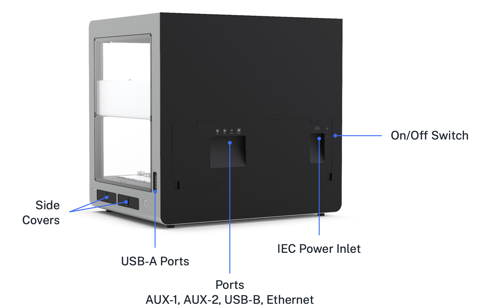

## Power connection

Opentrons Flex connects to a power source via a standard IEC-C14 inlet. The robot contains an internal full-range AC/DC power supply, accepting 100–240 VAC, 50/60 Hz input and converting it to 36 VDC. All other internal electronics are powered by the 36 VDC supply.

!!! warning
    Only use the power cord provided with the robot. Do not use a power cord with inadequate current or voltage ratings.

    Keep the power cord free of obstructions so you can remove it if necessary.

There is also a CR1220 coin cell battery to power the robot's real-time clock when not connected to mains power. The battery is located inside the touchscreen enclosure. Contact Opentrons Support for more information if you think you need to replace the battery.

## USB and auxiliary connections

Opentrons Flex has 10 total *USB ports* located in different areas of the robot, which serve different purposes.

The 8 rear USB-A ports (numbered USB-1 through USB-8) and 2 *auxiliary ports* (M12 connectors numbered AUX-1 and AUX-2) are for connecting Opentrons modules and accessories. See the [Modules chapter](../modules/index.md) for more information on connecting these devices and using them in your protocols.

The rear USB-B port is for connecting the robot to a laptop or desktop computer, to establish communication with the Opentrons App running on the connected computer. The front USB-A port (USB-9), located below the touchscreen display, has the same functionality as the rear USB-A ports.

!!! note
    The USB ports are power-limited to protect the robot and connected devices. Power delivery is split internally into three port groups: the left rear USB-A ports (USB-1 through USB-4), the right rear USB-A ports (USB-5 through USB-8), and the front USB-A port. Each of these groups will deliver a maximum of 500 mA to connected USB 2.0–compatible devices.

## Network connections

Opentrons Flex can connect to a local area network through a wired (Ethernet) or wireless (Wi-Fi) connection.

The Ethernet port is located on the rear of the robot. Connect it to an Ethernet hub or switch on your network. Or, starting in robot system version 7.1.0, connect it directly to an Ethernet port on your computer.

The internal Wi-Fi module supports 802.11 ac/a/b/g/n networks with a dual-band 2.4/5 GHz antenna.