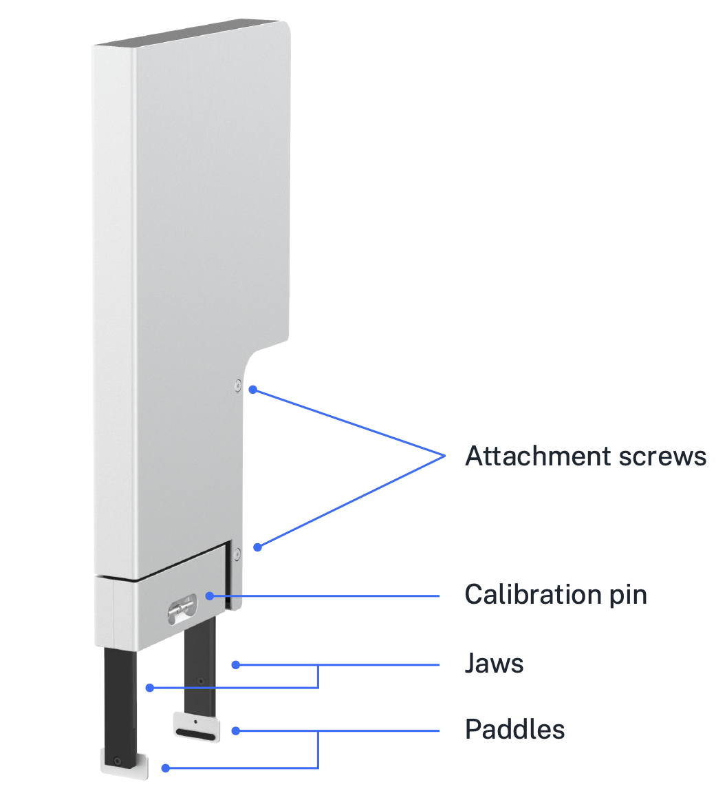

# Gripper

The *gripper* moves labware throughout the working area and staging area during the execution of protocols. The gripper attaches to the *extension mount*, which is separate from the pipette mounts; the gripper can be used with any pipette configuration. For details on installing the gripper, see [Instrument Installation and Calibration][instrument-installation-and-calibration].

The gripper can move labware across the deck and onto or off of modules. The gripper can manipulate certain fully skirted well plates, lids, and tip racks. For more details on what labware the gripper can move, see the [Labware and the Opentrons Flex Gripper section][labware-and-the-opentrons-flex-gripper] of the Labware chapter, or consult the [Opentrons Labware Library](https://labware.opentrons.com).

## Gripper specifications

The *jaws* perform the primary motion of the gripper, which is to open or close two parallel *paddles* to apply or release force on the sides of labware. Movement of the jaws is controlled by a 36 VDC brushed motor connected to a rack-and-pinion gear system.

To move a piece of labware that has been gripped by the jaws, the gantry lifts the gripper along the z-axis, moves it laterally, and then lowers it into the Calibration pin labware's new position.

<figure markdown>
{style="max-height: 600px"}
<figcaption>Locations of components of the gripper.</figcaption>
</figure>

## Gripper calibration

The gripper includes a metal *calibration pin*. The calibration pin is located in a recessed storage area on the lower part of the gripper. A magnet holds the pin in place. To remove the calibration pin, grasp it with your fingers and pull gently. To replace the pin, put it back in the storage slot. You'll know it's secure when it snaps into place.

When calibrating the gripper, attach the pin to each jaw in turn. The robot moves the pin to calibration points on the deck to measure the gripper's exact position.

During protocol runs, place the pin in its storage area for safekeeping. Contact us at <support@opentrons.com> if you lose the calibration pin.

## Gripper firmware updates

Opentrons Flex automatically updates the gripper firmware to keep it in sync with the robot software version. Gripper firmware updates are typically quick, and occur whenever:

- You attach the gripper.

- The robot restarts.

If, for any reason, your gripper firmware and robot software versions get out of sync, you can manually update the firmware in the Opentrons App.

1.  Click **Devices**.

2.  Click on your Flex in the device list.

3.  Under Instruments and Modules, the out-of-sync gripper will show a warning banner reading "Firmware update available." Click **Update now** to begin the update.

You can view the currently installed firmware version of the gripper. On the touchscreen, go to **Instruments** and tap the gripper. In the Opentrons App, find the gripper card under Instruments and Modules, click the three-dot menu (⋮), and then click **About gripper**.
