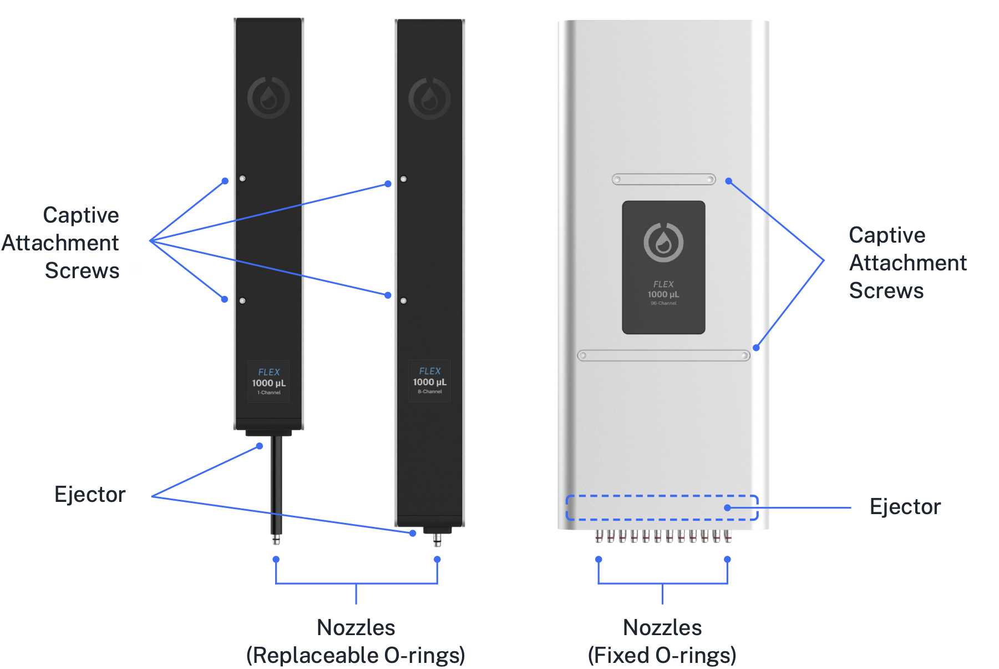

# Pipettes

Opentrons *pipettes* are configurable devices used to move liquids throughout the working area during the execution of protocols. There are several Opentrons Flex pipettes, which can handle volumes from 1 µL to 1000 µL in 1, 8, or 96 channels:

- Opentrons Flex 1-Channel Pipette (1–50 µL)

- Opentrons Flex 1-Channel Pipette (5–1000 µL)

- Opentrons Flex 8-Channel Pipette (1–50 µL)

- Opentrons Flex 8-Channel Pipette (5–1000 µL)

- Opentrons Flex 96-Channel Pipette (5–1000 µL)

Pipettes attach to the gantry using captive screws on the front of the pipette. 1-channel and 8-channel pipettes each occupy one *pipette mount* (left or right); the 96-channel pipette occupies both mounts. For details on installing pipettes, see [Instrument Installation and Calibration][instrument-installation-and-calibration].

<figure markdown>

<figcaption>Locations of components of the 1-, 8-, and 96-channel pipettes.</figcaption>
</figure>

The pipettes pick up disposable plastic *tips* by pressing them onto the pipette *nozzles*, and then use the tips to aspirate and dispense liquids. The amount of total force required for pickup increases as more tips get picked up simultaneously. For smaller numbers of tips, the pipette attaches tips by pushing each pipette nozzle down into a tip. To achieve the necessary force to pick up a full rack of tips, the 96-channel pipette also pulls the tips upward onto the nozzles. This pulling action requires placing tip racks into a *tip rack adapter*, rather than directly in a deck slot. To discard tips (or return them to their rack), the pipette *ejector* mechanism pushes the tips off of the nozzles.

## Pipette specifications

Opentrons Flex pipettes are designed to handle a wide range of volumes.
Because of their wide overall range, they can use multiple sizes of tips, which affect their liquid-handling characteristics. Opentrons has tested Flex pipettes for accuracy and precision in a number of tip and liquid volume combinations:

<table>
  <thead>
    <tr>
      <th>Pipette</th>
      <th>Tip Capacity</th>
      <th>Tested Volume</th>
      <th>Accuracy %D</th>
      <th>Precision %CV</th>
    </tr>
  </thead>
  <tbody>
    <tr>
      <td rowspan="3"><b>Flex 1-Channel 50 µL</b></td>
      <td>50 µL</td>
      <td>1 µL</td>
      <td>8.00%</td>
      <td>7.00%</td>
    </tr>
    <tr>
      <td>50 µL</td>
      <td>10 µL</td>
      <td>1.50%</td>
      <td>0.50%</td>
    </tr>
    <tr>
      <td>50 µL</td>
      <td>50 µL</td>
      <td>1.25%</td>
      <td>0.40%</td>
    </tr>
    <tr>
      <td rowspan="4"><b>Flex 1-Channel 1000 µL</b></td>
      <td>50 µL</td>
      <td>5 µL</td>
      <td>5.00%</td>
      <td>2.50%</td>
    </tr>
    <tr>
      <td>50 µL</td>
      <td>50 µL</td>
      <td>0.50%</td>
      <td>0.30%</td>
    </tr>
    <tr>
      <td>200 µL</td>
      <td>200 µL</td>
      <td>0.50%</td>
      <td>0.15%</td>
    </tr>
    <tr>
      <td>1000 µL</td>
      <td>1000 µL</td>
      <td>0.50%</td>
      <td>0.15%</td>
    </tr>
    <tr>
      <td rowspan="3"><b>Flex 8-Channel 50 µL</b></td>
      <td>50 µL</td>
      <td>1 µL</td>
      <td>10.00%</td>
      <td>8.00%</td>
    </tr>
    <tr>
      <td>50 µL</td>
      <td>10 µL</td>
      <td>2.50%</td>
      <td>1.00%</td>
    </tr>
    <tr>
      <td>50 µL</td>
      <td>50 µL</td>
      <td>1.25%</td>
      <td>0.60%</td>
    </tr>
    <tr>
      <td rowspan="4"><b>Flex 8-Channel 1000 µL</b></td>
      <td>50 µL</td>
      <td>5 µL</td>
      <td>8.00%</td>
      <td>4.00%</td>
    </tr>
    <tr>
      <td>50 µL</td>
      <td>50 µL</td>
      <td>2.50%</td>
      <td>0.60%</td>
    </tr>
    <tr>
      <td>200 µL</td>
      <td>200 µL</td>
      <td>1.00%</td>
      <td>0.25%</td>
    </tr>
    <tr>
      <td>1000 µL</td>
      <td>1000 µL</td>
      <td>0.70%</td>
      <td>0.15%</td>
    </tr>
    <tr>
      <td rowspan="4"><b>Flex 96-Channel 1000 µL</b></td>
      <td>50 µL</td>
      <td>5 µL</td>
      <td>10.00%</td>
      <td>5.00%</td>
    </tr>
    <tr>
      <td>50 µL</td>
      <td>50 µL</td>
      <td>2.50%</td>
      <td>1.25%</td>
    </tr>
    <tr>
      <td>200 µL</td>
      <td>200 µL</td>
      <td>1.50%</td>
      <td>1.25%</td>
    </tr>
    <tr>
      <td>1000 µL</td>
      <td>1000 µL</td>
      <td>1.50%</td>
      <td>1.50%</td>
    </tr>
  </tbody>
</table>

Keep this accuracy information in mind when choosing tips for your
pipette. In general, for best results you should use the smallest tips
that meet the needs of your protocol.

!!! note
    Opentrons performs volumetric testing of Flex pipettes to ensure that they meet the accuracy and precision specifications listed above. You *do not* have to calibrate the volume that your pipettes dispense before use. You only have to perform positional calibration. See the next section, as well as the [Pipette Installation section][pipette-installation] of the Installation and Relocation chapter, for details.

    The Opentrons Care and Opentrons Care Plus services include yearly pipette replacement and certificates of calibration. See the [Servicing Flex section][servicing-flex] of the Maintenance and Service chapter for details.

## Pipette calibration

The User Kit includes a metal pipette calibration probe, which you use during positional calibration. During protocol runs, safely store the probe on the magnetic holder on the front pillar of the robot. During the calibration process, attach the probe to the appropriate nozzle and lock it in place. The robot moves the probe to calibration points on the deck to measure the pipette's exact position.

## Pipette tip rack adapter

The Opentrons Flex 96-channel pipette ships with four tip rack adapters. These are precision formed aluminum brackets that you place on the deck. The adapters hold Flex 50 μL, 200 μL, and 1000 µL tip racks.

Because of the force involved, the 96-channel pipette requires an adapter to attach a full tip rack properly. During the attachment procedure, the pipette moves over the adapter, lowers itself onto the mounting pins, and pulls tips onto the pipettes by lifting the adapter and tip rack. Pulling the tips, rather than pushing, provides the leverage needed to secure tips to the pipettes and prevents warping the deck surface. When finished, the 96-channel pipette lowers the adapter and empty tip rack onto the deck. See the [Tips and Tip Racks section][tips-and-tip-racks] of the Labware chapter for more information.

## Partial tip pickup

By default, multi-channel pipettes use all of their nozzles to pick up tips and handle liquids: an 8-channel pipette picks up 8 tips at once, and a 96-channel pipette picks up 96 tips at once. Partial tip pickup lets you configure a multi-channel pipette to use fewer tips. This expands the liquid handling capabilities of your robot without having to physically switch pipettes, and is especially useful for the 96-channel pipette, which occupies both pipette mounts.

Currently, the 96-channel pipette supports partial tip pickup for a column, a row, or a single tip. The 8-channel pipettes support a partial column (2–7 consecutive tips) or a single tip.

When picking up fewer than 96 tips from a tip rack with any pipette, the rack must be placed directly on the deck, not in the tip rack adapter.

## Pipette sensors

Opentrons Flex pipettes have a number of sensors that detect and record data about the status of the pipette and any tips it has picked up.

### Capacitance sensors

In combination with a metal probe or conductive tip, the capacitance sensors detect when the pipette makes contact with something. Detection of contact between the metal probe and the deck is used in the automated [pipette calibration][pipette-calibration] and [module calibration][module-calibration] processes.

1-channel pipettes have one capacitance sensor, while multi-channel pipettes have two: on channels 1 and 8 of 8-channel pipettes, and on channels 1 and 96 (positions A1 and H12) of the 96-channel pipette.

### Optical tip presence sensors

A photointerruptor switch detects the position of the pipette's tip ejector mechanism, confirming whether tips were successfully picked up or dropped. 1-channel, 8-channel, and 96-channel pipettes all have a single optical sensor that monitors tip attachment across all channels.

### Pressure sensors

Flex pipettes use internal pressure sensors to detect liquid in well plates, reservoirs, and tubes. Liquid detection takes place as a pipette approaches the surface of a liquid. Sensors in the pipettes detect pressure changes relative to ambient pressure. A particular change in pressure tells the robot that liquid is present in a well and the pipette tip is in contact with the liquid's surface.

1-channel pipettes have one pressure sensor. The 8-channel pipette pressure sensors are on channels 1 and 8 (positions A1 and H1). The 96-channel pipette pressure sensors are on channels 1 and 96 (positions A1 and H12). Other channels on multi-channel pipettes do not have sensors and cannot detect liquid.

## Pipette firmware updates

Opentrons Flex automatically updates pipette firmware to keep it in sync with the robot software version. Pipette firmware updates are typically quick, and occur whenever:

- You attach a pipette.

- The robot restarts.

If, for any reason, your pipette firmware and robot software versions get out of sync, you can manually update the firmware in the Opentrons App.

1.  Click **Devices**.

2.  Click on your Flex in the device list.

3.  Under Instruments and Modules, the out-of-sync pipette will show a warning banner reading "Firmware update available." Click **Update now** to begin the update.

You can view the currently installed firmware version of any attached pipette. On the touchscreen, go to **Instruments** and tap the pipette name. In the Opentrons App, find the pipette card under Instruments and Modules, click the three-dot menu (⋮), and then click **About pipette**.
