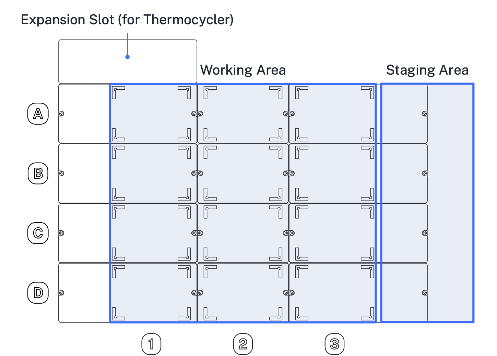
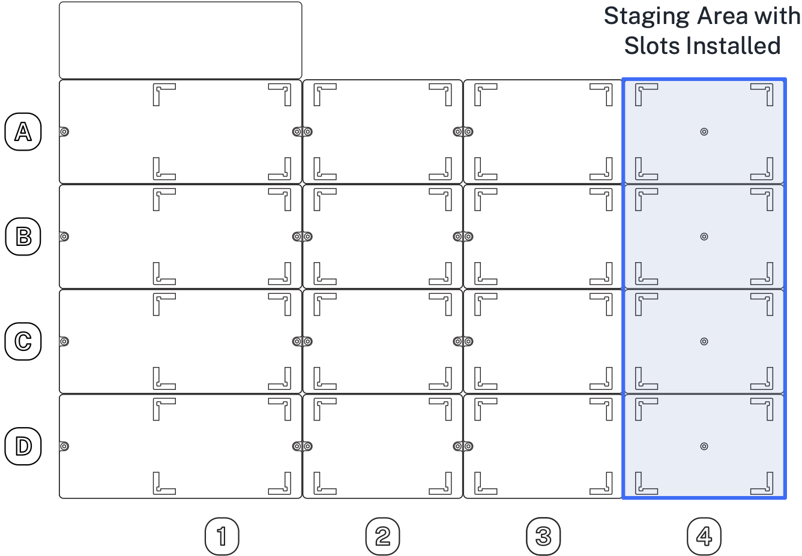
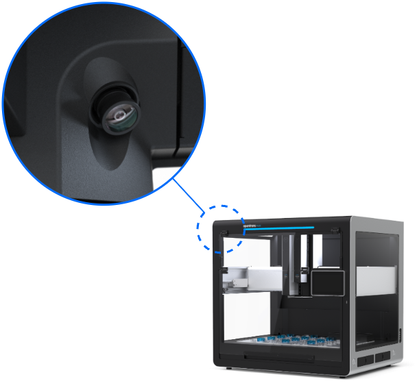
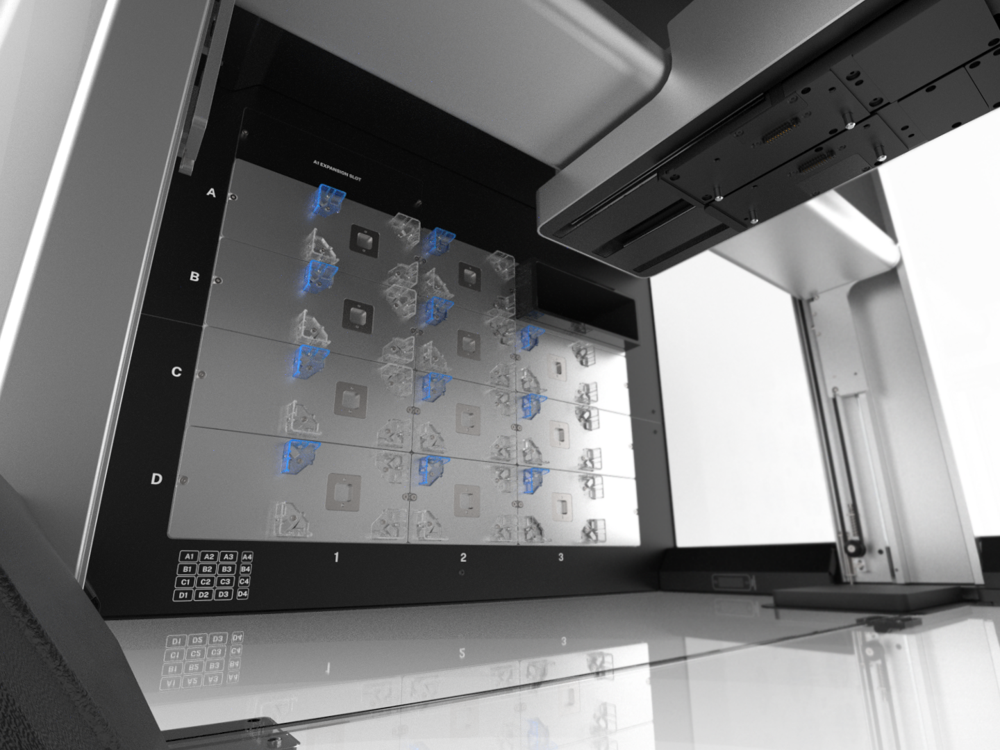
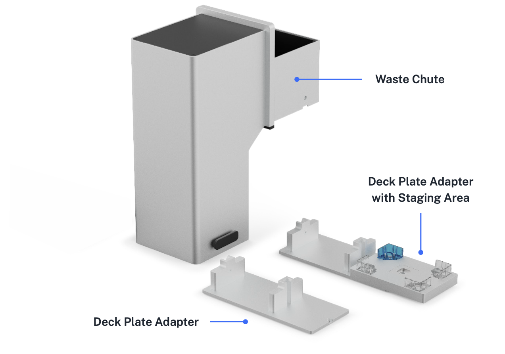
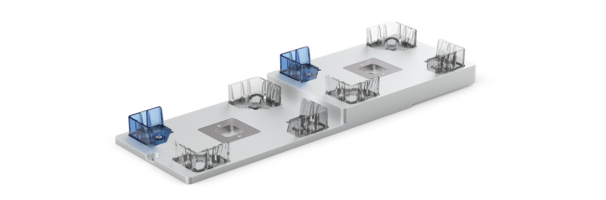
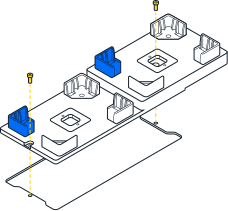
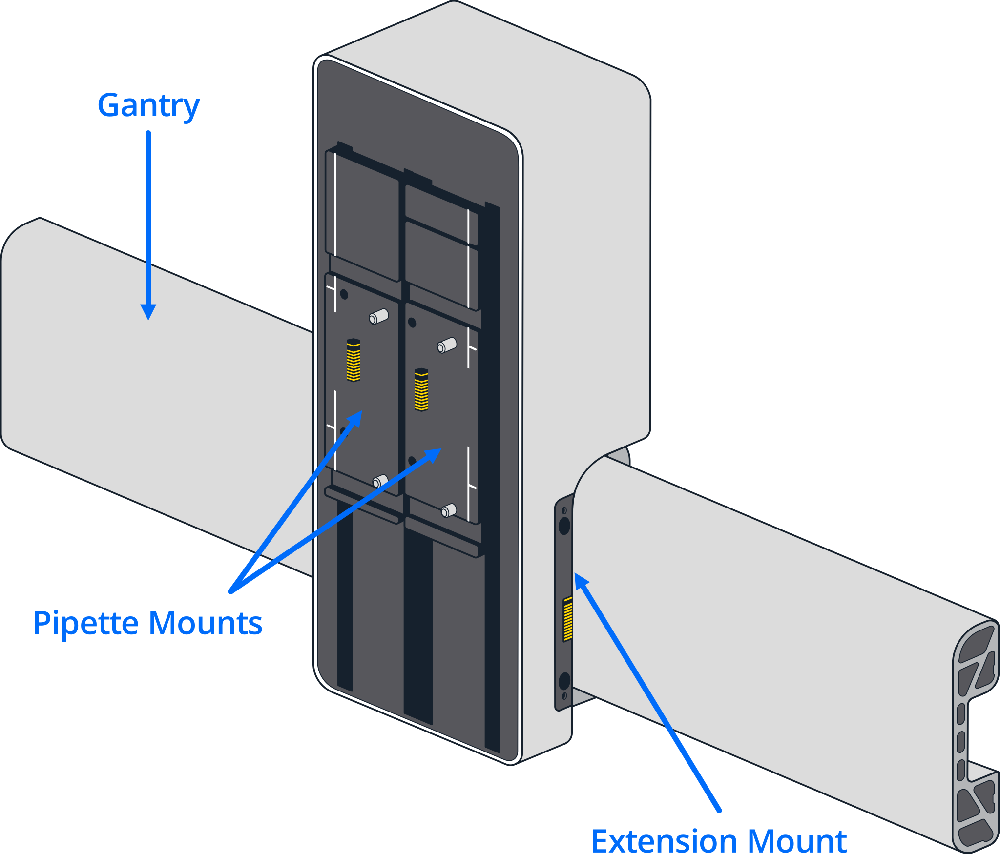

<figure markdown>

<figcaption>Locations of the physical components of Opentrons Flex.</figcaption>
</figure>

## Frame and enclosure

The *frame* of the Opentrons Flex robot provides rigidity and structural support for its *deck* and *gantry*. All of the mechanical subsystems are situated on and mounted to the main frame. The frame is constructed primarily of sheet metal and aluminum extrusions.

The metal frame has openings for *side windows* and a *front door* made of transparent polycarbonate that let you see what's going on inside Flex. The front door hinges open for access to the interior of the system. With the front door open, you can attach *instruments*, *modules*, and *deck fixtures*; prepare the deck before a protocol; or manipulate the state of the deck during a protocol.

White LED strips on the inside top edges of the frame provide software-controllable *ambient lighting*. A 2-megapixel camera can [photograph the deck](../opentrons-app/camera.md) and working area for recording and tracking protocol execution.

## Deck and working area

The deck is the machined aluminum surface on which automated science protocols are executed. The deck has 12 main ANSI/SLAS-format slots that can be reconfigured to hold labware, modules, and consumables. The deck slots are identified by a coordinate system, with slot A1 at the back left and slot D3 at the front right.

<figure markdown>

<figcaption>Areas of the deck within Flex.</figcaption>
</figure>

The *working area* is the physical space above the deck that is accessible for pipetting. Labware placed in slots A1 through D3 are in the working area.

Opentrons Flex comes with *removable deck slots* for all 12 positions in the working area. Each deck slot has corner *labware clips* for securely placing labware on the deck.

You can reconfigure the deck by replacing slots with other deck fixtures, including the *movable trash*, *waste chute*, and *module caddies*. The *expansion slot* behind A1 is only used to make additional room for the Thermocycler Module, which occupies slots A1 and B1.

!!! note
    Deck slots are interchangeable within a column (1, 2, or 3) but not across columns; column 1 and column 3 slots are distinct pieces despite their similar size. You can tell which column a slot goes in by orienting the blue labware clip to the back left.

You should leave deck slots installed in locations where you want to place standalone labware. The deck and items placed on it remain static, unless moved by the gripper or manual intervention.

## Staging area

The *staging area* is additional space along the far right side of the deck (column 4). Labware and modules placed in column 4 are in the staging area. To create this new space, you replace the standard deck slots in column 3 with [staging area slots](#staging-area-slots). These special fixtures span two columns by fitting into column 3 and extending the deck to create the new column 4 locations (A4–D4). An advantage of using the staging area is that it gives you extra labware storage and keeps space in the working area available for equipment essential to your protocols.

!!!note
    Flex pipettes cannot reach into the staging area, but the gripper can pick up and move labware to and from this location.

Staging area slots are included in certain workstation configurations.
You can also purchase a [set of four staging area slots](https://opentrons.com/products/opentrons-flex-deck-expansion-set-4-count) from Opentrons.

<figure markdown>

</figure>

## Deck fixtures

Fixtures are hardware items that replace standard deck slots. They let you customize the deck layout and add functionality to your Flex. Currently, deck fixtures include the staging area slots, the internal trash bin, and the external waste chute. You can only install fixtures in a few specific deck slots. The following table lists the deck locations for each fixture.

| **Fixture**                        | **Slots**         |
|------------------------------------|-------------------|
| Staging area slots                 | A4–D4             |
| Trash bin                          | A1–D1 and A3–D3   |
| Waste chute                        | D3 only           |
| Waste chute with staging area slot | D3 and D4         |

Fixtures are unpowered. They do not contain electronic or mechanical components that communicate their current state and deck location to the robot. This means you have to use the *deck configuration* feature to let the Flex know what fixtures are attached to the deck and where they're located.

You can access the deck configuration settings from the touchscreen via the three-dot (⋮) menu and from the Opentrons App. See the [Deck Configuration section](../touchscreen/deck-config.md) of the Touchscreen chapter for more information.

## Camera

The *camera* is mounted on the interior frame of the robot, in the upper corner of the enclosure near the front door.

This fixed location gives you a wide-angle field of view of attached instruments, deck-mounted modules, and labware.

For information about using the camera, see [Using the Camera](../opentrons-app/camera.md).

## Waste chute

The Opentrons Flex Waste Chute transfers liquids, tips, tip racks, and well plates from the Flex enclosure to a trash receptacle placed below its external opening. The waste chute attaches to a deck plate adapter that fits in slot D3. It also comes with a special window half panel that lets the chute extend out of the front of the robot.

<figure markdown>

<figcaption>Components of the waste chute.</figcaption>
</figure>

## Staging area slots

*Staging area slots* are ANSI/SLAS compatible deck pieces that replace standard slots in column 3 to create new slots in the [staging area](#staging-area) (column 4). You can install a single slot or a maximum of four slots to create new location coordinates (A4 to D4) along the right side of the deck. Note, however, that replacing deck slot A3 requires moving the trash bin. By adding staging area slots to the deck, your Flex robot can store more labware and operate more efficiently.

<figure markdown>

<figcaption>Flex staging area slot.</figcaption>
</figure>

### Slot installation

To install, remove the screws that attach a standard slot to the deck and replace it with the staging area slot. After installation, use the touchscreen or Opentrons App to tell the robot you've added a staging area slot to the deck.

<figure markdown>

<figcaption>Installing a staging area slot.</figcaption>
</figure>

### Slot compatibility

Staging area slots are compatible with the Flex instruments, modules, and labware listed below.

| Flex component | Staging area compatibility |
|:-------------- |:------------|
| **Gripper**        | The Flex Gripper can move labware to or from staging area slots.                                                     |
| **Pipettes**       | Flex pipettes cannot reach the staging area. Use the gripper to move tip racks and labware from the staging area to the working area before pipetting. |
| **Modules**        | The Magnetic Block GEN1 can be placed in column 3 on top of a staging area slot. Modules are not supported in column 4.  Powered modules such as the Heater-Shaker and Temperature Module fit into caddies that can be placed in column 3. You can't add a staging area slot to a position occupied by a module caddy. |
| **Labware**        | Staging area slots have the same ANSI/SLAS dimensions as standard deck slots. Use [gripper-compatible labware](../labware/gripper.md) in the staging area, or manually add and remove labware from this location. |

## Gantry

Attached to the frame is the gantry, which is the robot's movement and positioning system.

The gantry moves separately along the x- and y-axis to position the pipettes and gripper at precise locations for protocol execution. Movement along these axes is precise to the nearest 0.1 mm. The gantry is controlled by 36 VDC hybrid bipolar stepper motors.

In turn, attached to the gantry are the *pipette mounts* and the *extension mount*. These move along the z-axis to position the pipettes and gripper at precise locations for protocol execution. Movement along this axis is controlled by 36 VDC hybrid bipolar stepper motors.

The electronics contained in the gantry provide 36 VDC power and communications to the pipettes and gripper, when attached.

<figure markdown>

<figcaption>Location of instrument mounts on Flex.</figcaption>
</figure>

## Touchscreen display

The primary user interface is the 7-inch LCD *touchscreen*, located on the front right of the robot. The touchscreen is covered with Gorilla Glass 3 for scratch and damage resistance. Access many features of Flex right on the touchscreen, including:

- Protocol management

- Protocol setup, execution, and monitoring

- Labware management

- Robot settings

- System software and firmware updates

- Operation logs and error notifications

For more information on using Flex via the touchscreen, see the [Touchscreen chapter](../touchscreen/index.md).

## Status light { #status-light-flex }

The *status light* is a strip of LEDs along the top front of the robot that provides at-a-glance information about the robot. Different colors and patterns of illumination can communicate various success, failure, or idle states:

<table>
  <thead>
    <tr>
      <th>LED color</th>
      <th>LED pattern</th>
      <th>Robot status</th>
    </tr>
  </thead>
  <tbody>
    <tr>
      <td rowspan="2" markdown> White Neutral states</td>
      <td>Solid</td>
      <td>Powered on and not running a protocol</td>
    </tr>
    <tr>
      <td>Pulsing</td>
      <td>Robot is busy (e.g., updating software or firmware, setting up protocol run, canceling protocol run)</td>
    </tr>
    <tr>
      <td rowspan="3"> Green Normal states</td>
      <td>Blinks twice</td>
      <td>Action is complete (e.g., protocol stored, software updated, instrument attached or detached)</td>
    </tr>
    <tr>
      <td>Solid</td>
      <td>Protocol is running</td>
    </tr>
    <tr>
      <td>Pulsing</td>
      <td>Protocol is complete</td>
    </tr>
    <tr>
      <td> Blue Mandatory states</td>
      <td>Pulsing</td>
      <td>Protocol is paused</td>
    </tr>
    <tr>
      <td rowspan="2"> Yellow Abnormal states</td>
      <td>Solid</td>
      <td>Software error</td>
    </tr>
    <tr>
      <td>Pulsing</td>
      <td><a href="../../touchscreen/protocol-run/#error-recovery">Error recovery mode</a></td>
    </tr>
    <tr>
      <td> Red Emergency states</td>
      <td>Blinks three times, repeatedly</td>
      <td>Physical error (e.g., instrument crash)</td>
    </tr>
  </tbody>
</table>

The status light can also be disabled in the robot settings.
