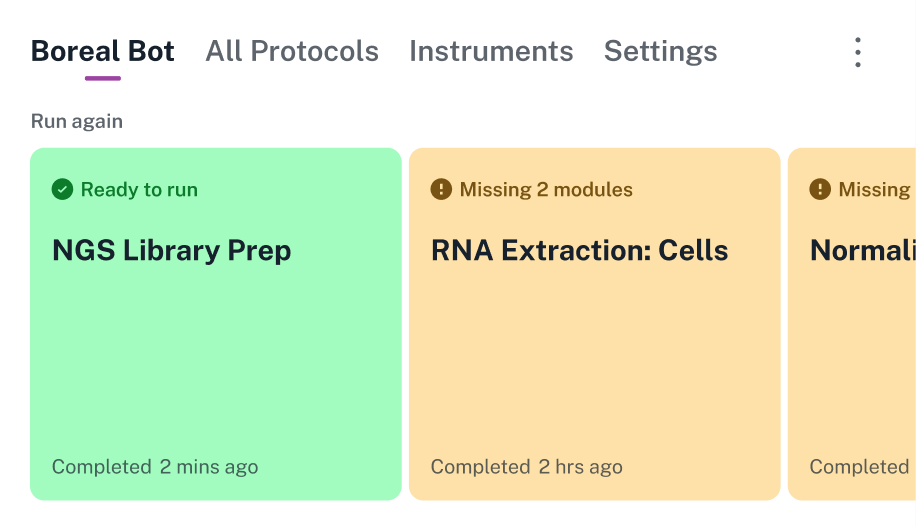

<figure class="screenshot" markdown>

</figure>

The *dashboard* is the main screen for the robot, accessible by tapping the robot's name in the top left corner of the touchscreen.

The dashboard provides quick access to recently run protocols. It displays protocols as large cards in a horizontal carousel. Green cards show protocols that are ready to run. Orange cards show protocols that require hardware setup or have a deck configuration conflict. The dashboard can display up to eight previously run protocols.

## Dashboard settings

From the dashboard you can also perform actions that apply to the robot as a whole, rather than a particular protocol. Access these actions by tapping the three-dot (⋮) menu:

- **Home gantry:** Move the gantry to its home position at the back right of the working area.

- **Restart robot:** Tap the restart icon (↻) to perform a soft restart of the robot.

- **Turn off robot:** Tap the power icon (⏻) to shut down the robot and then toggle the rear power switch off. This is the recommended way to turn off your Flex.

- **[Deck configuration](deck-config.md):** Manage deck fixture locations.

- **Lights on/off:** Toggle the LED lights that illuminate the working area.

The top navigation on the dashboard provides access to the other main screens: [All Protocols](protocol-management.md), [Instruments](instruments.md), and [Settings](settings.md).