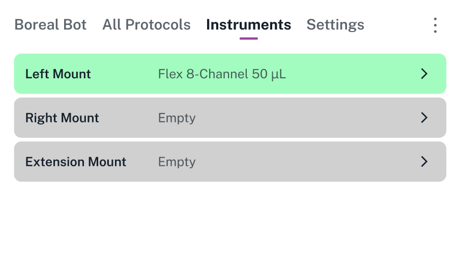
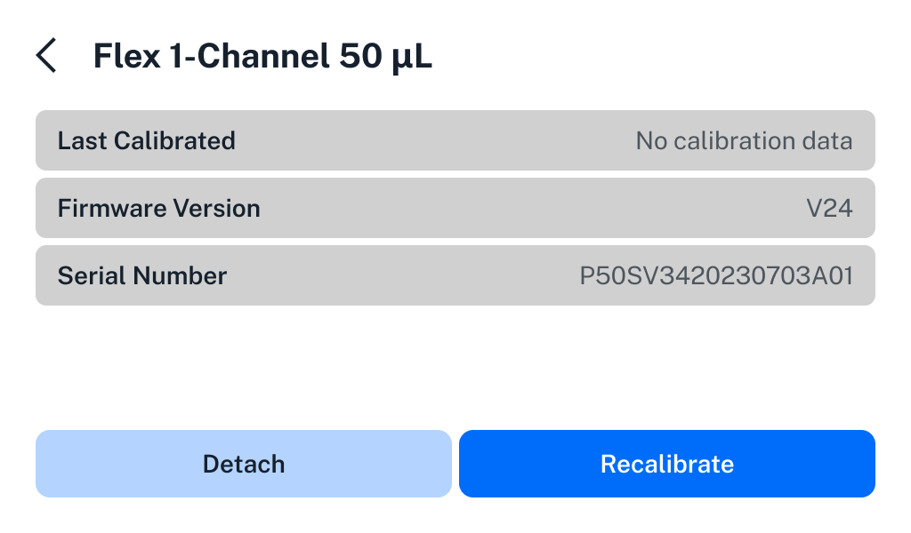

The Instruments screen is an interactive list of all instruments that you've connected to your Flex. The list is organized by mount: left pipette mount, right pipette mount, and extension mount.

<figure class="screenshot" markdown>

</figure>

For an empty mount, tap anywhere on the row to begin the process of attaching an instrument.

For an occupied mount, the row lists its current contents. Tap anywhere on the row to get more details about the instrument, detach it, or recalibrate it.

<figure class="screenshot" markdown>

</figure>

- **Last Calibrated:** The date and time of the instrument's most recent calibration.

- **Firmware Version:** The version of the firmware running on the instrument. Flex automatically updates instrument firmware whenever the instrument is attached, depending on the robot system version.

- **Serial Number:** A unique identifier for the instrument. If you are having problems with an instrument, Opentrons Support will want to know the serial number.

## Attach an instrument

Choose an empty mount and then choose the type of instrument to install. Then connect and secure the instrument using its captive mounting screws. For more details, follow the instructions on the touchscreen or see the [Instrument Installation and Calibration section](../installation/instruments.md) of the Installation and Relocation chapter.

Exact installation steps depend on the instrument you choose and the current setup of your robot. For example, if you have an 8-channel pipette already attached and you attempt to install the 96-channel pipette on the other mount, the touchscreen will give you instructions for detaching the 8-channel so the 96-channel can occupy both mounts.

## Detach an instrument

Choose an attached instrument that you want to detach. Then loosen the instrument's captive mounting screws and remove it from the gantry. For more details, follow the instructions on the touchscreen. Exact removal steps depend on the instrument you choose and the current setup of your robot.

## Recalibrate an instrument

Choose an attached instrument that you want to recalibrate. Then connect the instrument's calibration probe or pin and begin the automated calibration process. For more details, follow the instructions on the touchscreen or see the [Instrument Installation and Calibration section](../installation/instruments.md) of the Installation and Relocation chapter.

!!! note
    The new calibration data will overwrite any previous calibration data for that instrument.
