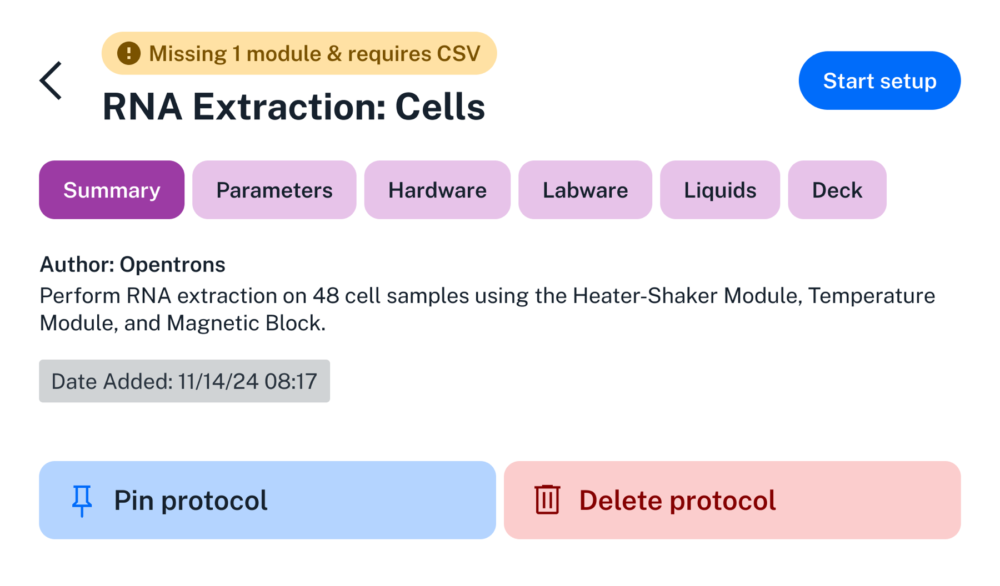
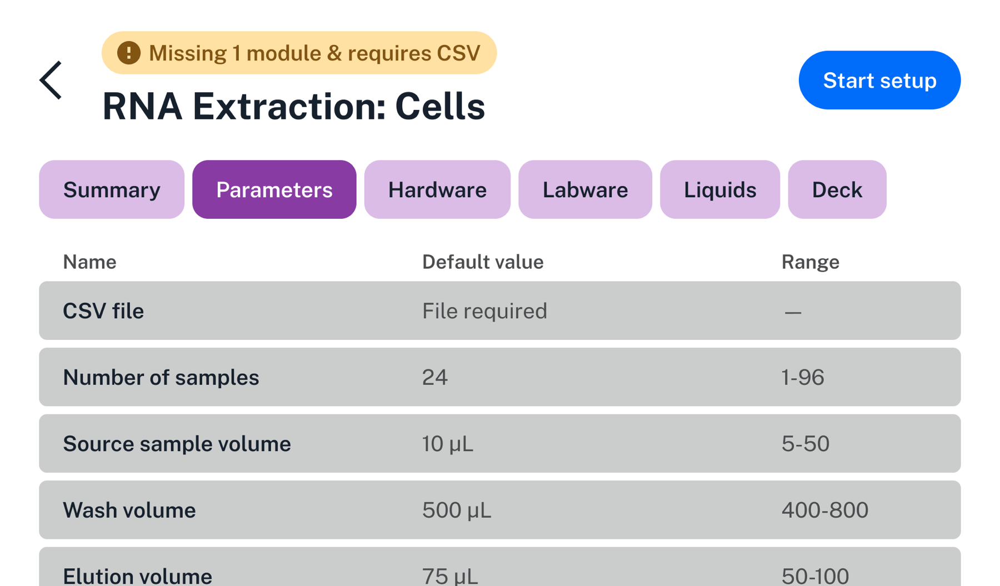
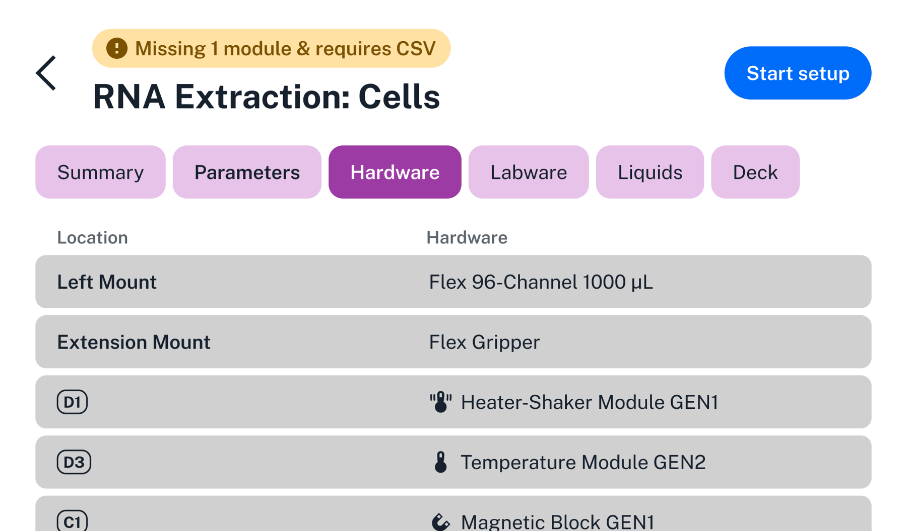
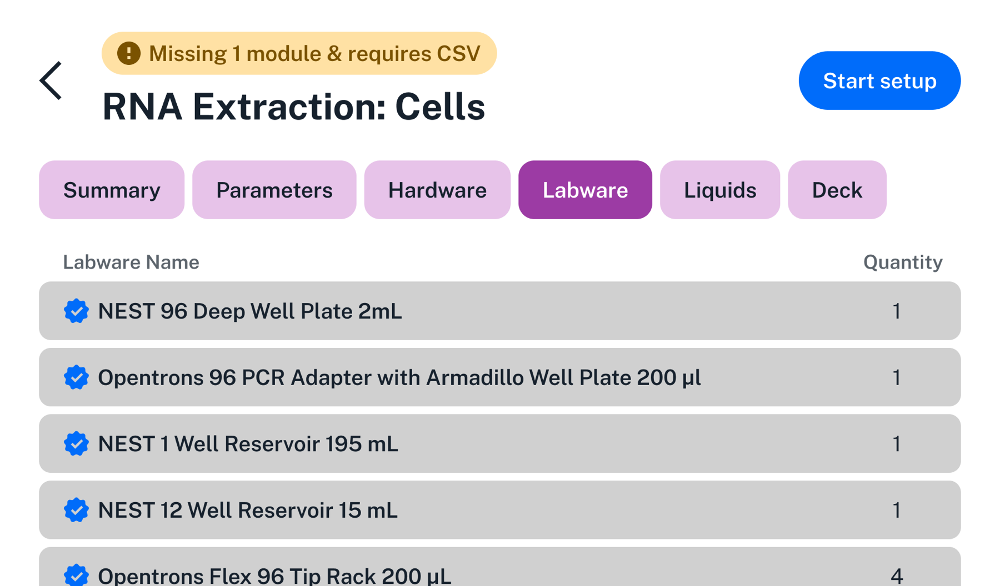
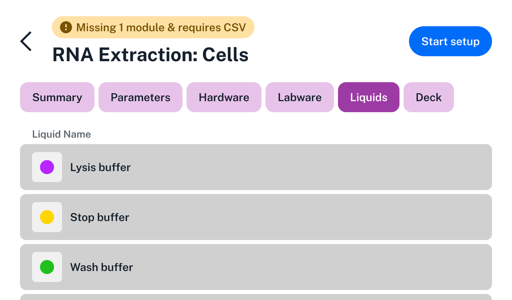
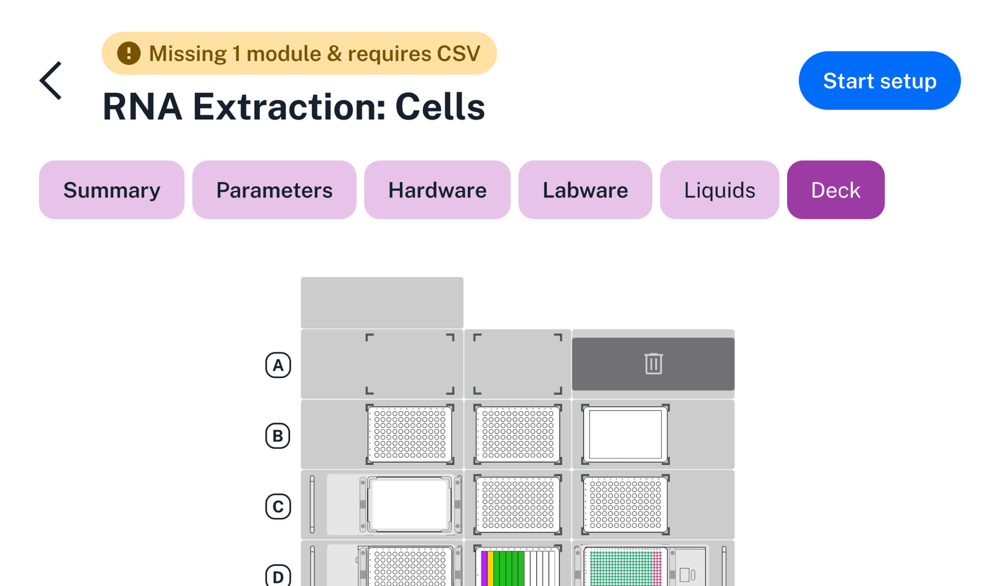

Tap on any protocol to view its detail screen. This screen displays all of the types of information included in the protocol file, as well as common protocol actions. An indicator at the top left of the screen shows whether the protocol is ready to run, or whether you need to perform additional setup.

## Summary tab

<figure class="screenshot" markdown>

</figure>

The Summary tab shows:

- **Protocol name:** For protocols with very long names, tap to toggle between the full and truncated name.

- **Author:** Who created the protocol.

- **Description:** Scroll to read the full text. Also identifies quick transfer protocols.

- **Date added:** Timestamp when Flex received the protocol file.

## Parameters tab

<figure class="screenshot" markdown>

</figure>

The Parameters tab lists all of the runtime parameters that you can configure from the touchscreen while setting up the protocol. The Default Value column shows the value that the protocol will use if you don't change it. The Range column shows the maximum and minimum, list of choices, or number of choices depending on the parameter type.

!!! note
    Runtime parameters are only available in Python protocols that define their names, descriptions, and possible values. See [Runtime Parameters](../../python-api/runtime-parameters/index.md) in the Python API documentation for information on defining parameters and using their values. JSON protocols do not currently support this feature.

## Hardware tab

<figure class="screenshot" markdown>

</figure>

The Hardware tab is a list of all instruments, modules, and fixtures used in the protocol. The Location column tells you where the hardware needs to be attached to Flex. For instruments, location can be the left pipette mount, right pipette mount, both mounts (for the 96-channel pipette), or the extension mount (for the gripper). For modules and fixtures, the location is the deck slot or slots that the item occupies.

## Labware tab

<figure class="screenshot" markdown>

</figure>

The Labware tab is a list of all labware used in the protocol. It shows the names and quantities of labware. It does not show their locations, since labware can be moved, added, or removed from the deck during the course of a protocol. Use the Deck tab to see initial positions of labware.

Opentrons-verified labware is indicated with a blue checkmark.

## Liquids tab

<figure class="screenshot" markdown>

</figure>

The Liquids tab lists all liquids to be loaded into labware at the start of the protocol. It shows the color code of the liquid (as assigned by the protocol author), the liquid name, and the total volume of liquid used across all wells. Use the Deck tab to see well-by-well initial positions of liquids.

## Deck tab

<figure class="screenshot" markdown>

</figure>

The Deck tab shows a visual map of the deck at the beginning of the protocol.

For an interactive view that provides more information about the contents of each deck slot, tap **Start setup**, then tap **Labware**, and then tap **Map View**. There you can tap on any labware to see its type and custom label (if set by the protocol).

## Action buttons

On any of the protocol detail tabs, three action buttons are available:

- **Start setup** (top right)

- **Pin protocol** (bottom left)

- **Delete protocol** (bottom right)

Next we'll look at the steps for setting up and performing a protocol run.
