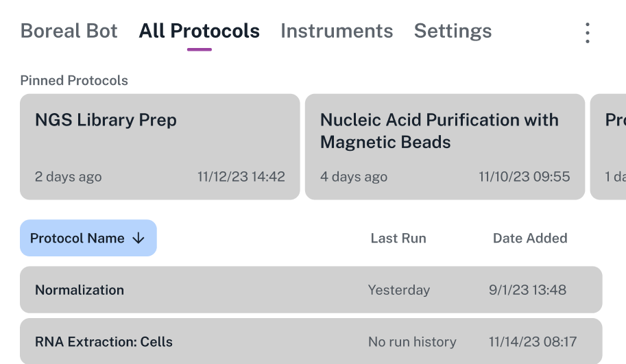
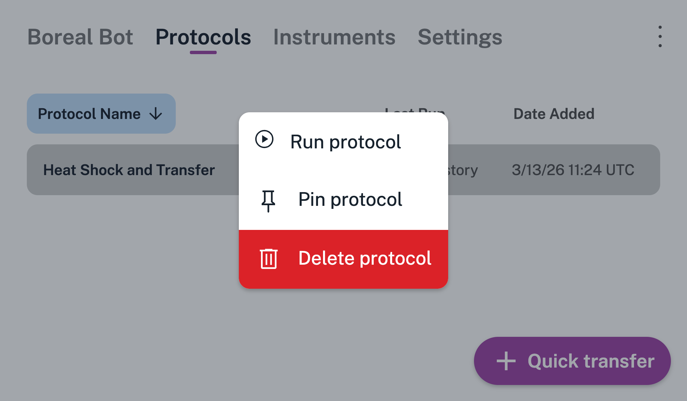
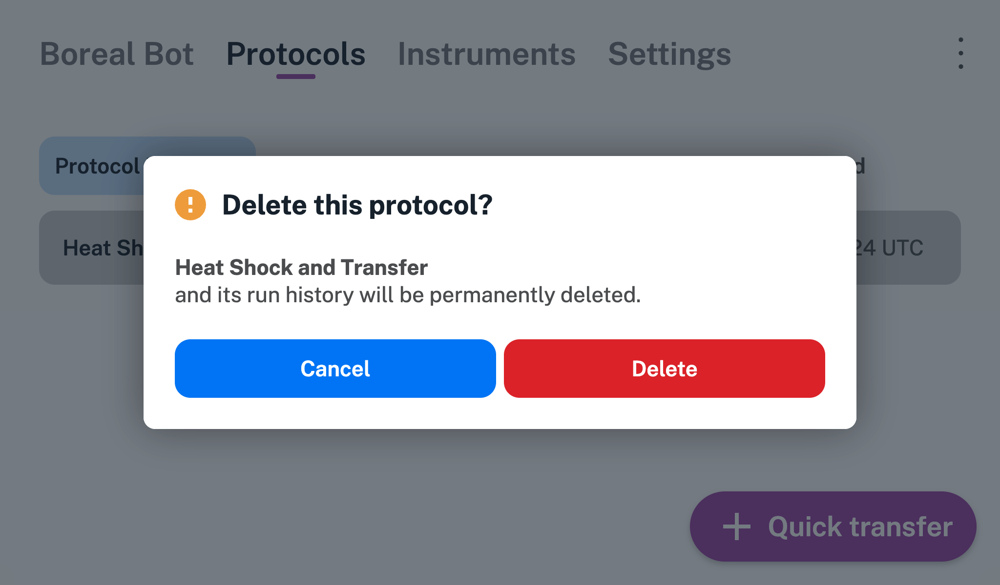

The All Protocols screen is an interactive list of all protocols that you've stored on Opentrons Flex. (Sending a protocol to Flex requires the Opentrons App. See [Transferring Protocols](../opentrons-app/protocol-transfer.md) for more information about that process.)

There are two sections of the All Protocols screen:

- Pinned protocols: Large cards in a horizontal carousel at the top of the screen.

- Other protocols: A vertical list at the bottom of the screen.

<figure class="screenshot" markdown>

</figure>

Regardless of which section a protocol is in, its card or list entry includes information about when it was last run and when it was added to this robot.

!!! note
    Flex can store a maximum of 20 unique protocols. It automatically deletes older protocols to maintain this limit. Use the Opentrons App if you need to manage a larger number of protocols.

## Pin a protocol

Long press on a protocol and tap **Pin protocol** to move it to the pinned protocols section. Conversely, long press a pinned protocol and tap **Unpin protocol** to remove it from the section.

<figure class="screenshot" markdown>

</figure>

You can pin up to eight protocols. When you hit the maximum, you'll need to unpin a protocol before pinning another one.

## Sort protocols

Tap any of the three headers — Protocol Name, Last Run, or Date Added — to sort the All Protocols section.

Tap once to sort protocols in ascending order (A to Z for names, oldest to newest for dates). Tap again to reverse the sort order. The current sort criterion is highlighted in blue and the current sort order is indicated by an upward or downward arrow.

## Delete a protocol

Long press on a protocol and tap **Delete protocol** to delete it directly from the All Protocols screen. Flex will prompt you for confirmation that you want to delete the protocol file and all of its run history.

<figure class="screenshot" markdown>

</figure>

!!! warning
    Run history is *not recoverable* after you delete a protocol on Flex. The protocol file itself is also not recoverable, although you may be able to resend the protocol to Flex if you've kept a copy of it on a computer.
