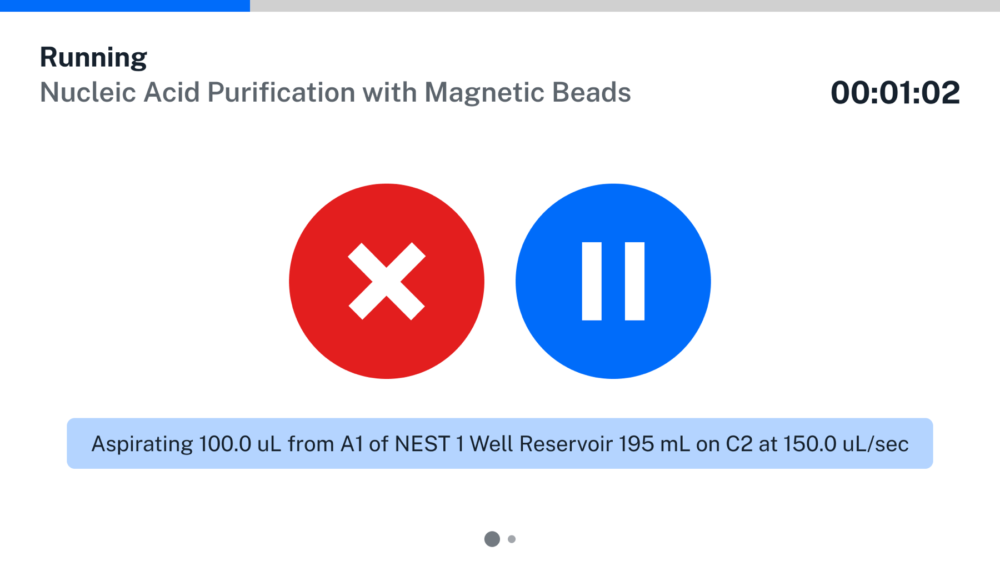
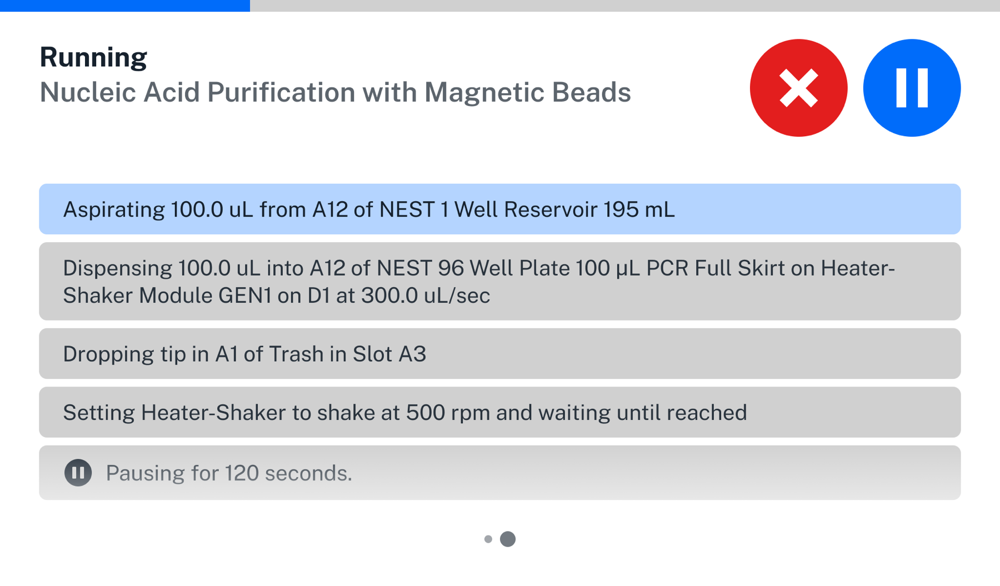
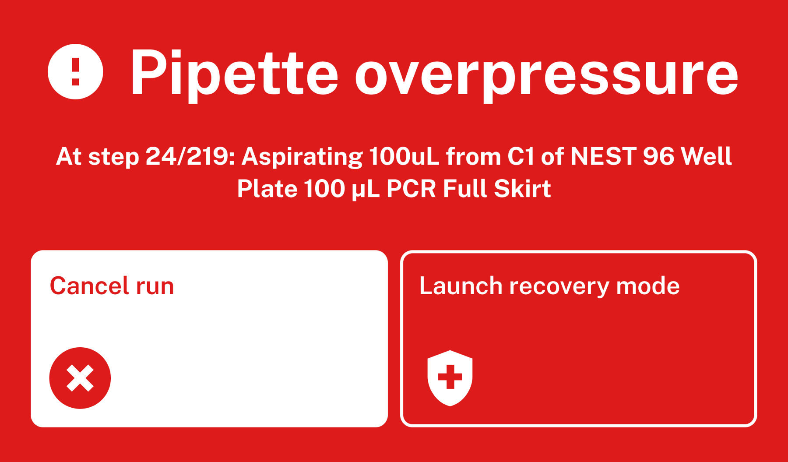
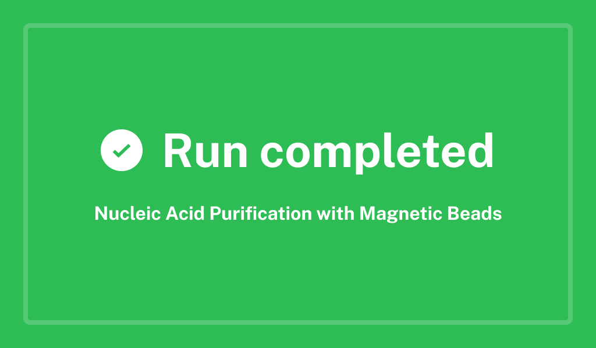
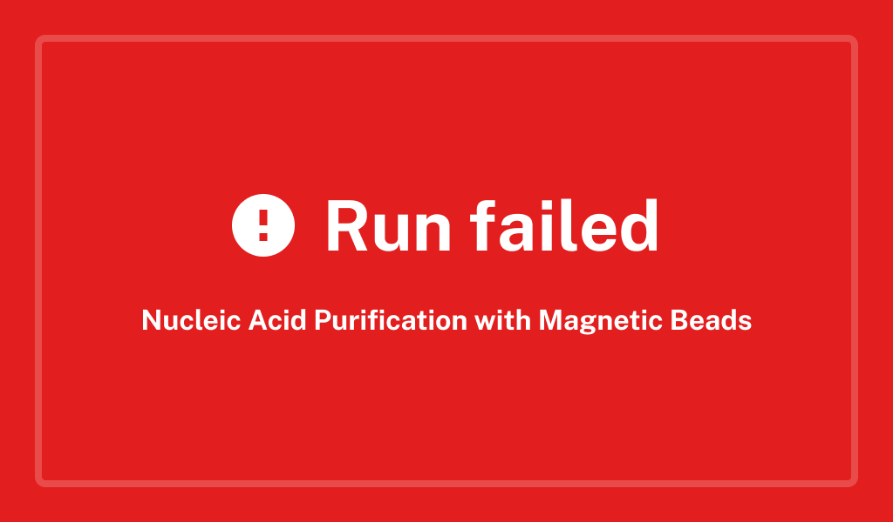
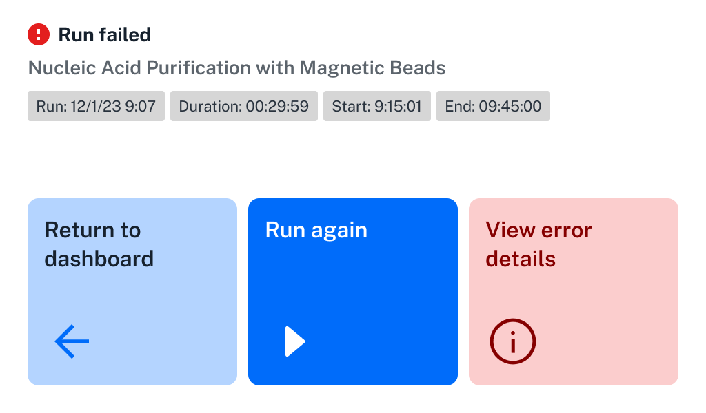
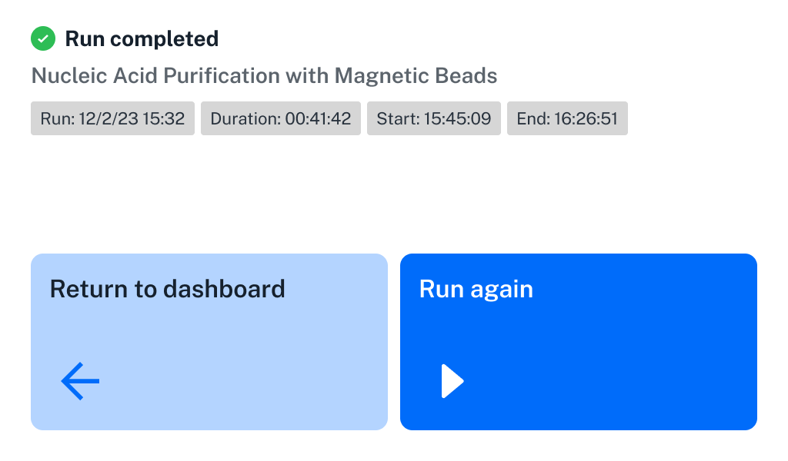

Once everything is set up, begin your run by tapping the play button :material-play-circle: on the "Prepare to run" screen. Flex will begin the protocol and you'll see the Running screen.

## Run Progress

The Running screen gives you quick access to stop and play/pause controls, in case you need to intervene in your protocol. On the default view, these controls are large and only the current step of the protocol is shown.

<figure class="screenshot" markdown>

</figure>

Swipe from right to left to see an alternative view with smaller controls and more protocol steps. The current step will always be at the top of the list.

<figure class="screenshot" markdown>

</figure>

## Error recovery

Starting in robot software version 8.0.0, if something unexpected happens during the protocol run, Flex will pause and give you the option to enter *error recovery mode*. In earlier versions, Flex cancels the run when an error occurs.

Tap **Launch recovery mode** to see options for the particular type of error that has occurred. Instead of just canceling the protocol and forcing a restart, this feature gives you a chance to correct problems like replacing a damaged tip or filling an empty well. Even if you have to cancel a protocol run, error recovery will let you preserve liquids in the pipette and control where tips are dropped. After all, an occasional mistake or problem shouldn't end a procedure with the loss of expensive reagents or valuable samples.

Flex provides a protocol recovery path for the following error conditions.

<table>
  <thead>
    <tr>
      <th>Error type</th>
      <th style="width: 30%;">Description</th>
      <th>Recovery options</th>
    </tr>
  </thead>
  <tbody>
    <tr>
      <td>No liquid detected</td>
      <td>Occurs when a pipette encounters an empty well and expects a liquid to be present.</td>
      <td>
        <ul>
          <li>Manually fill the empty well and retry with the same tips.</li>
          <li>Manually fill the empty well and retry with new tips.</li>
          <li>Manually fill the empty well and skip to the next step.</li>
          <li>Ignore the error and skip to the next step.</li>
          <li>Cancel protocol run.</li>
        </ul>
      </td>
    </tr>
    <tr>
      <td>Pipette overpressure</td>
      <td>Occurs when pressure inside the pipette exceeds the normal range while aspirating or dispensing liquid. Caused by clogged, bent, or sealed tips.</td>
      <td>For aspiration: 
        <ul>
            <li>Retry with new tips.</li>
            <li>Cancel protocol run.</li>
        </ul>
        For dispense:
        <ul>
            <li>Skip to the next step with the same tips.</li>
            <li>Skip to the next step with new tips.</li>
            <li>Cancel protocol run.</li>
        </ul>
      </td>
    </tr>
    <tr>
      <td>General errors</td>
      <td>A catch-all category for other errors.</td>
      <td>
        <ul>
          <li>Retry step.</li>
          <li>Skip to next step.</li>
          <li>Cancel protocol run.</li>
        </ul>
      </td>
    </tr> </tbody>
</table>

!!! note
    The tip presence sensor is disabled for [partial tip pickup](../system-description/pipettes.md#partial-tip-pickup) of 1, 2, or 3 tips. In these configurations, Flex cannot detect tip pickup errors and will not present error recovery options if the pipette fails to pick up the tips. The run will continue unless and until another error occurs.

You can view the status of a finished protocol and review any resolved errors on the run completion screen.

## Run completion

At the end of your protocol, a large "Run completed" or "Run failed" message will take over the touchscreen. These color-coded messages match the LED status bar at the top of the robot and are visible at a distance.

<figure class="side-by-side" markdown>

</figure>

Tap anywhere on either of these screens to go to the run summary screen, which shows information about the protocol run time and next steps. The summary screen always gives you the options to **Return to dashboard** or have the protocol **Run again**. If the run failed, you can also **View error details** and begin the troubleshooting process.

<figure class="screenshot side-by-side" markdown>

</figure>
