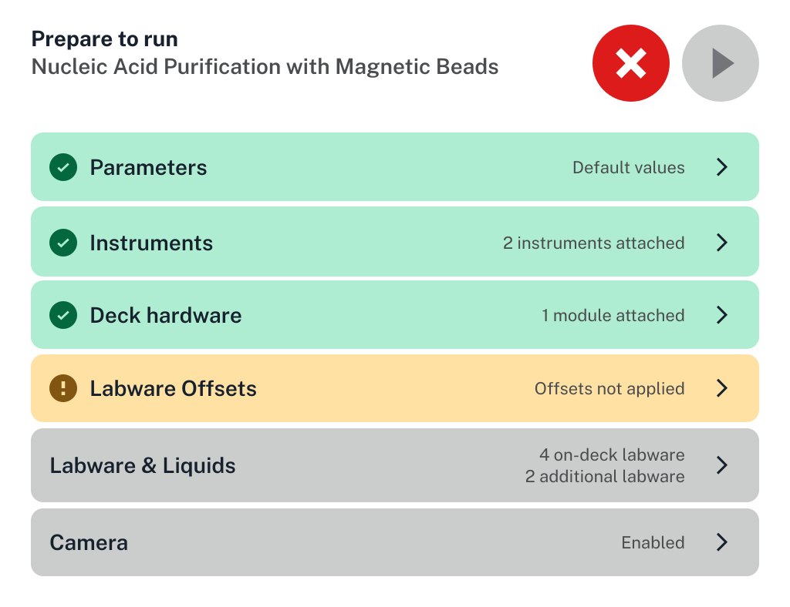
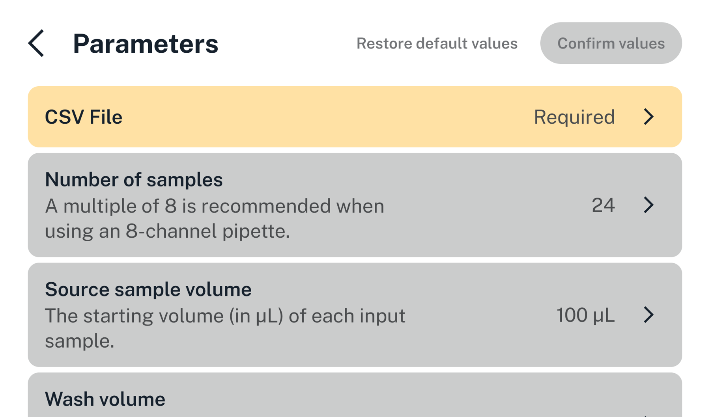
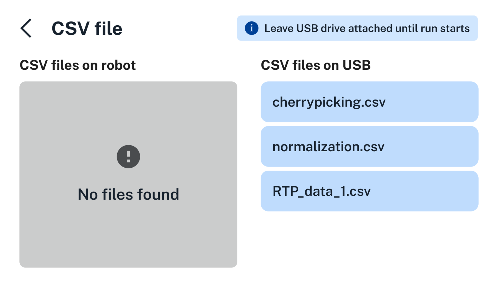
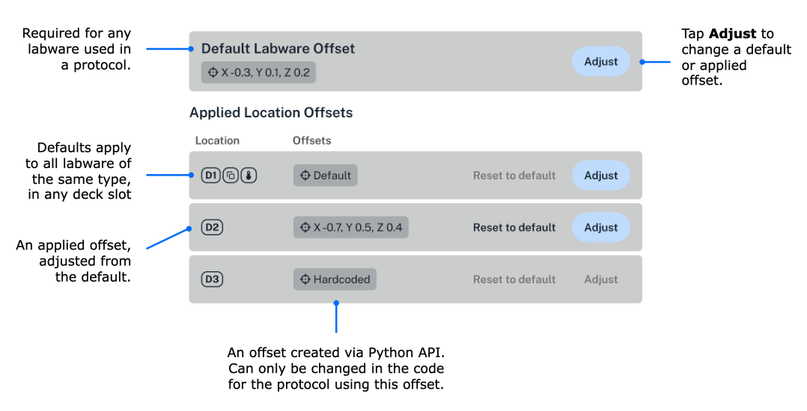
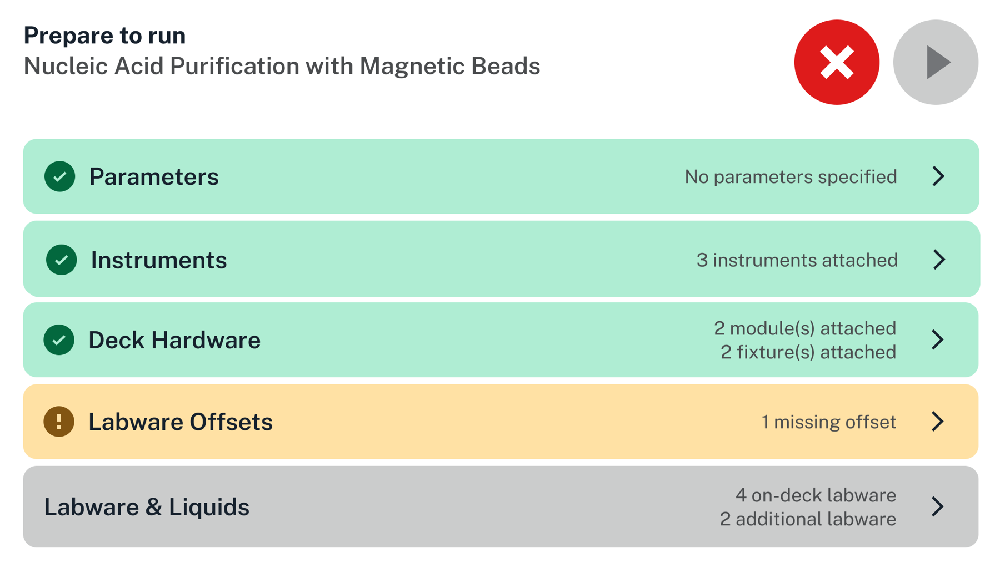
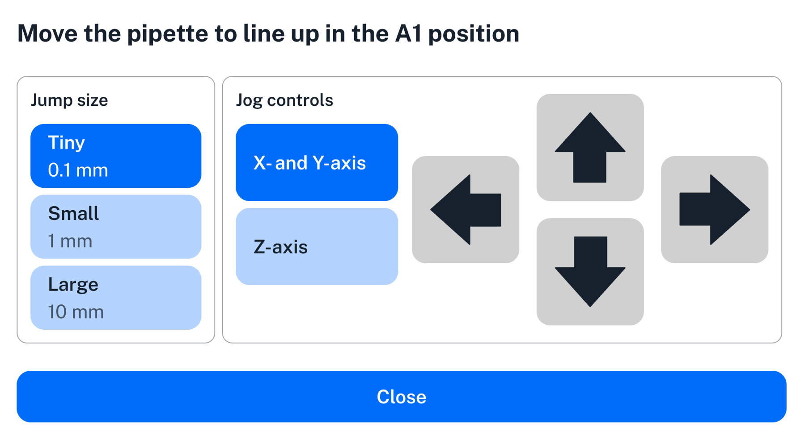

When you start setup for a protocol, you'll see the "Prepare to run" screen, which summarizes all of the requirements for the protocol.

<figure class="screenshot" markdown>

<figcaption>All sections of the "Prepare to run" screen. On the touchscreen, scroll the list to see all sections.</figcaption>
</figure>

If hardware is not connected or calibrated, you will see a warning icon (exclamation point) and the row will be highlighted in orange. If all requirements are met, you will see a checkmark and the row will be highlighted in green.

Tap any row with a right arrow to show more information for that category. (The one exception is tapping Labware Position Check, which begins that process. See the Labware Position Check section below for more details.)

<table>
  <thead>
    <tr>
      <th>Category</th>
      <th>Description</th>
    </tr>
  </thead>
  <tbody>
    <tr>
      <td>Parameters</td>
      <td>
        
Review the names, descriptions, and default values of runtime parameters for the protocol.

        
Tap a parameter to edit its value. See the <a href="#runtime-parameters">Runtime Parameters section</a> for more information.

      </td>
    </tr>
    <tr>
      <td>Instruments</td>
      <td>
        
Verify that all instruments are attached to the correct mounts and calibrated.

        
Tap <strong>Attach</strong> or <strong>Calibrate</strong> to set up any that aren't.

      </td>
    </tr>
    <tr>
      <td>Deck hardware</td>
      <td>
        
Check the physical locations and connection statuses of hardware on the deck.

        <ul>
          <li>Tap  <strong>Setup Instructions</strong> to get detailed instructions.</li>
          <li>Tap <strong>Map View</strong> to switch to a visual layout of hardware positions.</li>
        </ul>
      </td>
    </tr>
    <tr>
      <td>Labware Offsets</td>
      <td>
        
Manage existing offset measurements or run <a href="#labware-offsets-and-position-checking">Labware Position Check</a>.

        <ul>
          <li>Tap <strong>Apply Offsets</strong> to apply offset data to labware.</li>
          <li>Tap <strong>Labware Position Check</strong> to verify or reverify offset data.</li>
        </ul>
      </td>
    </tr>
    <tr>
      <td>Labware &amp; Liquids</td>
      <td>
        
Inspect deck locations alongside the specific types and total volumes of liquids loaded.

        <ul>
          <li>Tap <strong>Map View</strong> or <strong>List View</strong> to switch between a visual map or list of on-deck labware.</li>
          <li>Tap any labware to see a list of well-by-well liquids and volumes.</li>
          <li>Tap <strong>Confirm Placements</strong> to verify labware locations.</li>
        </ul>
      </td>
    </tr>
    <tr>
      <td>Camera</td>
      <td>
        
Take still images with the built-in camera or watch a live video of a protocol in operation.

        
See <a href="../../opentrons-app/camera/">Using the Camera</a> for more information about settings and features for this device.

      </td>
    </tr>
  </tbody>
</table>

On any category screen, return to the "Prepare to run" screen by tapping the back arrow in the top left.

## Runtime parameters

Runtime parameters customize protocols during setup, letting you adjust pipette types, mount positions, aspirate/dispense volumes, labware types, and more—all without writing a new protocol.

<figure class="screenshot" markdown>

</figure>

Tap a configurable parameter to modify it. Different types of touchscreen controls are used for different parameter types.

- **Boolean:** Tap the parameter to toggle its value between On and Off.

- **String and numeric choices:** Choose from a menu of possible values.

- **Numeric range:** Use the onscreen keypad to enter a value within the acceptable range.

- **CSV:** Choose from a file picker.

### Using CSV data

Flex looks for CSV files in the root directory of an attached USB drive or files that were used in a previous run of the same protocol. You can connect a USB drive to any open USB port on Flex, but we recommend using the port below the touchscreen. As shown here, this protocol has no CSV files saved on this robot, but there are several on an attached USB drive. Tap the desired CSV file to use its data into your protocol.

<figure class="screenshot" markdown>

</figure>

When working with CSV files, keep in mind that:

- The touchscreen truncates file names that are longer than 52 characters. You can still upload files with names that exceed the limit.

- The USB drive must use a file system that's readable by the robot. FAT32, NTFS, and ext4 file systems are supported. The HFS+ and APFS file systems are not.

- You must leave the USB drive attached until you start the run, or Flex won't be able to access the CSV data that you chose.

### Confirming runtime parameters

Parameter and CSV file selections are still editable until you tap **Confirm values**. Modifications become read-only after that. To make further adjustments, you'll have to cancel the protocol run and start over.

## Labware offsets and position checking

### Labware offsets
*Labware offsets* are fine-tuned positional coordinates that help your robot align its pipette relative to a specific piece of labware. The release of robot software version 8.4 introduced significant improvements to the labware offset and position checking system.

| Feature | Description |
|----|----|
| Protocol independence | Offsets are positional adjustments associated with a piece of labware, rather than with a specific protocol, and saved on the robot. This allows for greater flexibility and reusability of offset data in any protocol. |
| Default offsets | Default offsets are manually created via Labware Position Check and then automatically applied to each instance of that labware, regardless of deck slot or protocol. This "measure once, set everywhere" feature means you don't have to check offsets for duplicate labware, which helps reduce protocol setup time and effort. |
| Applied offsets | Applied offsets override defaults for a specific piece of labware in a specific deck slot. You can use an applied offset with different protocols, but the labware and deck slot must be the same as the original applied offset. |
| Hardcoded offsets | A hardcoded offset is an offset type typically created by advanced users via the Opentrons Python API. Because these offsets are defined in code (`set_offset`), you cannot change them from the touchscreen or Opentrons App. You’ll need to modify the Python protocol file to change a hardcoded offset. See [Setting Labware Offsets](../../python-api/advanced-control/jupyter.md#setting-labware-offsets). |

### Offsets at-a-glance

This illustration shows how the different types of offsets appear as you're configuring a protocol on the Flex touchscreen.

### Labware Position Check

*Labware Position Check* lets you align a pipette relative to a piece of labware (e.g., a well plate), which helps ensure accurate and reproducible pipetting results.

You must ensure that each piece of labware used in your protocol has a default or applied offset associated with it. As shown in the example below, you cannot run a protocol (the play button is inactive) if it uses labware that is missing offset data.

<figure class="screenshot" markdown>

</figure>

Tap **Labware Offsets** to see which labware is missing an offset and to start Labware Position Check. Refer to the touchscreen or the Opentrons App when running Labware Position Check. It will provide instructions and animations to guide you through this process.

### Jog controls

During Labware Position Check, you’ll use the jog controls to align the pipette with the selected labware.

<figure class="screenshot" markdown>

<figcaption>Jog controls used in Labware Position Check.</figcaption>
</figure>

To use the jog controls:

1. Select a jog control option to set the pipette's axis of movement.
2. Select a jump size to set how far the pipette moves (in mm). You can move the pipette in increments of 0.1, 1, or 10 mm.  Use larger jump sizes to move the pipette quickly, but beware of crashing the pipette into labware.
3. Tap an arrow to move the pipette for your selected direction and distance.
4. Tap **Close** when, in your best judgement, the pipette is optimally aligned with the selected labware.
5. Continue to follow prompts and instructions on the touchscreen to complete the Labware Position Check process.

!!! note
    Labware Position Check corrects for minor, millimeter-scale pipette and labware alignment variations. If you find yourself using it to compensate for large, multi-centimeter offsets, this may suggest an alignment problem related to labware manufacturing defects or incorrect labware definitions. Contact Opentrons Support if you encounter persistent, significant instrument or labware misalignments.