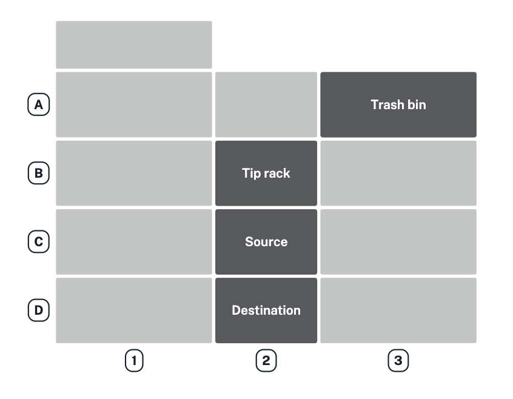
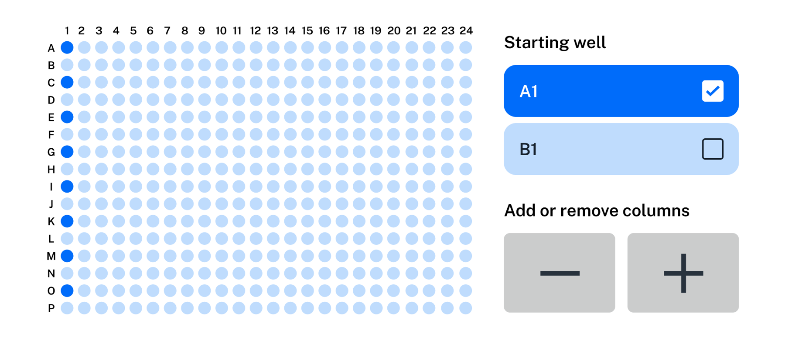
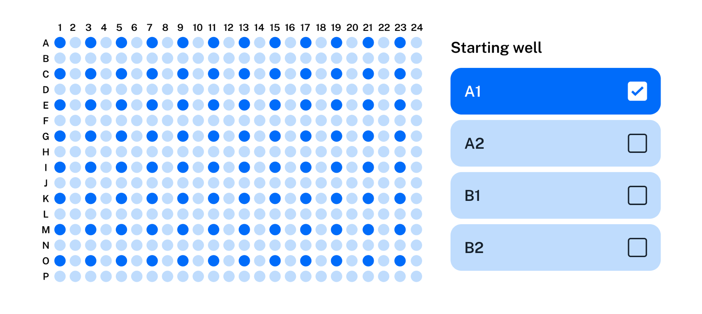

*Quick transfer* is a touchscreen-only feature that lets you create, save, and run simple procedures that move liquid from a source to a destination, all without creating a protocol or writing code. Available starting in robot software version 8.0.0, this feature is ideal for preparing labware you need to use in other, more complex procedures. For example, you can use quick transfers to:

- Provision well plates with a reagent, buffer, or other liquid.

- Consolidate liquid from many wells to one well.

- Distribute liquid from a single well to multiple wells.

- Move culture to growth media or to prepare it for long-term storage.

To get started, tap **+Quick transfer** in the Protocols tab.

<figure class="screenshot" markdown>

</figure>

Tapping **+Quick transfer** starts a guided setup. Follow the instructions on the screen. You can run, save, pin, or delete the transfer when finished.

The remainder of this section goes through quick transfer features in detail.

## Deck slots and hardware requirements

Quick transfers require a Flex pipette, a tip rack in slot B2, source labware in slot C2, and destination labware in slot D2. For tip disposal, quick transfer relies on the robot's [deck configuration](deck-config.md) to determine where the trash bin or waste chute is on the deck. It shows the trash bin in slot A3 if no trash container is configured. You cannot use the gripper, modules, and custom labware in a quick transfer.

<figure class="screenshot" markdown>

</figure>

If everything is set up correctly, you'll move on to selecting pipettes and tips.

## Pipettes and tips

Creating a quick transfer involves selecting a pipette and appropriate tips. Quick transfer can use any 1-, 8-, or 96-channel pipette that's attached to the robot. When selecting a pipette tip, try to match the tip to a pipette of the same capacity or larger. For best performance, use the smallest tips that can hold the amount of liquid you need to aspirate.

Beginning with robot software version 8.6.0, you can apply Opentrons-verified liquid class settings in a quick transfer. Additionally, the release of robot software version 8.8.0 gives you the option to return tips to their original location, which can help you conserve them for future use. After choosing your pipette and tips, select the aqueous, viscous, or volatile liquid class to increase pipetting accuracy.

## Labware

Quick transfer works with most of the labware in the [Opentrons Labware Library](https://labware.opentrons.com/). It omits labware from the source and destination menus when those items are incompatible with the selected pipette. For example, only the 1-channel pipette can aspirate or dispense from tube racks. If you select a multi-channel pipette, quick transfer won't let you choose a tube rack as a source or destination.

## Well selection

Well selection depends upon the pipette and labware you're using. When using a 1-or 8-channel pipette and a 96-well plate, you select individual wells by tapping or tapping and dragging on the touchscreen. Or, when using multi-channel pipettes and high-density well plates, quick transfer provides button controls that let you select columns and well groups instead of individual wells.

For example, these controls let you select wells and columns with an 8-channel pipette and a 384-well plate.

<figure class="screenshot" markdown>

</figure>

And these controls let you select wells and columns with a 96-channel pipette and 384-well plate.

<figure class="screenshot" markdown>

</figure>

Quick transfer checks your pipette, source, and destination choices to prevent incompatible combinations. If you make a mistake while selecting wells, or want to start over, tap **Reset** to clear your selections.

After making instrument and well selections, you'll set the transfer volume and give your new quick transfer a name.

## Transfer volumes and name

You'll set the amount of liquid to transfer (in µL) after specifying the source and destination wells. You'll also have a chance to name the transfer after setting the transfer volume. A good, concise name helps you find a quick transfer in a list of saved or pinned transfers and indicates what it does.

## Advanced settings

These are available after you name a quick transfer and before you save it. If some settings are familiar to you that's because they're the same as those offered in Protocol Designer. Advanced settings are optional; select any that you need or just save or run the transfer.

If your quick transfer will apply liquid class settings, values for your chosen liquid class are shown for each advanced setting. You can still make changes before moving to the next step. 

| Setting {style="width: 25%;"} | Description |
|----------|-------------|
| Aspirate and dispense flow rates | Set how quickly the pipette will aspirate or dispense, in µL/s.|
| Pipette path           | Choose how the pipette moves between wells. Options include: <ul><li>single transfer (1 well to 1 well)</li><li>multi-aspirate (many wells to 1 well)</li><li>multi-dispense (1 well to many wells)</li></ul> |
| Tip position           | Change where in the well the pipette aspirates or dispenses. By default, the robot positions the tip 1 mm from the bottom center of a well. |
| Pre-wet tip            | Pre-wet the pipette tip by aspirating and dispensing ⅔ of the tip's maximum volume. |
| Mix                    | Aspirate and dispense repeatedly from a single location. Used to mix the contents of a well together. |
| Delay                  | Adds a timed delay (in seconds) before an aspirate or dispense action. |
| Touch tip              | Move the pipette so the tip touches the wall of a well. Used to help knock off any droplets that might cling to the pipette's tip. Not supported on all labware. |
| Air gap                | When used during aspiration, draw in extra air after the liquid. When used during dispense, draw in extra air before moving to the trash container to dispose of the tip. Used to prevent liquid from leaking out of the pipette tip. |
| Blowout                | Blow an extra amount of air through the tip to clear it. The pipette can blow out into the trash bin, source well, or destination well. |
| Change tip             | Replace the tip at the start of the transfer, before every aspirate, or per source well. |

## Managing transfers

Click **Create Transfer** when you're satisfied with your transfer settings. After creating a quick transfer, you can run, save, or delete it.

You can find all your quick transfer protocols in the Protocols tab. 

!!! note
    Flex can store a maximum of 20 unique protocols, including quick transfers. It automatically deletes older protocols to maintain this limit.  

- Long press a saved quick transfer to run it, pin it, or delete it. Flex pins a maximum of 8 protocols, including quick transfers.

- Long press a pinned transfer to run it, un-pin it (returns it to the saved list), or delete it.

<figure class="screenshot" markdown>

</figure>

