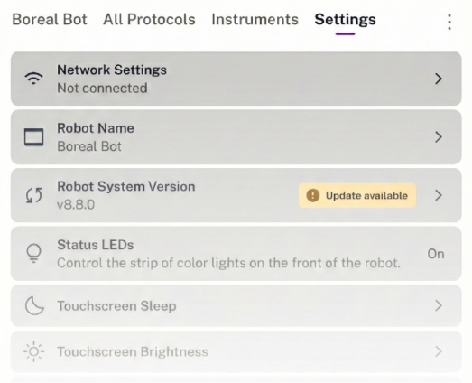

The Settings screen provides additional controls you can use to customize the behavior of your Flex. Tap a setting to toggle it on or off, or to open another screen that displays related adjustment controls.

<figure class="screenshot" markdown>

<figcaption>Examples of some configurable options and features.</figcaption>
</figure>

The following sections summarize the currently available settings.

## Setup

All of these settings are covered when you [first set up your Flex](../installation/first-run.md). However, you can change them at any time.

### Language

Set the language used by the touchscreen to Chinese or English.

### Network Settings

View the status of or set up a Wi-Fi, Ethernet, or USB connection. Multiple connections can be active simultaneously.

### Robot Name

Change the name of your Flex. The robot name appears on the touchscreen dashboard and in the Opentrons App.

### Robot System Version

See the current version of the robot software or check for updates. If Flex has already automatically checked for updates and found one, this item will have an "Update available" badge in the settings list.

## Display

These settings let you control how the robot displays information about its working status and operation.

### Status Light

The [status light][status-light-flex] is a strip of LEDs along the top front of the Flex. It provides at-a-glance information about the robot. Different colors and patterns of illumination can communicate various success, failure, or idle states.

### Touchscreen Brightness

Set the screen's brightness to one of six levels by tapping **−** or **+**.

### Touchscreen Sleep

Set how long the touchscreen should remain on when idle. When the screen is asleep, tap it once to wake it. Sleep options are:

- Never (default)
- 3 minutes
- 5 minutes
- 10 minutes
- 15 minutes
- 30 minutes
- 1 hour

## Advanced

These settings aren't required for everyday operation but can be useful for troubleshooting or testing pre-release features.

### Developer Tools

Enable additional tools and features designed for developers. Not recommended for use unless instructed by Opentrons Support.

### Device Reset

Batch delete certain types of information from the robot, such as calibrations, run history, or protocols.

### Disable Stacker sensors for labware detection in z- and x-axis

Controls the _Time of Flight_ (ToF) sensor in the Flex Stacker. By default, the ToF sensor detects if labware is loaded in the Stacker before this external module attempts to dispense or store it.

You should disable this setting only when using specialized labware that causes detection errors (false positives or negatives). Sometimes these errors can occur with labware that is opaque or has an irregular shape that interferes with the sensor's ability to "see" labware in the Stacker.

!!! note
    When disabled, the Stacker will always try to store or dispense labware, even if it is empty.

### Home Gantry on Restart

By default, the gantry moves to its home position any time you turn on Flex. Only disable this behavior if you have a reason that the gantry must remain stationary after powering on.

### Recovery Mode

Turns [error recovery][error-recovery] on and off. Error recovery mode pauses the active protocol and gives you a chance to fix a problem if something unexpected happens during the run.

### Update Channel

Choose whether to receive stable or beta software updates.

## Camera

Every Flex comes equipped with a [built-in camera][camera-features-and-controls], which is off by default. Camera options include on/off settings for still photographs, video, and on-error image capture.

## Privacy

Choose what data you want Flex to share with Opentrons. This information is always anonymized and we only use it to improve our products.

Flex records what it's doing in several log files that are stored on the robot. These logs are grouped into two categories for privacy opt-in purposes:

- **Robot Logs:** Data about robot server activities, executed API commands, and interactions with attached modules.

- **Display Usage:** Data about how the touchscreen draws its graphics.

If you opt out of automatic data sharing, you can still download Flex log files for your own use or to send them to Opentrons Support for troubleshooting. See [Downloading Flex Log Files](../advanced-operation/log-files.md#downloading-flex-log-files) for instructions.

!!! note
    There are separate privacy controls in the Opentrons App. Turning sharing on or off from the touchscreen only affects data collected and sent by the robot. Your laptop or desktop computer will still automatically share data if this feature is enabled in the Opentrons App.
