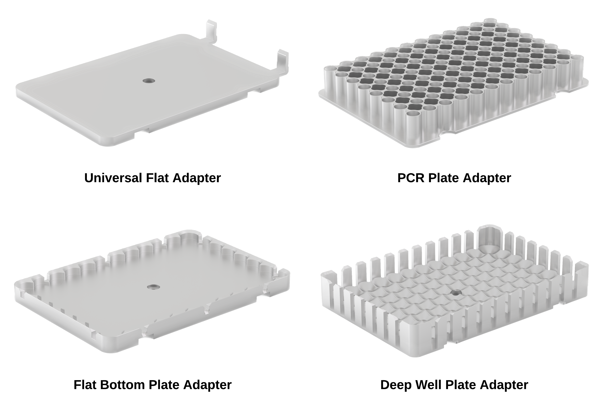
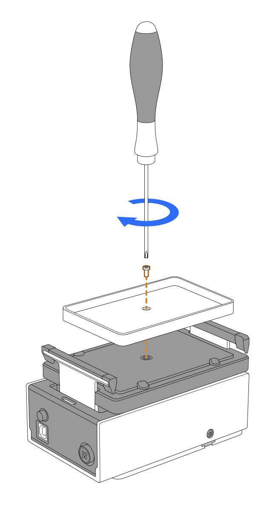
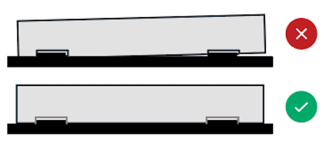

# Thermal Adapters

Aluminum thermal adapters help transfer heat from the Heater-Shaker to attached labware. The module comes with your choice of a universal flat adapter, a PCR well plate adapter, a 96-well flat bottom adapter, or a deep well adapter. You can also purchase additional adapters directly from the [modules section](https://opentrons.com/products/categories/modules) of the Opentrons website.

## Supported Labware

The listed thermal adapters are only compatible with the following labware.

| Labware | API Load Name |
| ---- | ---- |
| [NEST 96 Well Plate 100 µL PCR Full Skirt][nest100] | `nest_96_wellplate_100ul_pcr_full_skirt` |
| [NEST 96 Well Plate 200 µL Flat][nest200] | `nest_96_wellplate_200ul_flat` |
| [NEST 96 Deep Well Plate 2 mL][nestDeepWell] | `nest_96_wellplate_2ml_deep` |
| [Opentrons Tough 96 Well Plate 200 µL PCR Full Skirt][opentronsTough] | `opentrons_96_wellplate_200ul_pcr_full_skirt` |
| [Corning 384 Well Plate 112 µL Flat][corning384] | `corning_384_wellplate_112ul_flat` |

<!-- Reference links keep the table above tidy and neat -->
[nest100]: https://labware.opentrons.com/nest_96_wellplate_100ul_pcr_full_skirt?category=wellPlate#/?loadName=nest_96_wellplate_100ul_pcr_full_skirt
[nest200]: https://labware.opentrons.com/nest_96_wellplate_100ul_pcr_full_skirt?category=wellPlate#/?loadName=nest_96_wellplate_200ul_flat
[nestDeepWell]: https://labware.opentrons.com/nest_96_wellplate_100ul_pcr_full_skirt?category=wellPlate#/?loadName=nest_96_wellplate_2ml_deep
[opentronsTough]: https://labware.opentrons.com/nest_96_wellplate_100ul_pcr_full_skirt?category=wellPlate#/?loadName=opentrons_96_wellplate_200ul_pcr_full_skirt
[corning384]: https://labware.opentrons.com/nest_96_wellplate_100ul_pcr_full_skirt?category=wellPlate#/?loadName=corning_384_wellplate_112ul_flat

The Universal Flat Bottom Plate Adapter works with most flat- bottom ANSI/SLAS automation compliant labware. For more information, see the [JSON Labware Schema section](../flex/labware/definitions.md#json-labware-schema) in the Labware chapter of the Flex Instruction Manual.

## Attaching a Thermal Adapter

1. Use the included T10 Torx screwdriver and Thermal Adapter Screw to attach your chosen adapter to the module.

    !!!warning
        Using a different screwdriver can strip the screws. Using different screws can damage the module.

{style="width: 60%; margin-left: 0;"}

2. Check the alignment of the thermal adapter. If properly attached, it will sit flush to the surface of the module.

    

3. Verify that the adapter is firmly attached. The adapter is secure when it doesn’t move while gently pulling on it and rocking it from side to side.

