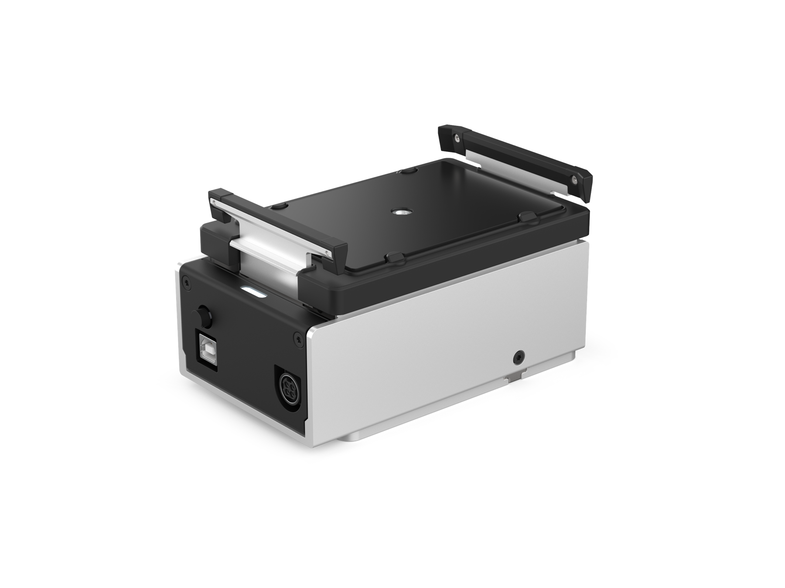

# Heater-Shaker Module GEN1 Instruction Manual

**Opentrons Labworks Inc.** 
April 2026

## Product Description

The Opentrons Heater-Shaker Module GEN1 provides on-deck heating and orbital shaking. The Heater-Shaker can heat samples to 95 °C and shake them at speeds ranging from 200 to 3000 rpm. It is compatible with the Opentrons Flex and OT-2 liquid handling robots and selected flat, deep-well, and 96-well plates. The Heater-Shaker can also be used alongside other Opentrons modules and with the Opentrons Flex Gripper.
