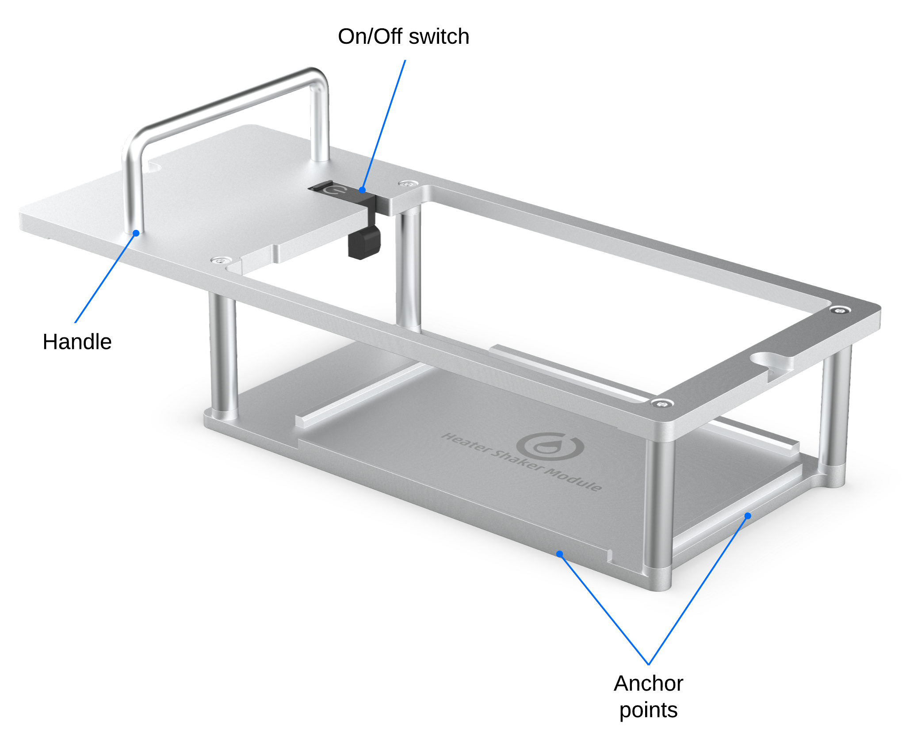
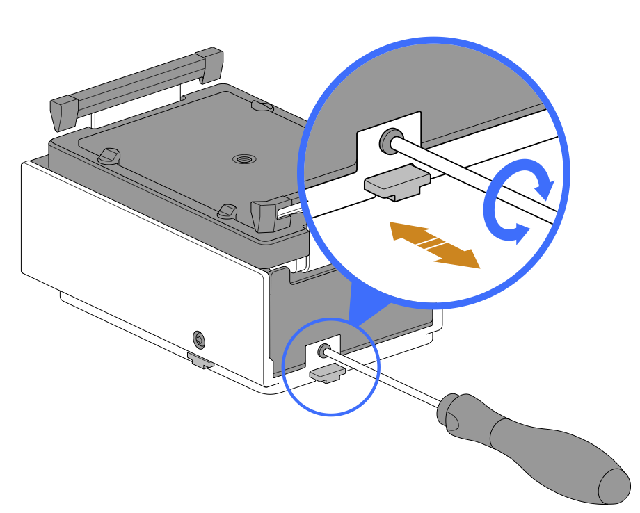
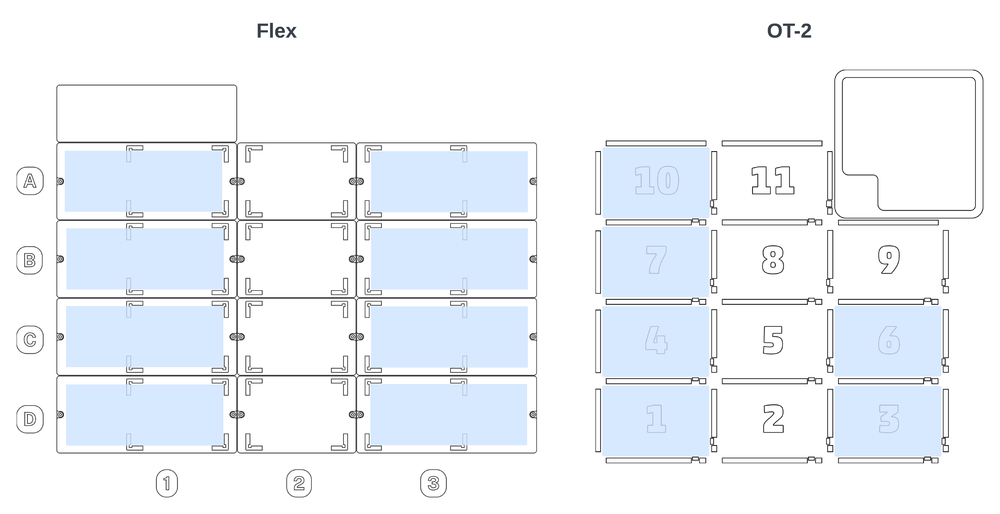

# Before You Begin

Review this section for important information about deck placement, alignment, and anchor adjustments for the Heater-Shaker.

## Flex Caddies

When used with a Flex robot, the Heater-Shaker fits into a caddy that occupies space below the deck. The caddy places your labware closer to the deck surface and allows for below-deck cable routing. See the Caddies section in Chapter 4 of the Flex Instruction Manual for more information.

Caddies are available for purchase from the [Modules section](https://opentrons.com/products/categories/modules) of the Opentrons website.

The OT-2 does not use caddies. The module clips directly to the deck. However, you still need to secure the Heater-Shaker with its anchors when used with an OT-2.

## Anchor Adjustments

Anchors are screw-adjustable panels on the Heater-Shaker module. They provide the clamping force that secures the module to its caddy or to the deck when mounted on a Flex or OT-2. Use the T10 Torx screwdriver that comes with the module to adjust the anchors.

- Loosen the anchors...
- Tighten the anchors...

Before installation:

- Check the anchors to make sure they’re flush with the base of the Heater-Shaker.
- If the anchors interfere with installing the module, adjust them until there’s enough clearance to seat the module and tighten them to hold it in place.

## Deck Placement and Cable Alignment

The supported deck slot positions for the Heater-Shaker depend on the robot you’re using.

| Robot Model | Deck Placement |
|----|----|
| Flex | In any slot in column 1 or 3. The module can go in slot A3, but you need to remove the trash bin first. |
| OT-2 | In deck slots 1, 3, 4, 6, 7, or 10. |

To properly align the Heater-Shaker relative to the robot, make sure the module’s power and USB ports face outward, away from the center of the deck. This helps make cable routing and access easier.

<table>
  <thead>
    <tr>
      <th>Robot Model</th>
      <th>Deck Placement</th>
    </tr>
  </thead>
  <tbody>
    <tr>
      <td>Flex</td>
      <td>
        <ul>
          <li>Facing left in column 1.</li>
          <li>Facing right in column 3.</li>
        </ul>
      </td>
    </tr>
    <tr>
      <td>OT-2</td>
      <td>
        <ul>
          <li>Facing left in slot 1, 4, 7, or 10.</li>
          <li>Facing right in slot 3 or 6.</li>
        </ul>
      </td>
    </tr>
  </tbody>
</table>

Do not install the Heater-Shaker with the ports facing in, towards the middle of the deck. This alignment makes cable routing and access difficult.
