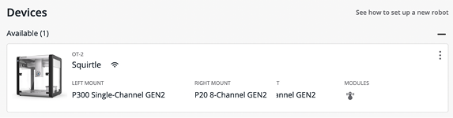
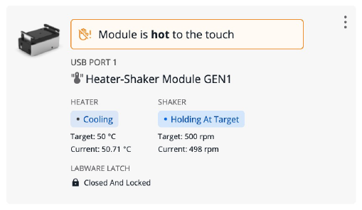
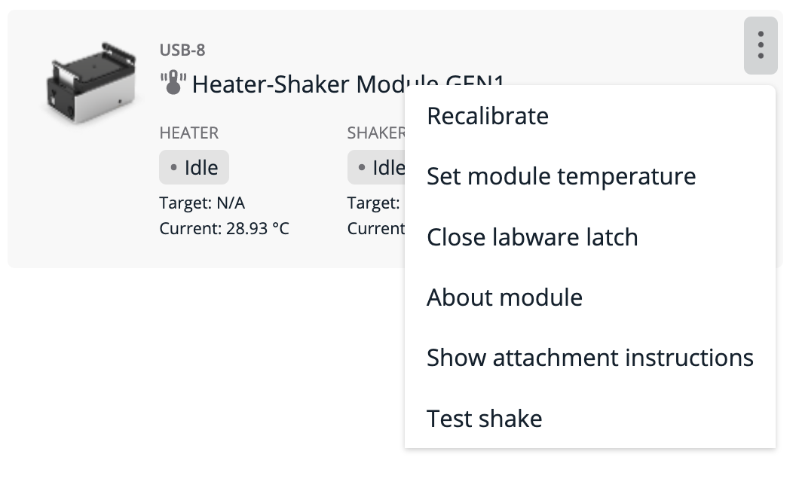

# Software Control

You control the Heater-Shaker through protocols you create in [Opentrons Protocol Designer](https://designer.opentrons.com/) or the [Python API](https://docs.opentrons.com/v2/modules/heater_shaker.html#heater-shaker-module). Running these protocols requires version 6.1.0 or newer of the [Opentrons App](https://opentrons.com/ot-app) and robot server.

The Opentrons App displays the current status of the Heater-Shaker and can also control the module outside of protocols. To control a Heater-Shaker, go to the **Devices** tab and select a robot that has a Heater-Shaker connected to it. Robots with a connected and powered on Heater-Shaker will display a thermometer icon  under the modules section of the device card.

<figure class="screenshot" markdown>

</figure>

On the device detail page, a module card shows the current status
of the Heater-Shaker, including:

- Whether it is heating, cooling, or holding at the target temperature. A warning banner appears if the module is hot to the touch (>49 °C).
- The target (if set) and current temperature.
- Whether the module is speeding up, slowing down, or holding at the target shake speed.
- The target (if set) and current shake speed.
- Whether the labware latch is open or closed.

<figure class="screenshot" markdown>

</figure>

On the module card, you can click the three-dot menu (⋮) to see other controls for the Heater-Shaker. These options let you control the heater, shaker, and labware latch independently. You can also view information about the module, including its serial number, firmware version, or launch the in-app attachment guide.

<figure class="screenshot" markdown>

</figure>
