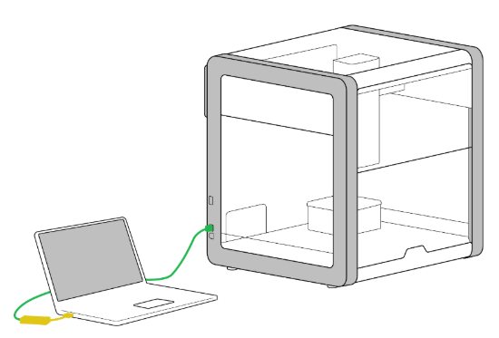
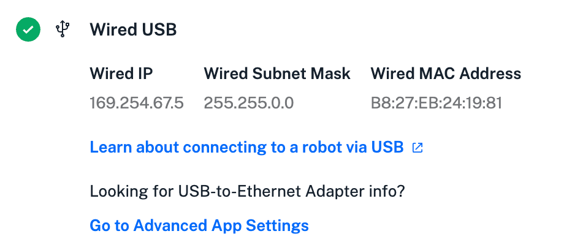

The OT-2 gives you command-line access to its operating system through a Secure Shell (SSH) terminal connection. Terminal access lets you:

- Run protocols directly via the [Python API and command line](../../python-api/advanced-control/command-line.md).
- Perform advanced tasks like customizing the robot's Python environment.
- Execute protocols that reference external files on disk (apart from custom labware definition files).

An SSH key is required to perform these tasks and to issue commands from the terminal. The instructions below will show you how to create a key and connect to an OT-2 through a terminal window.

## Before you begin

The OT-2 requires an Ethernet connection to generate an IP address and to register a security key. This means you cannot use a wireless connection for SSH. Instead, you must connect your computer to the robot with an Ethernet cable before working through the steps in this procedure.



If you're using a computer without an Ethernet port, make this connection using the dongle that shipped with your OT-2 or another adapter with an Ethernet port.

## Create an SSH key

Follow these steps to create an SSH key on your Mac, Windows, or Linux computer:

<div class="instruction-list" markdown>

1. Open a terminal window and run the following command:

    ```bash
    ssh-keygen -f ot2_ssh_key -t ecdsa
    ```

2. Create a passphrase when prompted. A passphrase is not required, but it is recommended for extra security.

## Get the robot's IP address

3. From the Opentrons OT-2 App, click **Devices** and locate the robot that you want to work with.

4. Click the three-dot menu (⋮) for that robot and then click **Robot settings**.

5. Click the **Networking** tab. Copy the **Wired IP** address for your OT-2. The IP address is required to install the key.

    <figure class="screenshot" markdown>
    { width="80%" }
    </figure>

## Install and verify the key

6. Type the command shown below in the terminal window. Replace `ROBOT_IP` with the IP address of your OT-2.

    
    curl \
    -H "Content-Type: application/json" \
    -d "{\"key\":\"$(cat ot2_ssh_key.pub)\"}" \
    http://ROBOT_IP:31950/server/ssh_keys
    ```

    When successful, the robot responds with a message that the key has been added.

7. Type the command shown below in the terminal window to establish the connection. Replace `ROBOT_IP` with the IP address of your OT-2.

    ```
    ssh -i ot2_ssh_key root@ROBOT_IP
    ```

    !!! note
        The first time you connect, the terminal will:

        * Show a message indicating the authenticity of the host can't be established. Ignore the message.
        * Ask if you want to continue. Type the full word `yes` and press **Enter** or **Return** to continue.

8. Verify the connection. The terminal will show ASCII art that spells "OT2" when the connection is successful.

    ```
          @@@@@    @@@@@
        @@@@          @@@@
       @@@      @@      @@@    @@@@@@   @@@@@
      @@@      @@@@      @@@   @@@@@@  &@' '@@
      @@     @@@@@@@@    &@@     @@         @@
      @@    .@@@    @    #@@     @@        @@
      @@@    @      @    @@@     @@       @@
       @@@    @@..@@    @@@      @@      @@
        @@@@          @@@@       @@     @@@@@&
          @@@@@@@@@@@@@@         ##    &@@@@@#
              @@@@@@.
    ```

</div>

You can now interact with the OT-2 via the terminal.