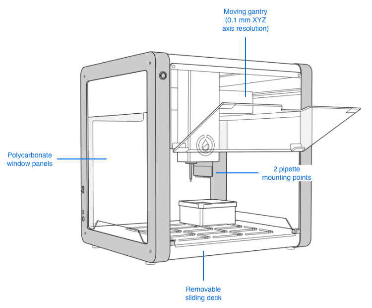

## Product elements
<!-- looks good enough; tried side by side -->
### OT-2 features

### Deck features

## Box contents

- (1) OT-2
- (2) Side Window Panels
- (1) Rear Window Panel
- (1) Power Supply (36V/6A)
- (1) Regional IEC Power Cable
- (1) Ethernet Cable
- (1) Ethernet-to-USB Dongle (connects the OT-2 to a laptop)
- (1) 2.5 mm Hex Screwdriver
- (1) 14 mm Wrench
- (1) T10 Torx
- (4) L-keys (1.5 mm, 2 mm, 2.5 mm, 3 mm)
- (1) Super Lube (silicone-based lubricant)
- (2) M3 Hex Nut
- (2) M4 Square Nut