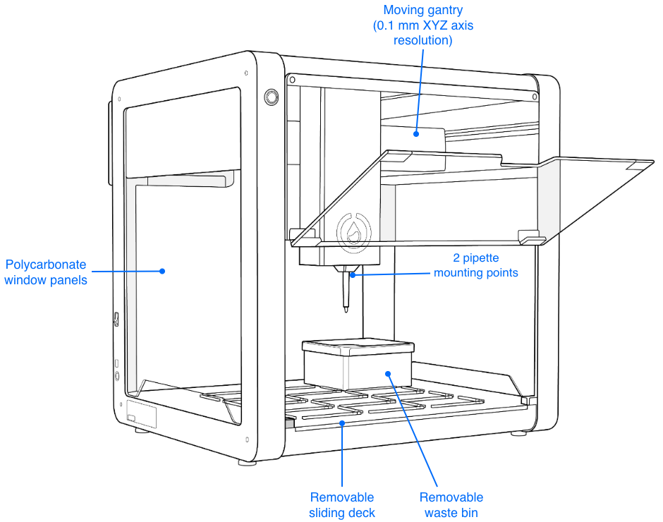
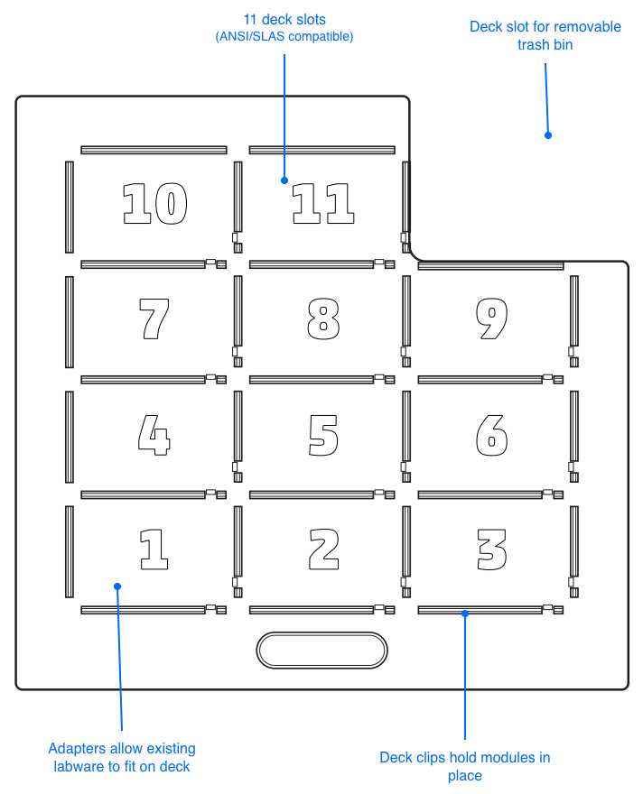

## Product elements
<!-- looks good enough; tried side by side -->
### OT-2 features

### Deck features

## Box contents

The OT-2 ships with the components listed below. Additional pipettes and modules ship separately.

<figure markdown>

<figcaption>(1) Opentrons OT-2 robot</figcaption>
</figure>

<figure markdown>

<figcaption>(3) Window Covers</figcaption>
</figure>

<figure markdown>

<figcaption>(1) External Power Supply</figcaption>
</figure>

<figure markdown>

<figcaption>(1) IEC Power Cable</figcaption>
</figure>

<figure markdown>

<figcaption>(1) Ethernet Cable</figcaption>
</figure>

<figure markdown>

<figcaption>(1) Ethernet-USB Adapter</figcaption>
</figure>

<figure markdown>

<figcaption>(1) 2.5 mm Hex Screwdriver</figcaption>
</figure>

<figure markdown>

<figcaption>(1) 14 mm Wrench</figcaption>
</figure>

<figure markdown>

<figcaption>(1) T10 Torx</figcaption>
</figure>

<figure markdown>

<figcaption>(4) Hex Keys (1.5 mm, 2 mm, 2.5 mm, 3 mm)</figcaption>
</figure>

<figure markdown>

<figcaption>(1) Silicone Lubricant</figcaption>
</figure>

<figure markdown>

<figcaption>(2) M3 Hex Nuts</figcaption>
</figure>

<figure markdown>

<figcaption>(2) M4 Square Nuts</figcaption>
</figure>

<figure markdown>

<figcaption>(4) Window Screws, Washers, and O-rings</figcaption>
</figure>

<figure markdown>

<figcaption>(4) Pipette screws</figcaption>
</figure>

<figure markdown>

<figcaption>(1) Trash Bin</figcaption>
</figure>

<figure markdown>

<figcaption>(1) Calibration Block</figcaption>
</figure>

