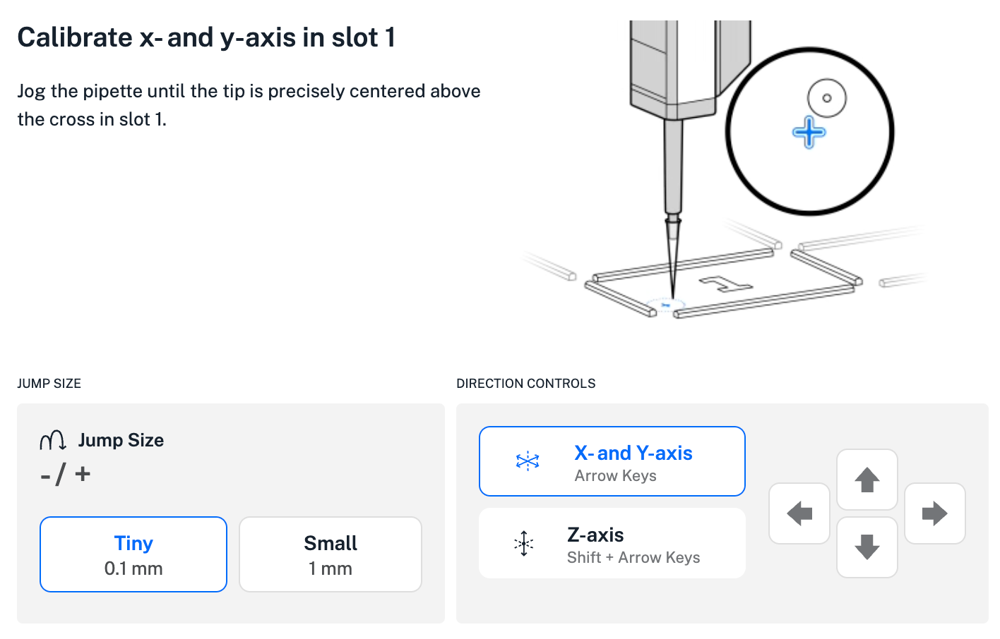
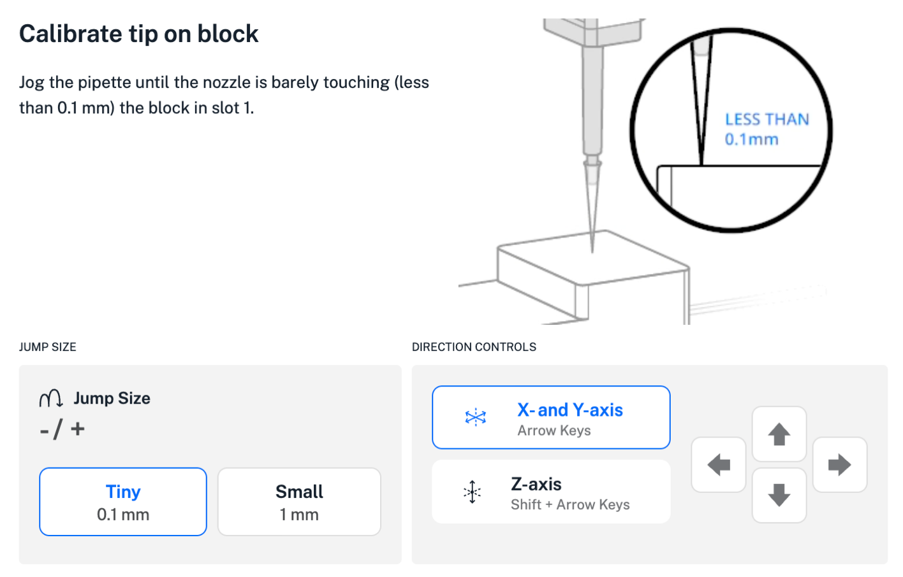
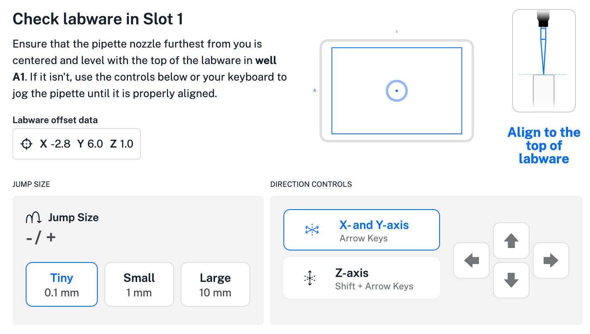
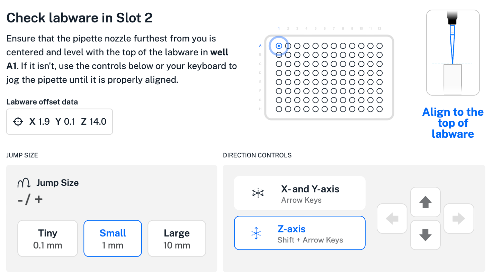

The Opentrons OT-2 App displays various _jog controls_ while you perform robot calibrations or run Labware Position Check. These are movement controls that allow you to make fine adjustments along the X, Y, and Z-axes for better alignment with the deck, labware, and modules.

## Jog control examples

Jog controls vary slightly depending on the procedure. To help you navigate these differences, the Opentrons OT-2 App includes text, animations, and visual indicators that show you how to use the jog controls during each alignment step. This information helps ensure you can move the pipette in the right direction and precise distance needed for accurate calibration.

<figure class="screenshot side-by-side" markdown>

<figcaption>Examples of robot calibration jog controls.</figcaption>
</figure>

<figure class="screenshot side-by-side" markdown>

<figcaption>Examples of Labware Position Check jog controls.</figcaption>
</figure>

You may not always need to jog the pipette. Sometimes the robot knows how to align with its deck, labware, or modules. In these cases, simply confirm the position to proceed.

## Using jog controls

To use the jog controls:

1. Select **X- and Y-axis** to move the pipette horizontally, or **Z-axis** to move the pipette vertically.
2. Select a jump size to set how far the pipette moves (in mm). You can move the pipette in increments of 0.1, 1, or 10 mm. Use larger jump sizes to move the pipette quickly, but beware of crashing the pipette.
3. Click an arrow to move the pipette for your selected direction and distance.
4. Click the confirmation button when, in your best judgment, the pipette is optimally aligned with its target.
5. Continue to follow prompts and instructions in the Opentrons OT-2 App to complete the selected calibration process.

