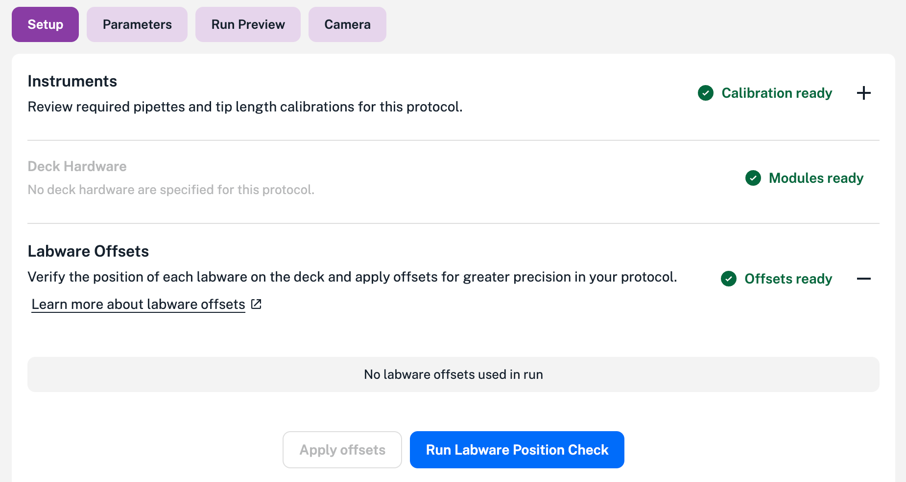
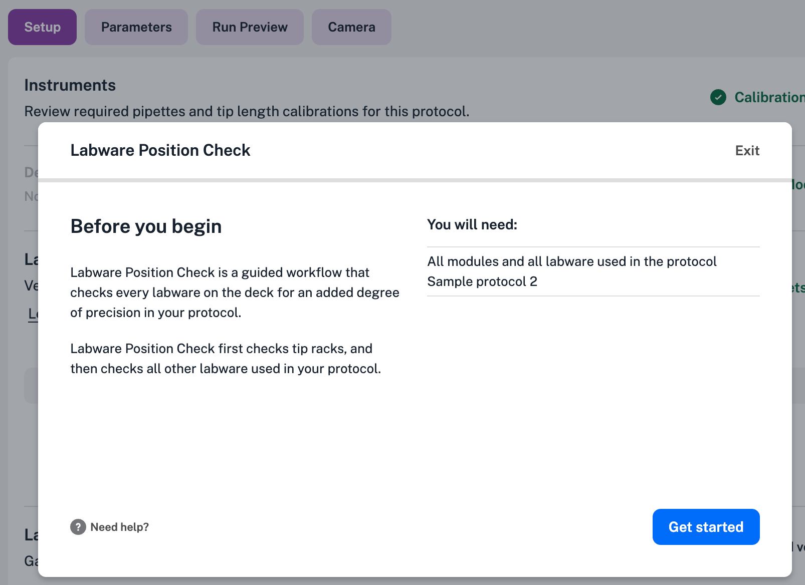

Labware calibration helps the OT-2 match the physical dimensions and deck locations of labware with their corresponding definitions in the robot's software. Labware offsets and the Labware Position Check are the two procedures that comprise labware calibration.

## Labware offsets

Labware offsets are fine-tuned positional coordinates that help the OT-2 align its pipette relative to a specific piece of labware. A key feature of these offsets is protocol independence: because offset data is associated with the physical labware and saved directly on the robot, you can reuse the same offsets across different protocols.

Depending on how they are created and used, offsets fall into three categories:

| Offset&nbsp;type | Description |
| :--- | :--- |
| **Default** | Created manually via Labware Position Check and automatically applied to every instance of that labware. This "measure once, set everywhere" approach reduces setup time for duplicate labware across any deck slot or protocol. |
| **Applied** | Overrides a default offset for a specific piece of labware in a specific deck slot. You can reuse this offset in other protocols, but only for that exact labware-and-slot combination. |
| **Hardcoded** | Defined directly in Python API protocols using `set_offset`. Because these offsets are written into the code, they cannot be adjusted via the Opentrons App or touchscreen; you must edit the Python script. See [Setting Labware Offsets](../../python-api/advanced-control/jupyter.md#setting-labware-offsets).. |

This illustration shows offsets applied to a tip rack, reservoir, and well plate used in a protocol. Clicking **Run Labware Position Check** will let you recalibrate labware if needed.

<figure class="screenshot" markdown>

<figcaption>Applied offsets shown in the Opentrons App.</figcaption>
</figure>

## Labware Position Check

Labware Position Check is the process used to align a pipette to a specific piece of labware. You must ensure that each piece of labware used in your protocol has a default or applied offset associated with it.

!!! note
    Labware Position Check is designed to correct minor, millimeter-scale variations. If you need to compensate for multi-centimeter offsets, you may have an incorrect labware definition or a defect. For persistent misalignment issues, contact Opentrons Support.

## Running Labware Position Check

The Labware Position Check is a guided workflow that's similar to the [robot calibration procedure](./robot-calibration.md). You work through this process after importing a protocol. To run Labware Position Check:

1. From the Setup tab of an imported protocol, expand the Labware Offsets section, and click **Run Labware Position Check**.

    <figure class="screenshot" markdown>
    
    <figcaption>Starting the Labware Position Check from the protocol setup screen.</figcaption>
    </figure>

2. Click **Get started** to start Labware Position Check. Make sure all your required labware is mounted on the deck and in the location specified by your protocol.

    <figure class="screenshot" markdown>
    
    <figcaption>The Labware Position Check splash screen.</figcaption>
    </figure>

3. Follow the instructions shown on the screen. As you go through each step in the process you'll verify the type and location of labware used in your protocol and use the [jog controls](./jog-controls.md) to align the pipette with that labware.

4. Click **Complete** to finish Labare Position Check.

    <figure class="screenshot" markdown>
    
    <figcaption>Successfully completing the Labware Position Check.</figcaption>
    </figure>

Upon completion, the app returns you to the Setup screen for your protocol. At this point, you can choose your own adventure by running the protocol or re-running Labware Position Check.