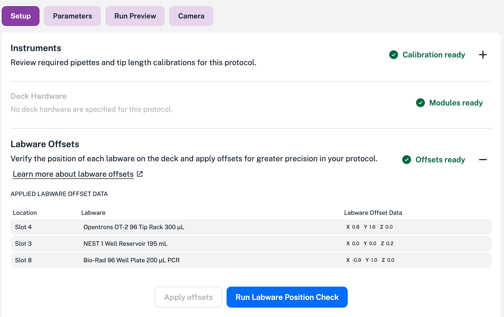
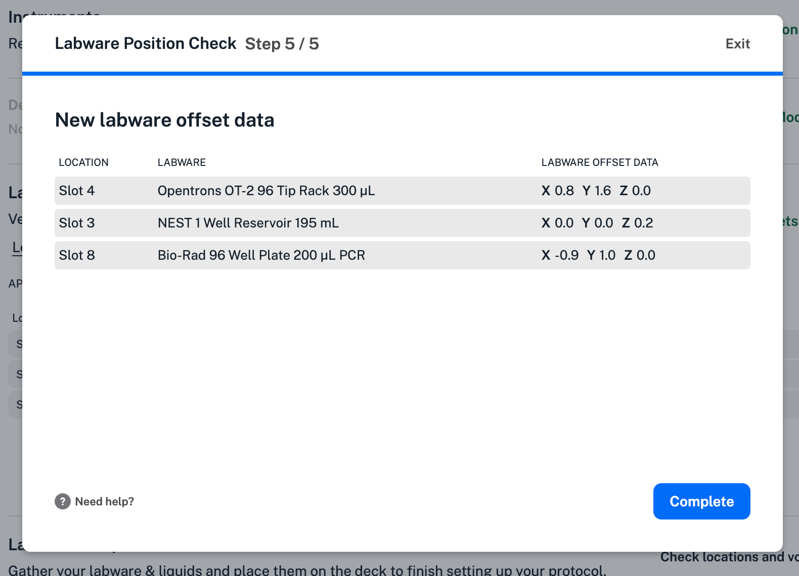

Labware offsets are fine-tuned positional coordinates that help the OT-2 align a pipette relative to a specific piece of labware used in a protocol. _Labware Position Check_ is the procedure your OT-2 runs to create these offset measurements.

You can reuse labware offsets in other protocols, but only for an exact labware-and-slot combination. Opentrons recommends running Labware Position Check before every protocol run to help ensure positional accuracy.

You can also define offsets directly in Python API protocols using `set_offset`. However, because these offsets are written into the code, they cannot be adjusted via the Opentrons OT-2 App; you must edit the Python script to make changes. See [Setting Labware Offsets](../../python-api/advanced-control/jupyter.md#setting-labware-offsets).

!!! note
    Labware Position Check is designed to correct minor, millimeter-scale variations. If you need to compensate for multi-centimeter offsets, you may have a manufacturing defect in your labware. For persistent misalignment issues, contact Opentrons Support.

## Offsets example

After importing a protocol into your OT-2, any available offset data appears in the Labware Offsets section under the **Setup** tab.

<figure class="screenshot" markdown>

<figcaption>Labware using offset data from Labware Position Check.</figcaption>
</figure>

You can always generate or recheck labware offsets by clicking **Run Labware Position Check**.

## Running Labware Position Check

The Labware Position Check is a guided workflow that's similar to the [robot calibration procedure](./robot-calibration.md). To run Labware Position Check:

1. Click the **Setup** tab of an imported protocol.

2. Click the :octicons-plus-16: to expand the Labware Offsets section.

3. Click **Run Labware Position Check**.

4. Click **Get started** to start Labware Position Check. Make sure all your labware is placed on the deck and in the location specified by your protocol.

5. Follow the instructions shown on the screen. As you go through each step, you'll verify the type and location of labware used in your protocol and use the [jog controls](./jog-controls.md) to align the pipette.

6. Click **Complete** to finish Labware Position Check.

    <figure class="screenshot" markdown>
    
    <figcaption>Successfully completing the Labware Position Check.</figcaption>
    </figure>

Upon completion, the app returns you to the Setup screen for your protocol. At this point, your protocol is ready to run.