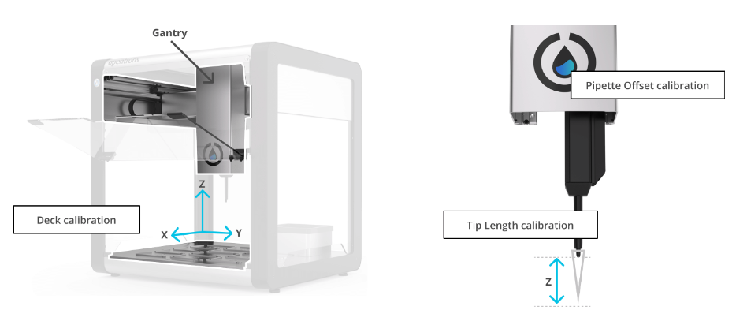
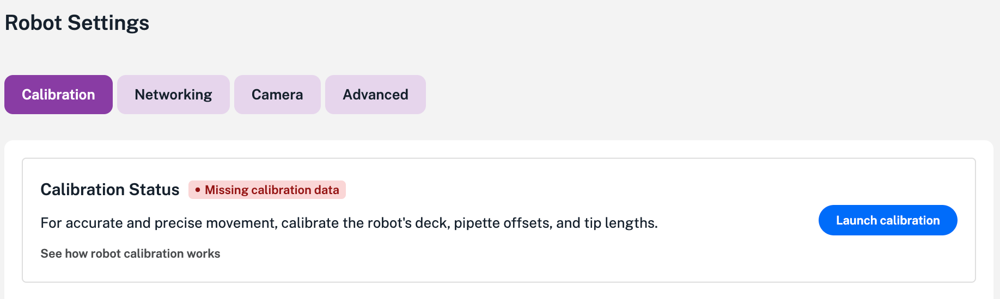
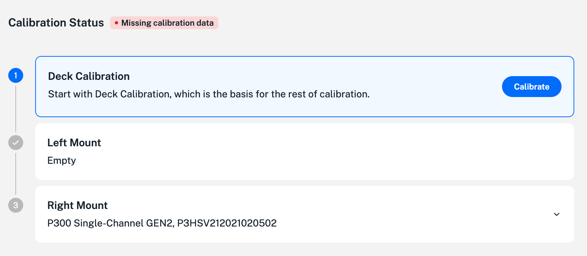
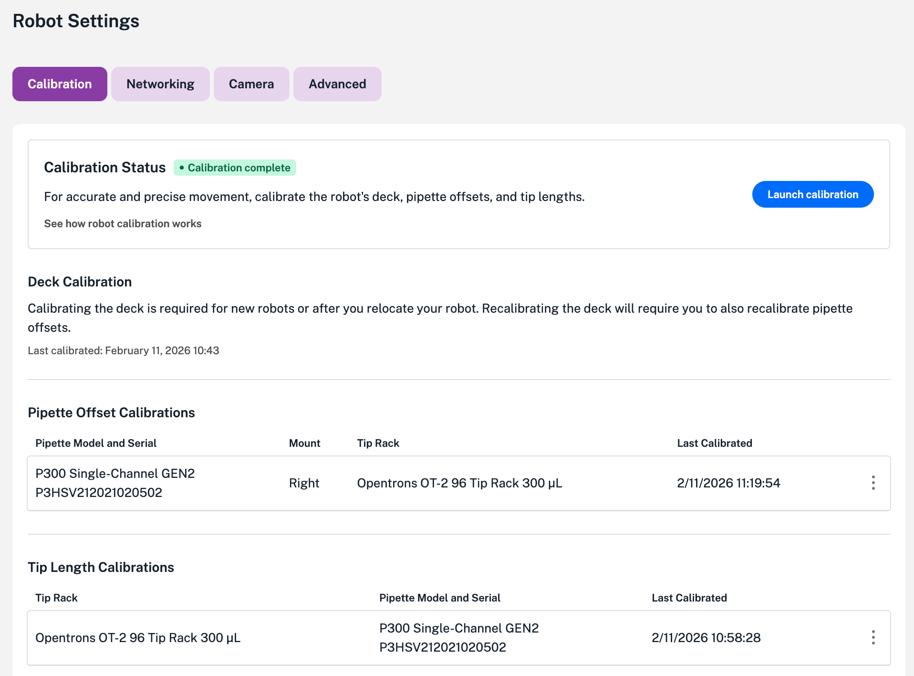

Start here for an overview of the robot calibration process and instructions on how to perform these procedures.

## Calibration overview

Your OT-2 moves gantry-mounted pipettes in three-dimensional space (left-right, front-back, up-down). To move accurately, the robot needs a precise map of its own hardware relative to a good reference point: the deck. The robot calibration process creates this map.

<figure class="screenshot" markdown>

<figcaption>Robot calibration</figcaption>
</figure>

There are three positional calibrations that work together and are performed in sequence:

- **Deck calibration:** The foundation. This process maps the deck to the gantry.
- **Tip length calibration:** Measures the distance from the nozzle of the pipette to the tip.
- **Pipette offset calibration:** Aligns the pipette nozzle to the calibrated deck.

## Deck calibration

Deck calibration helps the OT-2 understand deck location and size. This calibration ensures that the distance the robot moves in software corresponds to the physical distance it moves across the deck. It compensates for physical variations caused by factors such as:

* How the deck is fastened to the frame.
* Parallelism of the gantry rails.
* Manufacturing tolerance variations in motors and pulleys.

<table>
  <tbody>
    <tr>
      <th>How it works</th>
      <td>During deck calibration, the Opentrons App guides you to <a href="../jog-controls">manually jog</a> the pipette to specific reference points precision-engraved into the deck surface. The robot measures the motor steps required to reach each point and performs calculations to match its internal coordinate system to the actual location of these marks on the deck.</td>
    </tr>
    <tr>
      <th>When to calibrate</th>
      <td>
        Deck calibration is required:
        <ul>
          <li><strong>During setup:</strong> Always calibrate after unboxing and assembling an OT-2.</li>
          <li><strong>After relocation:</strong> Always calibrate after moving the robot more than a short distance.</li>
          <li><strong>For troubleshooting:</strong> A good idea to try if the robot experiences consistent positioning errors across the deck.</li>
        </ul>
      </td>
    </tr>
  </tbody>
</table>

!!! note
    Deck calibration does *not* account for the deck being tilted or bent. It assumes the deck is perfectly level.

## Tip length calibration

Tip length calibration measures the Z-axis distance between the pipette’s nozzle and the bottom of the tip. This helps ensure the robot knows exactly how close the tip is to the deck or labware.

Because pipette nozzles vary slightly in manufacturing, this calibration is unique to specific pipette and tip combinations. For example, if you have two identical P300 pipettes, they each need their own tip length calibration for the same box of tips.

<table>
  <tbody>
    <tr>
      <th>How it works</th>
      <td>During tip length calibration, the OT-2 measures the height of the bare pipette nozzle against a flat surface. Next, it picks up a tip from a tip rack and performs movements to determine the height of the tip compared to the reference. The difference between the measurements is saved as the tip length.</td>
    </tr>
    <tr>
      <th>When to calibrate</th>
      <td>Tip length calibration is required the first time you use a specific tip type or model with a specific pipette. Also, you must perform this calibration <em>before</em> you can check the pipette offset.</td>
    </tr>
  </tbody>
</table>

## Pipette offset calibration

Pipette offset calibration calculates the precise X, Y, and Z position of the pipette nozzle relative to the pipette mount and the deck. It accounts for slight variations in how the pipette is screwed onto the mount and how the mount sits on the gantry. The pipette offset calibration relies on the deck and tip length measurements and is the final part of the robot calibration process.

<table>
  <tbody>
    <tr>
      <th>How it works</th>
      <td>During pipette offset calibration, the robot moves the pipette to a known slot on the deck. You manually jog the pipette until the nozzle is perfectly centered over a specific reference point. The OT-2 saves this adjustment (the "offset") and applies it to every movement that pipette makes.</td>
    </tr>
    <tr>
      <th>When to calibrate</th>
      <td>
        A pipette offset calibration is required after:
        <ul>
          <li>Attaching a new pipette to the gantry.</li>
          <li>Running a deck calibration.</li>
          <li>Running a tip length calibration.</li>
        </ul>
      </td>
    </tr>
  </tbody>
</table>

## Running robot calibrations

The calibration controls are located in the Robot Settings section of the Opentrons App. To calibrate your OT-2:

1. Click the **Devices** tab in the Opentrons App.

2. Find your robot in the list and click on it to open the **Robot details** page.

3. Click the three-dot menu (⋮) and select **Robot settings**. This opens the Calibration tab in the Settings screen. Note: if your robot has never been calibrated or the calibration data was reset, the robot shows a small warning label, "Missing calibration data."

    <figure class="screenshot" markdown>
    
    <figcaption>Starting the robot calibration process.</figcaption>
    </figure>

4. Click **Launch Calibration**. This opens the calibration status dashboard.

    <figure class="screenshot" markdown>
    
    <figcaption>Calibration status dashboard.</figcaption>
    </figure>

5. Click **Calibrate**. Instructions and animations will guide you through the robot calibration process.

## Post-calibration

Upon completion, the Robot Settings screen updates the calibration status of your OT-2.

- The status banner shows "Calibration complete."
- The app updates the calibration date and timestamps for the deck, pipette offsets, and and tip length sections.

<figure class="screenshot" markdown>

<figcaption>Robot Settings screen after calibration.</figcaption>

Your OT-2 is ready to run protocols or perform any labware position checks, as required.