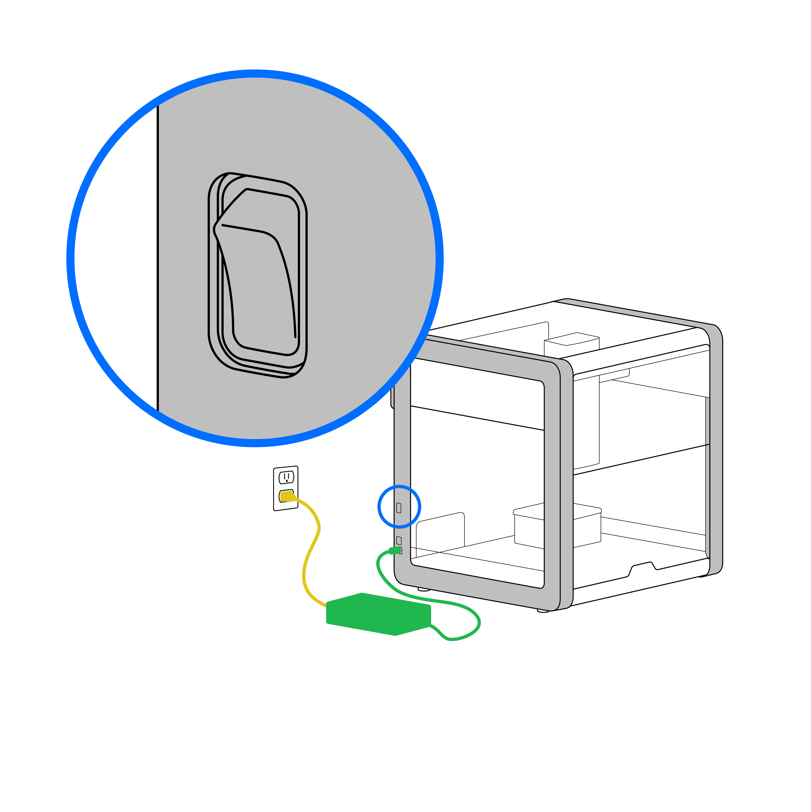
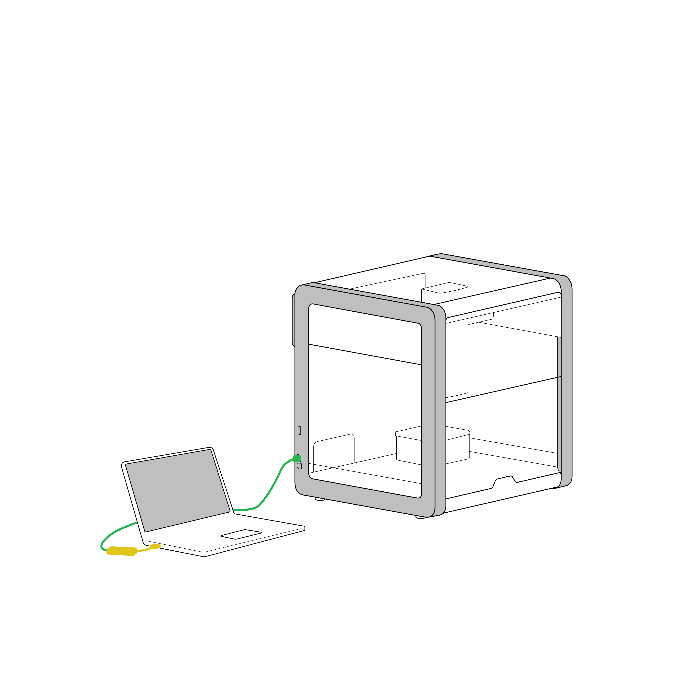

These procedures help you power up your OT-2, connect it to a computer or local network, and install the Opentrons app.

## Power on

Connect the external power supply to the OT-2 and then connect the power cable to a wall outlet.
    

Turn on the power by pressing the power button on the OT-2. It may take up to 45 seconds before the OT-2 starts running. After starting up, the robot will move the gantry to its home position.

## Connect to a network or computer

Connect the Ethernet cable to the OT-2 and laptop. If your computer does not have an Ethernet port, use the provided Ethernet-to-USB dongle.
    

## Install and update the app

Download and install the Opentrons App, which is available at <https://opentrons.com/ot-app>.

