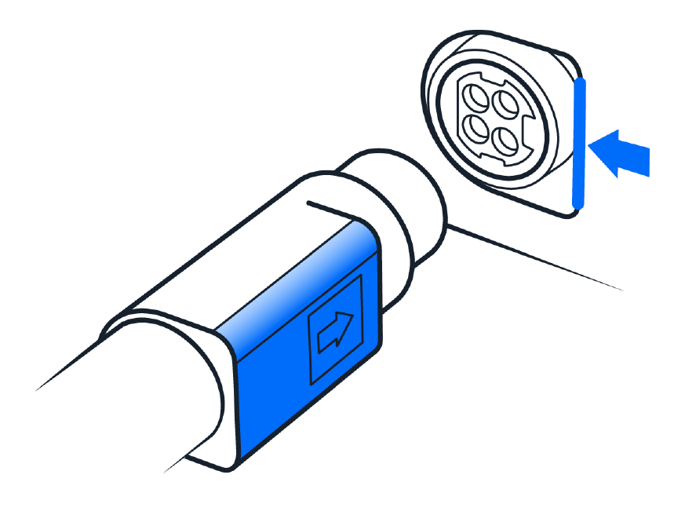

The OT-2 is powered by an external power supply that converts AC wall current to the 36 VDC used by the robot's internal systems. You control the robot through the Opentrons OT-2 App and a computer connected using the supplied Ethernet cable and dongle. This section guides you through downloading the Opentrons OT-2 App, connecting your computer to the OT-2, and connecting the robot to the external power supply.

## Installing the Opentrons OT-2 App

1. Download and install the Opentrons OT-2 App on your computer. The app is available from Opentrons at <https://opentrons.com/ot-app>.

2. Connect the Ethernet cable to the OT-2 and your computer. If your computer does not have an Ethernet port, use the provided Ethernet-to-USB dongle.

    

## Connecting the power cables

3. Connect the round end of the power cable to your OT-2. The OT-2 uses an asymmetrical 4-pin power connector. When connecting the power cable to the robot:

    - Match the connector's flat side to the flat side of the robot's power port.
    - An aligned power cable attaches easily; a misaligned cable does not.
    - Do not plug the power supply into a wall outlet or turn on the power until instructed to do so.

    

4. Connect the power cable to the external power supply, and then connect plug to a wall outlet. Your OT-2 ships with a power plug specific to your country or region.

    

5. Turn on the power by pressing the power button on the OT-2.

    
After turning on the power, it may take up to 45 seconds, or longer, before the OT-2 starts running. During the startup process:

- The light on the front of the robot will blink on and off and then turn solid blue.
- The gantry will move to its home position.
- The robot may emit other mechanical noises as it starts up.

!!!note
    If the blue light on the front of the robot does not turn solid after the robot has been powered on for more than five minutes, contact Opentrons Support.

## Making a LAN connection

Along with a direct connection to a computer, you can also connect the OT-2 to your local area network (LAN) using the supplied Ethernet cable. For a LAN, just connect the Ethernet cable to the robot and a wall jack. You can also plug the Ethernet cable into a nearby network switch or hub. After the robot is connected and powered on, it will appear under the **Devices** tab in the Opentrons OT-2 App.

## Making a Wi-Fi connection

If you need to connect to a Wi-Fi network that uses enterprise authentication (including [eduroam](https://eduroam.org/how/) and similar academic networks that require a username and password), first connect to the Opentrons OT-2 App by Ethernet or USB to complete initial setup. Then use the Opentrons OT-2 App and connect to the enterprise Wi-Fi network in the networking settings for your OT-2. To access the networking settings:

1. Click Devices in the left sidebar of the Opentrons OT-2 App.
2. Click the three-dot menu (⋮) for your OT-2 and select **Robot Settings**.
3. Click the Networking tab.
4. Select your network from the dropdown menu or choose "Join other network..." and enter its SSID. Choose the enterprise authentication method that your network uses. See the following section for the supported security types.

### Wi-Fi security

The OT-2 can connect to Wi-Fi networks with the following security types:

- Open networks (not recommended because anyone can access and control your robot)
- 802.1x or "eduroam" (common to academic institutions)
- WPA2 personal
- WPA2 enterprise, including:
    - EAP-TTLS with TLS
    - EAP-TTLS with MS-CHAP v2
    - EAP-TTLS with MD5
    - EAP-PEAP with MS-CHAP v2
    - EAP-TLS

!!!note "Captive portals not supported"
    The OT-2 cannot be used on or connect to a [captive portal network](https://en.wikipedia.org/wiki/Captive_portal). Typically, these are the kind of networks deployed at airports, hotels, and other public access points. If no other networks are available, use a direct USB or Ethernet connection to manage your robot.

## Install software updates

Now that you've connected the OT-2 to a network or computer, the robot can check for software and firmware updates and download them if needed. If there is an update, it may take a few minutes to install. Once the update is complete, the robot will restart.

## Naming your robot

Naming your robot lets you easily identify it in your lab environment. If you have multiple Opentrons robots on your network, make sure to give them unique names. Once you've confirmed your robot's name, the next step is to install and calibrate a pipette. Follow these instructions to name your OT-2:

1. In the Opentrons OT-2 App, click the **Devices** tab and select the OT-2 you want to work with.
2. Click the three-dot menu and then click **Robot settings**.
3. Click the **Advanced** tab.
4. In the About section, click **Rename robot**.
5. Name your OT-2 and click **Rename robot**.

## Next steps

Now that your robot is powered on and connected to a network, it's time to attach and calibrate a pipette! See [Instrument Installation and Calibration](instruments.md) to finish preparing your OT-2 and start putting it to work in your lab.