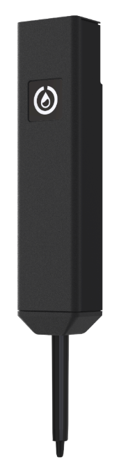
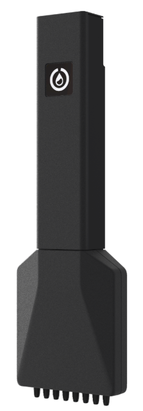
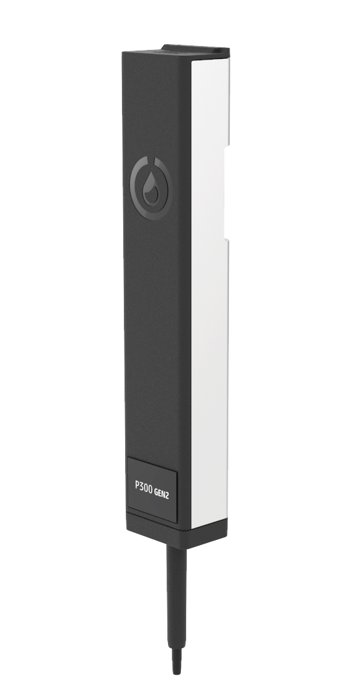
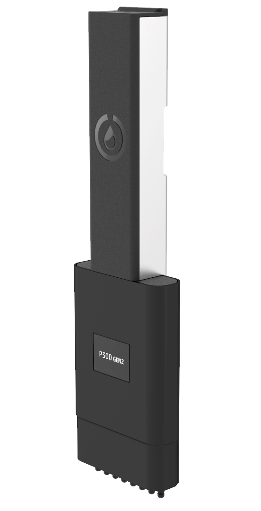
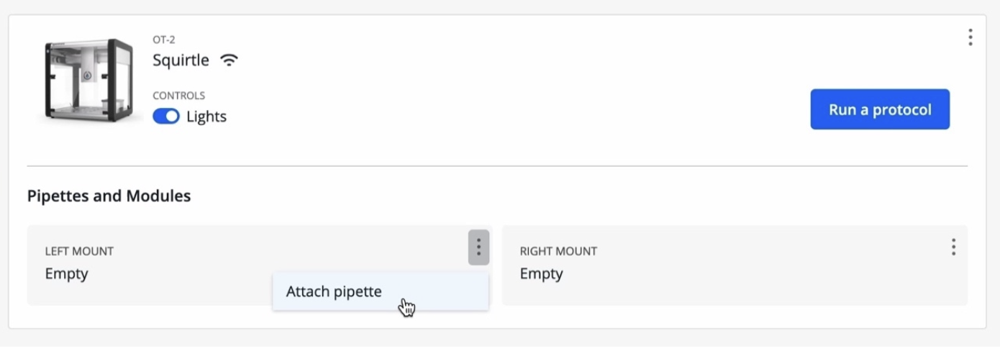
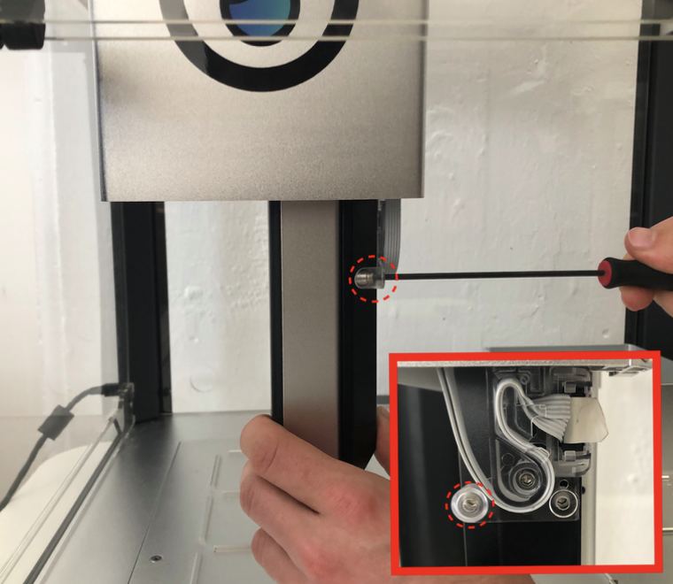

After initial robot setup, the next step is to attach instruments to the robot and calibrate them. The OT-2 has two pipette mounts. Each mount can hold a single GEN2 1-channel and/or 8-channel pipette. Additionally, all GEN2 pipettes have an automated calibration procedure, which you should perform immediately after installation.

## Identifying OT-2 pipette types

The OT-2 accepts GEN1 and GEN2 pipettes. This section covers GEN2 pipette installation and calibration only. Review the information in this section if you need help identifying your OT-2 pipettes.

### GEN1 pipettes

GEN1 pipettes are black and marked by a white Opentrons drop logo. They do not include any printed text or markings to identify them as GEN1 pipettes. The GEN1 pipettes are no longer manufactured or supported.

<figure class="side-by-side" markdown>

</figure>

### GEN2 pipettes

OT-2 GEN2 pipettes are easier to identify compared to their GEN1 predecessors. The GEN 2 pipettes are longer than the GEN1, their housing is black and sliver (instead of all black), and exterior markings identify these instruments as a GEN2 pipettes.

<figure class="side-by-side" markdown>

</figure>

## Pipette installation

Follow the instructions below, or in the App, to attach and calibrate your OT-2 GEN2 pipettes.

1. Choose pipette type. You can attach a 1- or 8-channel pipette to the robot.

2. Prepare for installation. Remove labware from the deck and clean up the working area to make attachment and calibration easier. 

3. In the Opentrons App click the **Devices** tab and select the OT-2 you want to work with.

4.  In the Pipettes and Modules section:

    - Select the left or right pipette mount.
    - Click the 3-dot menu (⋮) and then click **Attach pipette**. The gantry will move towards the front of the deck and the mount will lower.

    

5. Attach the pipette:

    During attachment it may help to start from _behind_ the mounting plate and then bring the pipette towards you. The instrument is ready to connect when the side of the pipette is even with the mount and the pins on the pipette match their corresponding connections on the ribbon cable connector.

6. Secure the pipette to the mounting plate by following the instructions in the Opentrons App. The pipette fastens to the mount with three 2.5 mm screws. These are:

    - Two captive screws permanently affixed to the pipette.
    - One bottom pipette screw supplied in a small bag that ships with the robot.

    

7. Connect the white ribbon cable to the pipette.