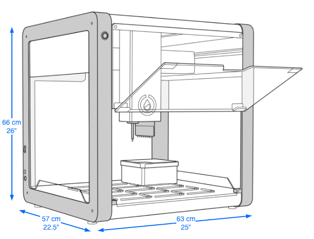

Before setting up an OT-2, make sure that your installation site meets the requirements described in this section. And, follow all of the safety guidance here and throughout the installation instructions.

## Placement

- **Weight bearing:** The OT-2 weighs 42 kg (93 lbs). Place the robot on a surface that can support its weight plus the weight of any modules, labware, liquids, or other lab equipment that may be used in your work.

- **Bench surface:** A good workspace is stationary, sturdy, level, and liquid-resistant. Tables or benches with wheels (even locking wheels) are not recommended. OT-2 gantry movements can shake light weight or moveable tables.

- **Operating space:** The OT-2's dimensions are 66 cm x 57 cm x 63 cm (≈ 26" x 22.5" x25"). The working area must include extra clearance on the sides and back beyond the space occupied by the robot. This additional space is needed to accommodate cables and USB connections, and to allow for proper exhaust dissipation from modules that heat or cool.

## Power consumption

The OT-2 has the following power requirements:

- **Mains power:** 100–240 VAC, 50/60 Hz
- **Input power supply:** 36 VDC, 10 A

The total power consumption of the OT-2 varies depending on the requirements of your protocol.

- **Operating:** ~100–180 W
- **Idle:** ~90–120 W

## Environmental conditions

Opentrons has validated the performance of the OT-2 in conditions recommended for system operation as follows:

- **Environment:** The robot is designed for indoor use only.
- **Temperature range:** 20 °C ± 4° C (68 °F ± 7.2 °F).
- **Relative humidity:** 40-60% (up to 80% is acceptable, but outside the recommended range).
- **Altitude:** Up to 2,000 meters above sea level.

The OT-2 is safe to use in conditions outside of the recommended specifications, but your results may vary.

