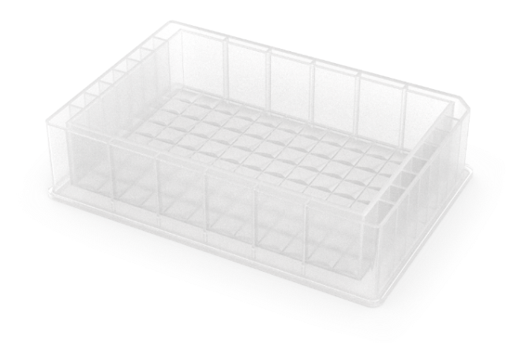
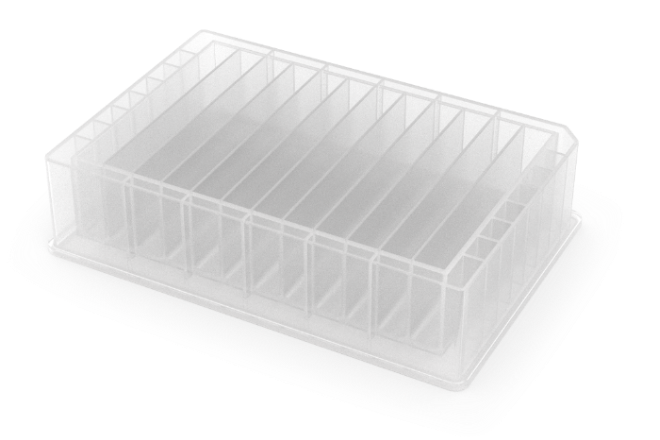
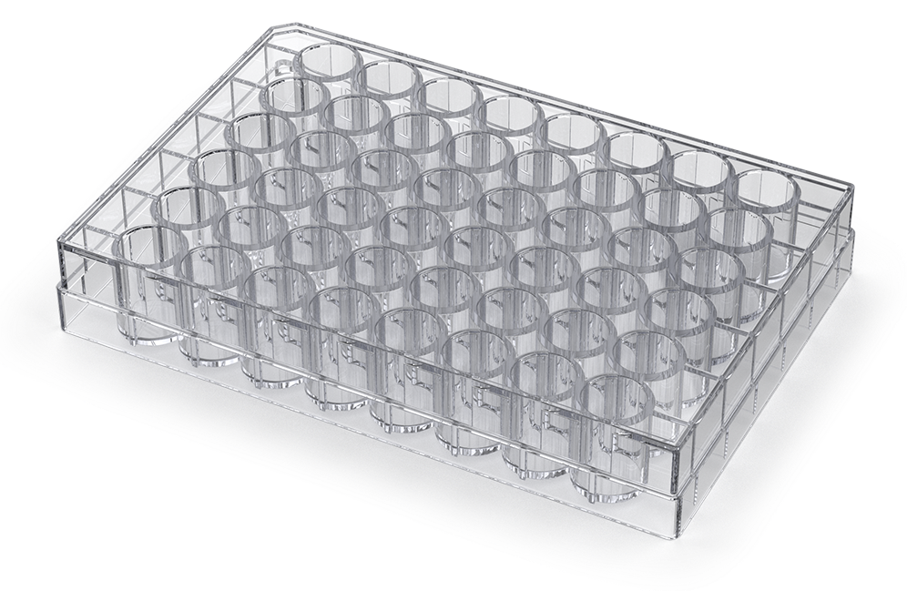
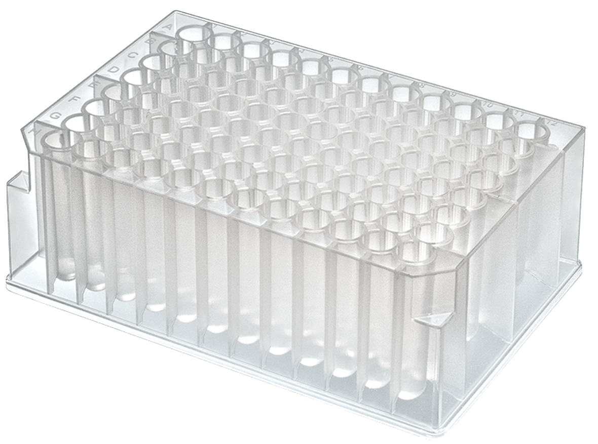
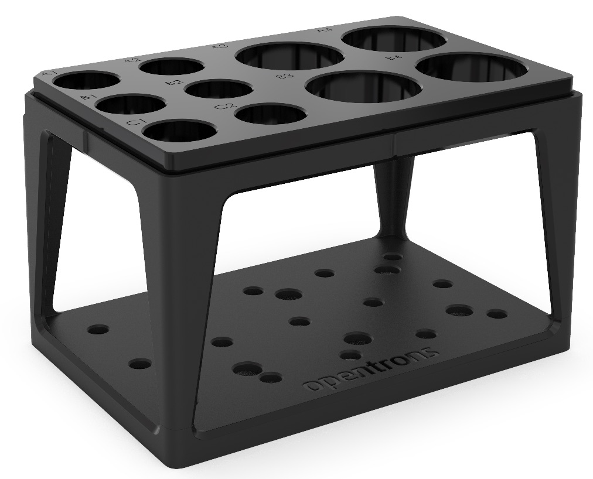
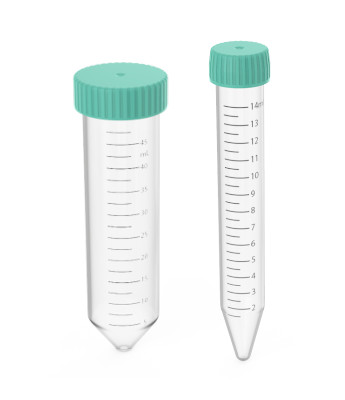
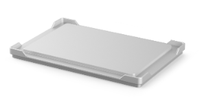
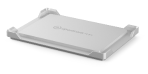
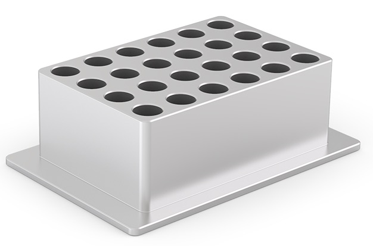
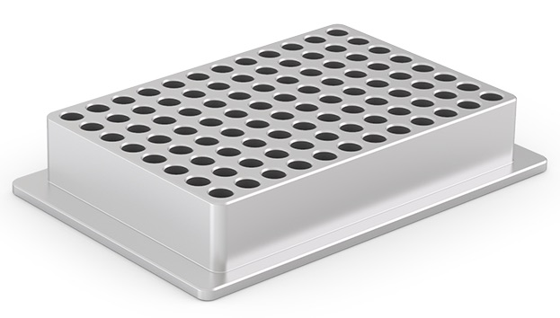

This section covers the different types of labware included in the Opentrons Labware Library for use with the OT-2.

## Reservoirs

<figure class="side-by-side" markdown>

</figure>

The OT-2 works by default with single-well and multi-well reservoirs. [Reservoirs on the Opentrons Labware Library](https://labware.opentrons.com/#/?category=reservoir) are automation-ready right out of the box.

## Custom reservoirs

The Labware Library currently includes reservoirs in several common configurations, although other well configurations are possible.

Try creating a custom labware definition with the [Opentrons Labware Creator](https://labware.opentrons.com/create/) if a reservoir you'd like to use isn't listed in the Labware Library. A custom definition combines all the dimensions, metadata, shapes, volumetric capacity, and other information in a JSON file. The OT-2 needs this information to understand how to work with your custom labware. See the [Labware Definitions section](./definitions.md) for more information.

## Well plates

<figure class="side-by-side" markdown>

</figure>

The OT-2 works by default with well plates in a variety of well configurations. This category includes standard depth and deep well plates, with various well bottom shapes. [Well plates on the Opentrons Labware Library](https://labware.opentrons.com/#/?category=wellPlate) are automation-ready right out of the box.

### Plates with fewer than 96 wells

The Labware Library includes plates with 12, 24, and 48 wells. Due to the grid configuration and spacing of the wells on these plates, they are only usable with single-channel pipettes.

### 96-well plates

The Labware Library includes many 96-well plates, including Opentrons and third-party plates. The 1-channel and 8-channel OT-2 pipettes are optimized to work with the well geometry on these plates.

For a full example of a 96-well plate, reference the [Opentrons Tough 96 Well Plate 200 µL PCR Full Skirt definition](https://github.com/Opentrons/opentrons/blob/edge/shared-data/labware/definitions/2/opentrons_96_wellplate_200ul_pcr_full_skirt/3.json) on GitHub.

### 384-well plates

The Labware Library includes 384-well plates for applications that require greater well density or smaller liquid quantities. The OT-2 single-channel and 8-channel pipettes can work with the well geometry on these plates.

### Custom well plates

Try using the [Opentrons Labware Creator](https://labware.opentrons.com/#/create) to make a custom labware definition if a well plate you'd like to use isn't listed in the Labware Library. A custom definition combines all the dimensions, metadata, shapes, volumetric capacity, and other information in a JSON file. The OT-2 reads this information to understand how to work with your custom labware. See the [Labware Definitions section](./definitions.md) for more information.

## Tips and tip racks { #tips-and-tip-racks-ot2 }

OT-2 tips come in racks that hold 96 tips. Currently, we offer tips in 20 µL, 200 µL, 300 µL, and 1000 µL sizes. These are clear, non-conducting, polypropylene tips that are available with or without filters. See the [Tips & Labware section](https://opentrons.com/products/categories/tips-&-labware) of the Opentrons website if you need tips for your OT-2 pipettes.

!!! tip
    For best performance, use the smallest tips that can hold the amount of liquid you need to aspirate.

### Tip compatibility

OT-2 pipette tips are designed for OT-2 pipettes. OT-2 tips are incompatible with Opentrons Flex pipettes, and Flex tips cannot be used on OT-2 pipettes. Other industry-standard tips may work with OT-2 pipettes, but this is not recommended. To ensure optimum performance, you should only use OT-2 tips with OT-2 pipettes.

### Tip sterility

OT-2 tips are sterilized by e-beam irradiation and are free of DNase, protease, and pyrogens.

## Tubes and tube racks

<figure class="side-by-side" markdown>

</figure>

The Opentrons 4-in-1 Tube Rack system works with the OT-2 by default. [Tube rack combinations on the Opentrons Labware Library](https://labware.opentrons.com/#/?category=tubeRack) are automation-ready right out of the box.

The Opentrons 4-in-1 tube rack supports a wide variety of tube sizes, singly or in different size (volume) combinations. These include a:

- 6-tube rack for 50 mL tubes.
- 10-tube combination rack for four 50 mL tubes and six 15 mL tubes.
- 15-tube rack for 15 mL tubes
- 24-tube rack for 0.5 mL, 1.5 mL, or 2 mL tubes

The 24-tube rack supports both snap cap and screw cap tubes.

### Custom tube rack labware

Try creating a custom labware definition using the [Opentrons Labware Creator](https://labware.opentrons.com/create/) if a tube and rack combination you'd like to use isn't listed on Labware Library. A custom definition combines all the dimensions, metadata, shapes, volumetric capacity, and other information in a JSON file. The OT-2 reads this information to understand how to work with your custom labware. See the [Labware Definitions section](./definitions.md) for more information.

## Aluminum blocks

The OT-2 uses [aluminum blocks on the Labware Library](https://labware.opentrons.com/#/?category=aluminumBlock) to hold sample tubes or well plates on the Temperature Module.

A set of OT-2 compatible aluminum blocks also ships with the Temperature Module GEN2. This includes a flat bottom plate, a 24-well block, and a 96-well block, which are also available for purchase from Opentrons.

### Flat bottom plate

The aluminum flat bottom plate is compatible with ANSI/SLAS standard well plates.

<figure class="side-by-side" markdown>

<figcaption>Flat well plate for the OT-2 (left) and Opentrons Flex (right).</figcaption>
</figure>

You can identify an [OT-2 compatible plate](https://opentrons.com/products/aluminum-block-flat-bottom-ot-2) from its plain matte finish and lack of external markings.

### 24-well aluminum block

<figure markdown>
{style="width: 65%"}
</figure>

The 24-well block is used with individual sample vials. For example, it accepts sample vials that:

- Have V-shaped or U-shaped bottoms.

- Secure contents with snap cap or screw cap closures.

- Hold liquid in capacities of 0.5 mL, 1.5 mL, and 2 mL.

### 96-well aluminum block

<figure markdown>
{style="width: 65%"}
</figure>

The 96-well block supports a wide variety of well plate types. For example, it accepts:

- Well plates designed with V-shaped bottoms, U-shaped bottoms, or flat bottoms.

- Well plates designed with 100 µL or 200 µL wells.

- Generic PCR strips.

### Custom aluminum block combinations

Labware Creator can't define new aluminum blocks. For placing tubes in the 24-well block, it can create combination labware definitions that combine the aluminum block and the tubes. For placing custom plates on the 96-well adapter, define the custom plate with the stacking offset information required for seating the plate on top of the block. See the [Labware Definitions section](./definitions.md) for more information.