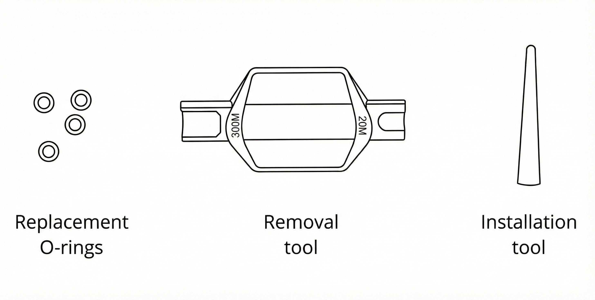
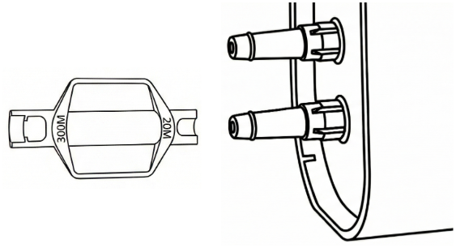
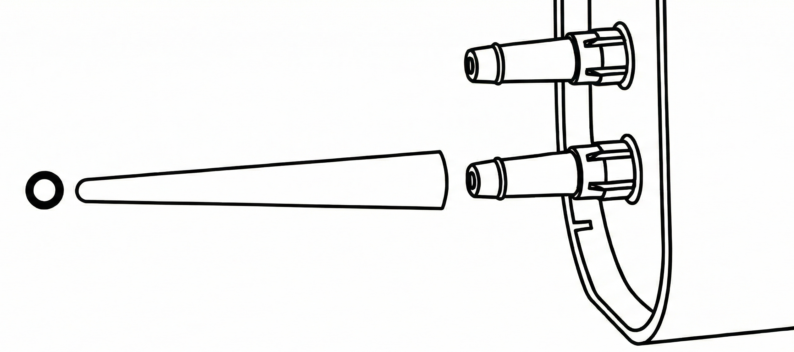

Routine cleaning helps keep your OT-2 free of contaminants that can affect your protocols. Cleaning also gives you a chance to inspect the robot for wear and damage. Review this section for information and instructions on how to clean your robot.

If you have any questions about cleaning your OT-2 or its related components, contact Opentrons Support at <support@opentrons.com>.

## Before you begin

The OT-2 is an electrically powered mechanical device. As a good practice, turn off the power before you start cleaning it and before reaching inside the enclosure. You may even want to unplug the robot as well. These are simple safety steps you can take to make the OT-2 inoperable until you're finished.

Along with turning the power off, remove any instruments, modules, and labware before cleaning the robot. Removing attached items gives you more room to work and provides better access to the deck, gantry, and other spaces.

## What you can clean

You can wipe off all the visible and easily accessible surfaces of your OT-2. This includes the exterior and interior frame, window panels, gantry, and deck. Do not open or disassemble the OT-2 for this level of maintenance. If you can see it, you can clean it. If you can't see it, don't clean it.

## Cleaning solutions

The following table lists the chemicals you can use to clean your OT-2. Diluted alcohol and distilled water are our recommended cleaning solutions, but you can refer to this list for other cleaning options. You can also use these chemicals to clean modules, pipettes, and other attached hardware.

!!!warning
    _Do not use acetone._ The robot, pipettes, and modules are made from materials that acetone can damage.

| Solution | Recommendations |
|----|----|
| **Alcohol** | Includes ethyl/ethanol, isopropyl, and methanol. Dilute to 70% for cleaning. Do not use 100% alcohol. |
| **Bleach** | Dilute to 10% (1:10 bleach/water ratio) for cleaning. Do not use 100% bleach. |
| **Distilled water** | You can use distilled water to clean or rinse your robot. |

## Frame and window panel cleaning

To clean the exterior and interior frame and window panels of your OT-2:

1. Dampen a soft, clean cloth or paper towel with a cleaning solution.
2. Gently wipe off the exposed and easily accessible surface areas.
3. Rinse off any remaining residue using a cloth dampened with distilled water.
4. Let the robot air dry.

## Deck cleaning

To clean the deck and trash bin:

1. Dampen a soft, clean cloth or paper towel with a cleaning solution.
2. Gently wipe off the deck and trash bin. You can remove and empty the trash bin for easier access.
3. Rinse off any remaining residue using a cloth dampened with distilled water.
4. Let the deck and/or trash bin air dry. Replace any items that you removed for cleaning.

## Gantry cleaning

To clean the gantry:

1. Dampen a soft, clean cloth or paper towel with a cleaning solution.
2. Gently wipe off the horizontal and vertical gantry surfaces, and side rails.
3. Rinse off any remaining residue using a cloth dampened with distilled water.
4. Let the gantry air dry.

## Pipette cleaning

To clean a single- or multi-channel pipette:

1. Remove the pipette from the gantry.
2. Dampen a soft, clean cloth or paper towel with a cleaning solution.
3. Gently wipe down the following parts:
    - Body
    - Ejector
    - Nozzles
4. Rinse off any remaining residue using a cloth dampened with distilled water.
5. Let the pipette air dry.
6. Reattach the pipette to the gantry. When prompted, recalibrate the pipette (optional, but recommended).

!!!warning
    - Do not disassemble OT-2 pipettes for cleaning or attempt to clean their internal electronic components.
    - Do not put OT-2 pipettes in an autoclave. The high temperatures, pressures, and steam used inside an autoclave can damage the electronics, circuit boards, small electric motors, and other sensitive components.

## Pipette decontamination

The routine cleaning steps described above may not clean your pipette if it becomes contaminated with substances like nucleic acids, proteins, or radioactive materials. When a pipette becomes contaminated, try the decontamination steps described in this section. You can also contact support if your pipette gets contaminated and these cleaning procedures do not work.

### Pipette exterior

Refer to the following table for recommended cleaning methods, by contamination type.

| Contaminant | Cleaning recommendation |
|----|----|
| **Aqueous solutions** | Rinse the contaminated parts with distilled water or 70% ethanol and air dry at 15.5 °C (60 °F). |
| **Nucleic acids** | Clean the contaminated parts in a glycine/HCl buffer (pH 2) for 10 minutes, rinse with distilled water, and air dry. |
| **Organic solvents** | Allow the solvent to evaporate on its own or immerse the pipette _nozzle only_ in a detergent, rinse with distilled water, and air dry. |
| **Proteins** | Clean the contaminated parts with a detergent, rinse with distilled water, and air dry. Do not use alcohol. That will set the proteins. |
| **Radioactive materials** | Place the pipette nozzle in a solution like Decon 90, rinse with distilled water, and air dry. |

### Pipette barrel

Filtered pipette tips help prevent contaminating the barrel or inside of the pipette. But, you cannot disassemble this instrument if it becomes contaminated. If the inside of your pipette gets contaminated, the following steps may help remove the contamination:

1. Remove the pipette from the gantry.
2. Inject a small amount of cleaning solution into the barrel using a manual pipette or syringe.
3. Gently shake the pipette to swirl the cleaning solution.
4. Rinse with distilled water.
5. Let the pipette air dry.
6. Reattach the pipette to the gantry. When prompted, recalibrate the pipette (optional, but recommended).

## Replacing pipette O-rings

The GEN2 multi-channel (8-channel) pipettes have a rubber O-ring around their nozzles. These O-rings help tips form a good seal against the pipette. You can replace the O-rings on a GEN2 multi-channel pipette if the rings become worn or broken.

!!!note
    - OT-2 single-channel and GEN1 8-channel pipettes do not have O-rings.
    - OT-2 and Flex pipette O-rings are not interchangeable.

Each GEN2 multi-channel pipette ships with several replacement O-rings and the special tools shown here.

<figure class="screenshot" markdown>

</figure>

Follow these instructions to replace the O-rings on your OT-2 multi-channel pipette:

1. Attach the O-ring removal tool to the pipette nozzle. Labels on either side of the tool help you match it to the pipette model.

    - Use the 20M side for a P20 pipette.
    - Use the 300M side for a P300 pipette.

    <figure class="screenshot" markdown>
    
    </figure>

2. Rotate and pull the tool gently to remove the O-ring. The O-ring may break during removal, which is common.

3. Place the wide base of the conical O-ring installation tool against the pipette nozzle and roll the new O-ring onto the nozzle.

    <figure class="screenshot" markdown>
    
    </figure>

## Pipette tip cleaning

OT-2 pipette tips are disposable items and should be discarded after use. You can purchase [replacement tips](https://opentrons.com/products/categories/tips-&-labware) directly from Opentrons.

## Module cleaning

You can clean the surfaces of any OT-2 module. The general cleaning procedure is the same for all supported modules:

Be sure to turn the module's power off before cleaning it. You can clean the top surfaces of modules while they're installed in a deck slot. However, for better access, you may want to:

- Turn off power to the module and disconnect any USB or power cables.
- Remove the module from its deck slot.

!!!warning
    - Do not disassemble modules for cleaning or attempt to clean their internal electronic components.
    - Do not put OT-2 modules in an autoclave. The high temperatures, pressures, and steam used inside an autoclave can damage the electronics, circuit boards, small electric motors, and other sensitive components.

### General module cleaning

Once you've prepared the module for cleaning:

1. Dampen a soft, clean cloth or paper towel with a cleaning solution.
2. Gently wipe off the module's surfaces.
3. Rinse off any remaining residue using a cloth dampened with distilled water.
4. Let the module air dry.

### Thermocycler seals

To set up the Thermocycler with a clean, reusable rubber seal:

1. Affix a seal to the Thermocycler lid (if one isn't attached already).
2. Wipe the seal with a 1:10 diluted bleach solution.
3. Rinse the seal with molecular biology grade water.
4. Let the seal air dry.

## Autoclaving labware

Opentrons doesn't recommend re-using autoclaved labware with your OT-2. The heat and pressure may cause items to warp or shrink, even if they're considered "autoclave safe." While autoclaved labware may be acceptable for quick, proof-of-concept testing, it's always better to use fresh labware for production runs, which helps ensure the best results. You can find robot-compatible labware in the [Opentrons Labware Library](https://labware.opentrons.com/) and on the [Tips & Labware section](https://opentrons.com/products/categories/tips-&-labware) of our website.

## Self-service inspection schedule

Along with routine cleaning, Opentrons also recommends the following optional procedures to help keep your OT-2 running smoothly. Feel free to adapt this schedule to your robot's workload. Alternatively, let Opentrons do the work for you. Our [service offerings](https://opentrons.com/instrument-services) cover a range of options to adapt to the needs of your lab.

<table>
  <thead>
    <tr>
      <th>Frequency</th>
      <th>Task</th>
      <th>Notes</th>
    </tr>
  </thead>
  <tbody>
    <tr>
      <td rowspan="2">Daily</td>
      <td>Empty trash bin</td>
      <td>When the trash bin reaches capacity.</td>
    </tr>
    <tr>
      <td>Inspect the deck</td>
      <td>Check for physical damage and clean spills and other residue.</td>
    </tr>
    <tr>
      <td rowspan="2">Weekly</td>
      <td>Pipette visual check</td>
      <td>Inspect the pipette for obvious damage if it aspirates or dispenses inaccurately or shows other signs of malfunction.</td>
    </tr>
    <tr>
      <td>Robot, module, and pipette cleaning</td>
      <td>Clean if accessories appear dirty or immediately after contamination.</td>
    </tr>
    <tr>
      <td rowspan="2">Monthly</td>
      <td>Ejection mechanism check</td>
      <td>Make sure your single-channel pipette can pick up and eject tips consistently.</td>
    </tr>
    <tr>
      <td>Power cycle OT-2 and modules</td>
      <td>It really isn't a bad idea to try turning it off and then on again.</td>
    </tr>
    <tr>
      <td>Quarterly</td>
      <td>Robot calibration health check</td>
      <td>Perform if:
        <ul>
          <li>Movement appears to be malfunctioning or incorrect.</li>
          <li>After deck, instrument, or tip length calibration.
        </ul></td>
    </tr>
    <tr>
      <td rowspan="4">Every six months</td>
      <td>Deck calibration</td>
      <td>Perform:
        <ul>
          <li>If a calibration health check shows inaccurate calibration results.
          <li>After installing a new pipette.</li>
          <li>If a pipette positioning crashes into the deck or labware.</li>
        </ul>
      </td>
    </tr>
    <tr>
      <td>Pipette Offset</td>
      <td>Perform:
        <ul>
          <li>If a calibration health check shows inaccurate calibration results.
          <li>After installing a new pipette.</li>
          <li>If a pipette positioning crashes into the deck or labware.</li>
        </ul>
      </td>
    </tr>
    <tr>
      <td>Tip Length Calibration</td>
      <td>After installing a new pipette.</td>
    </tr>
    <tr>
      <td>Labware Position Check</td>
      <td>Perform:
        <ul>
          <li>If a pipette appears to be misaligned with labware.</li>
          <li>After installing and using new types of labware with a previous protocol run.</li>
        </ul>
      </td>
    </tr>
    <tr>
      <td rowspan="3">Yearly</td>
      <td>Pipette replacement</td>
      <td>Replace if the pipette malfunctions during aspirate/dispense procedures.</td>
    </tr>
    <tr>
      <td>Inspect and clean circuit boards</td>
      <td>Use compressed air to blow accumulated dust off the rear circuit boards.</td>
    </tr>
    <tr>
      <td>Replace 8-channel GEN2 pipette O-rings</td>
      <td>If you notice any nicks or tears on the O-rings.</td>
    </tr>
  </tbody>
</table>