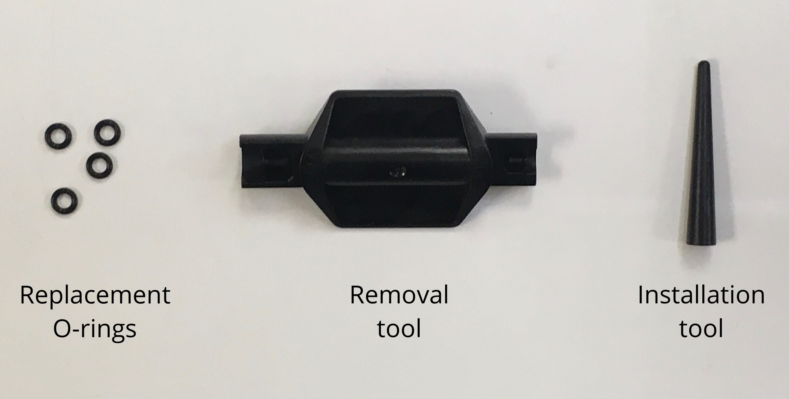

Routine cleaning helps keep your OT-2 free of contaminants that can affect your protocols. Cleaning also gives you a chance to inspect the robot for wear and damage. You should review this section for information, instructions, and resources about how to clean your robot.

If you have any questions about cleaning your OT-2, and its related components, contact the support team at <support@opentrons.com>.

## Before you begin

The OT-2 is an electrically powered mechanical device. As a good practice, turn off the power before you start cleaning it and before reaching inside the enclosure. You may even want to unplug the robot as well. These are simple safety steps you can take to make the OT-2 inoperable until you're finished.

Along with turning the power off, remove any instruments, modules, and labware before cleaning the robot. Removing attached items gives you more room to work and provides better access to the deck, gantry, and other spaces.

## What you can clean

You can wipe off all the visible and easily accessible surfaces of your OT-2. This includes the exterior and interior frame, window panels, gantry, and deck. The OT-2 does not have any internal parts that you need to open or disassemble for this level of maintenance. If you can see it, you can clean it. If you can't see it, don't clean it.

## Cleaning solutions

The following table lists the chemicals you can use to clean your Flex. Diluted alcohol and distilled water are our recommended cleaning solutions, but you can refer to this list for other cleaning options. You can also use these chemicals to clean modules, pipettes, and other attached hardware.

!!!warning
    _Do not use acetone._ The robot, pipettes, and modules are made from materials that acetone can damage.

| Solution | Recommendations |
|----|----|
| **Alcohol** | Includes ethyl/ethanol, isopropyl, and methanol. Dilute to 70% for cleaning. Do not use 100% alcohol. |
| **Bleach** | Dilute to 10% (1:10 bleach/water ratio) for cleaning. Do not use 100% bleach. |
| **Distilled water** | You can use distilled water to clean or rinse your robot. |

## Frame and window panel cleaning

To clean the exterior and interior frame and window panels of your Flex:

1. Dampen a soft, clean cloth or paper towel with a cleaning solution.
2. Gently wipe off the exposed and easily accessible surface areas.
3. Rinse off any remaining residue using a cloth dampened with distilled water.
4. Let the robot air dry.

## Deck cleaning

To clean the deck, deck slots, and trash bin:

1. Dampen a soft, clean cloth or paper towel with a cleaning solution.
2. Gently wipe off the deck, deck slots, and trash bin. You can remove and empty the trash bin for easier access.
3. Rinse off any remaining residue using a cloth dampened with distilled water.
4. Let the deck and/or trash bin air dry. Replace any items that you removed for cleaning.

## Gantry cleaning

To clean the gantry:

1. Dampen a soft, clean cloth or paper towel with a cleaning solution.
2. Gently wipe off the horizontal and vertical gantry surfaces, and side rails.
3. Rinse off any remaining residue using a cloth dampened with distilled water.
4. Let the gantry air dry.

## Pipette cleaning

To clean a single- or multi-channel pipette:

1. Remove the pipette from the gantry.
2. Dampen a soft, clean cloth or paper towel with a cleaning solution.
3. Gently wipe down the following parts:
    - Body
    - Ejector
    - Nozzles
4. Rinse off any remaining residue using a cloth dampened with distilled water.
5. Let the pipette air dry.
6. Reattach the pipette to the gantry. When prompted, recalibrate the pipette (optional, but recommended).

placeholder for labeled pipette images

!!!warning
    - Do not disassemble OT-2 pipettes for cleaning or attempt to clean their internal electronic components.
    - Do not put OT-2 pipettes in an autoclave. The high temperatures, pressures, and steam used inside an autoclave can damage the electronics, circuit boards, small electric motors, and other sensitive components.

## Pipette decontamination

The routine cleaning steps described above may not clean your pipette if it becomes contaminated with substances like nucleic acids, proteins, or radioactive material. When a pipette becomes contaminated, try the decontamination steps described in this section. You can also contact support if your pipette gets contaminated and these cleaning procedures do not work.

### Pipette exterior

Refer to the following table for recommended cleaning methods, by contamination type.

| Contaminant | Cleaning recommendation |
|----|----|
| **Aqueous solutions** | Rinse the contaminated parts with distilled water or 70% ethanol and air dry at 15.5 °C (60 °F). |
| **Nucleic acids** | Clean the contaminated parts in a glycine/HCl buffer (pH 2) for 10 minutes, rinse with distilled water, and air dry. |
| **Organic solvents** | Allow the solvent to evaporate on its own or immerse the pipette _nozzle only_ in a detergent, rinse with distilled water, and air dry. |
| **Proteins** | Clean the contaminated parts with a detergent, rinse with distilled water, and air dry. Do not use alcohol. That will set the proteins. |
| **Radioactive materials** | Place the pipette nozzle in a solution like Decon 90, rinse with distilled water, and air dry. |

### Pipette barrel

Filtered pipette tips help prevent contaminating the barrel or inside of the pipette. But, you cannot disassemble this instrument if it becomes contaminated. If the inside of your pipette gets contaminated, the following steps may help remove the contamination:

1. Remove the pipette from the gantry.
2. Inject a small amount of cleaning solution into the barrel using a manual pipette or syringe.
3. Gently shake the pipette to swirl the cleaning solution.
4. Rinse with distilled water.
5. Let the pipette air dry.
6. Reattach the pipette to the gantry. When prompted, recalibrate the pipette (optional, but recommended).

## Pipette O-rings

The GEN2 multi-channel (8-channel) pipettes have a rubber O-ring around their nozzles. These O-rings help tips form a good seal against the pipette. You can replace the O-rings on a GEN2 multi-channel pipette if the rings become worn or broken.

!!!note
    - OT-2 single-channel and very early model 8-channel pipettes do not have O-rings.
    - OT-2 and Flex pipette O-rings are not interchangeable.

Each GEN2 multi-channel pipette ships with the special tools and replacement O-rings rings shown here.

Might need some Jackson help with illustration here

