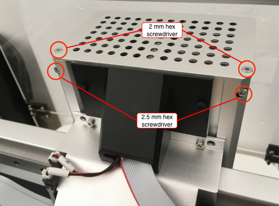
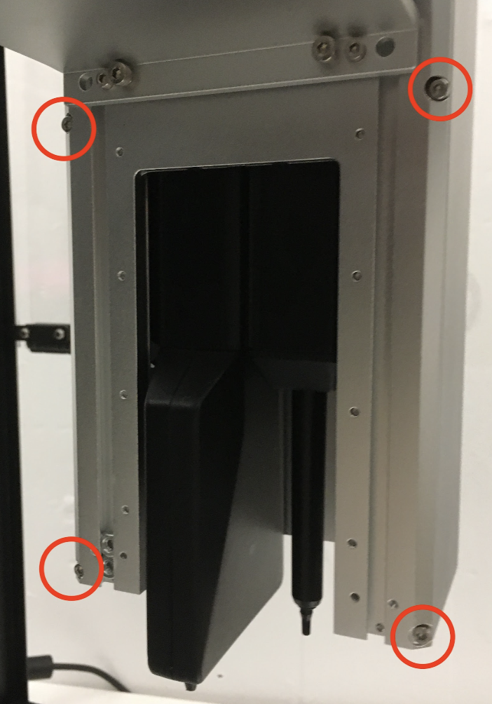
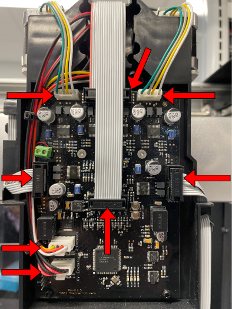
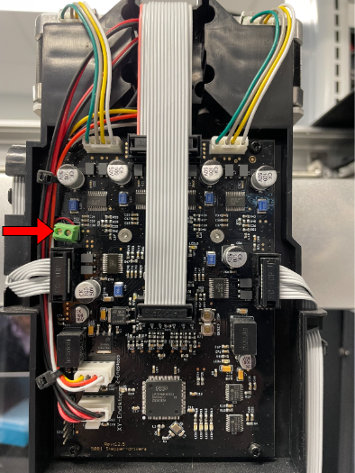
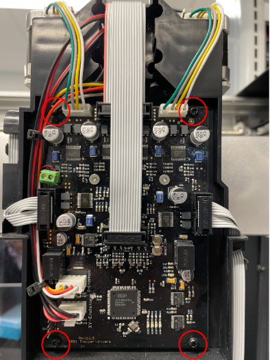
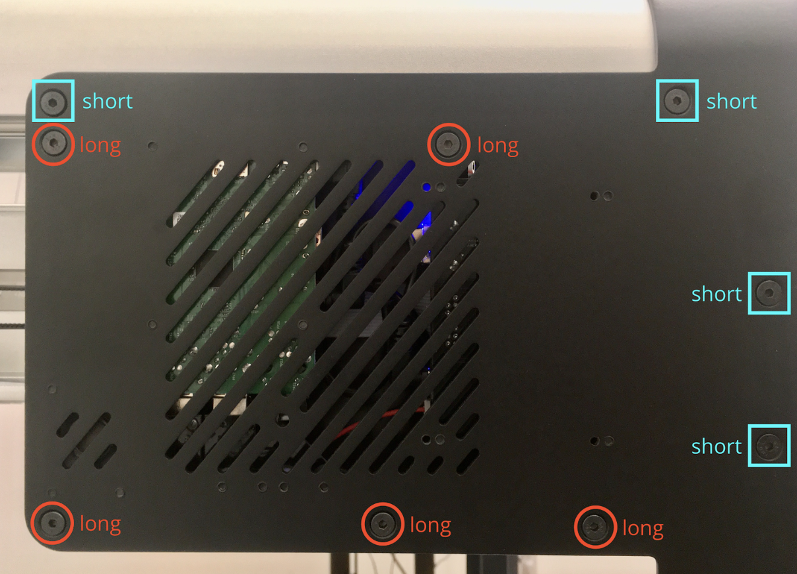
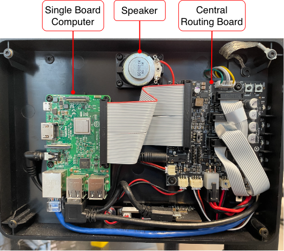

The OT-2 is designed for years of reliable, full-time operation. Unlike the cleaning procedures described in this section of the manual, you should not attempt to service or repair the OT-2 yourself. But, sometimes it may be necessary, and faster, to perform some maintenance tasks or replace malfunctioning components yourself. The instructions in this section will guide you through these tasks.

!!!warning
    - Do not attempt these troubleshooting or repair procedures unless directed by Opentrons Support.
    - Before you begin, turn off the power to the robot and unplug it from the wall outlet.

## Replacing the motor controller board

This printed circuit board assembly (PCBA) contains the electronics controlling the motors responsible for moving the pipettes. It is attached to the pipette carriage LINK REMINDER TO SYS DESC beneath the carriage cover. The information in this section section explains how to:

- Remove and replace the pipette carriage cover.
- Disconnect, remove, and replace the motor controller board.

This procedure requires the following tools:

- 2 mm hex screwdriver
- 2.5 mm hex screwdriver
- T10 Torx screwdriver

### Removing the cover

1. Remove the top, front, and side window panels for better access to the gantry and pipette carriage.

2. Use a 2 mm hex screwdriver to remove the 2 screws from the perforated cover on the top of the carriage cover and a 2.5 mm hex screwdriver to remove the 2 screws from the back of the carriage.

    

2. Use a 2.5 mm hex screwdriver to remove the remaining 4 screws from the back of the cover.

    

3. Slide the carriage cover down and then pull it off to expose the motor controller board.

### Removing the controller board

4. Disconnect the cables shown below from the controller board.

    

5. Find this green connector and use a small flathead screwdriver to loosen the screws that hold the 2 wires in place.

    

6. Use a 2.5 mm hex screwdriver to remove the screws that hold the PCBA to the carriage and remove the board.

    

### Installing a new controller board

7. Hold the new board in place.

8. Use a 2.5 mm hex screwdriver to reattach the board with the screws you removed while taking it off the robot.

9. Reconnect all the cables.

10. Reattach the carriage cover.

After installing a new board, follow up with Opentrons Support for further troubleshooting steps or instructions.

## Replacing the rear panel boards

The two PCBAs mounted inside the back panel of the OT-2 provide other command, control, network, and power distribution functions. Again, you should never have to remove this panel or work with the rear electronics unless directed to by Opentrons Support. The information in this section explains how to:

- Remove the back panel cover and identifies the main components in this area.
- Disconnect, remove, and replace the PCBAs housed in this location.

This procedure requires the following tools:

- 2.5 mm hex screwdriver

### Removing the rear panel cover and boards

1. Use a T10 Torx to remove the short and long screws that fasten the back panel to the robot. 

    

2. Disconnect any cables connected to the board you're working with.

    

3. Use a T10 Torx, to remove the screws that hold the PCBAs to the robot and remove the board you want to work with or replace.

4. Hold the new board in place.

5. Use a 2.5 mm hex screwdriver to reattach the board with the screws you removed while taking it off the robot.

6. Reattach all the cables

6. Use a 2.5 mm hex screwdriver to reattach the rear panel cover to the robot.

After installing a new board, follow up with Opentrons Support for further troubleshooting steps or instructions.