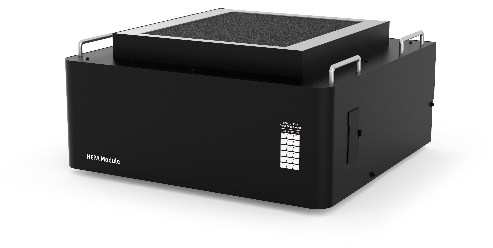

## HEPA Module features

The [Opentrons HEPA Module](https://opentrons.com/products/hepa-module?sku=999-00137) is a positive pressure clean air system for use with the OT-2 liquid handling robot. The HEPA Module introduces a steady stream of filtered air into the OT-2 enclosure, displacing contaminants and providing a positive pressure air boundary to prevent introduction of airborne contaminants.

!!! note
    The OT-2 HEPA module is not compatible with Opentrons Flex. The [Flex HEPA/UV module](../../hepa-uv/index.md) is not compatible with the OT-2.

## Intended use

The HEPA (high-efficiency particulate air) Module is optional equipment with the Opentrons OT-2. It is designed to clean the air of the OT-2 workspace using a HEPA filter to reduce the amount of particles in the workspace. The filter fan continuously moves air through the workspace and vents through the sides of the OT-2 to maintain a clean workspace.

!!! warning
    The HEPA Module is not a biosafety cabinet. Do not use it with pathogens, volatile chemicals, or potentially hazardous aerosols.

## HEPA module specifications

<table>
  <thead>
    <tr>
      <th>Specification</th>
      <th>Details</th>
    </tr>
  </thead>
  <tbody>
    <tr>
      <td>Input power</td>
      <td>
        <ul>
          <li>100-130 VAC, 50/60 Hz (145 W)</li>
          <li>220-240 VAC, 50/60 Hz (145 W)</li>
        </ul>
      </td>
    </tr>
    <tr>
      <td>AC mains fluctuations</td>
      <td>±10% of input voltage</td>
    </tr>
    <tr>
      <td>Dimensions</td>
      <td>625 mm x 599 mm x 303 mm</td>
    </tr>
    <tr>
      <td>Weight</td>
      <td>27 kg (60 lbs)</td>
    </tr>
    <tr>
      <td>Air flow</td>
      <td>Vertical downflow, 0.5 m/s–1.0 m/s</td>
    </tr>
    <tr>
      <td>HEPA filter grade/ efficiency</td>
      <td>
        <ul>
          <li>H14 filter</li>
          <li>99.99% efficiency for 0.3 µm particles</li>
        </ul>
      </td>
    </tr>
    <tr>
      <td>Controls</td>
      <td>
        <ul>
          <li>On/off</li>
          <li>Fan speed</li>
        </ul>
      </td>
    </tr>
    <tr>
      <td>Fan lifetime</td>
      <td>3 years of moderate use</td>
    </tr>
    <tr>
      <td>Filter lifetime</td>
      <td>1 year of moderate use (8 hours/day, 5 days/week)</td>
    </tr>
  </tbody>
</table>