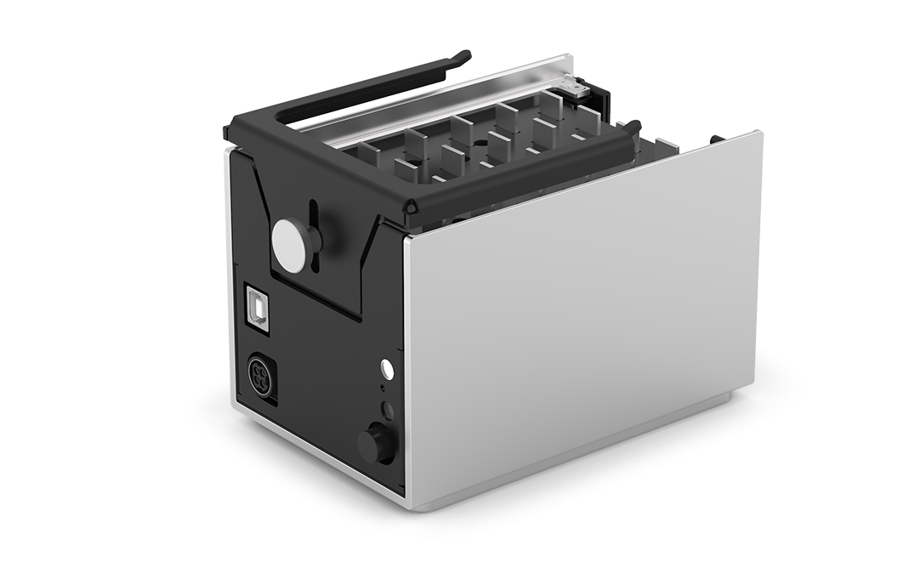

## Magnetic Module features

The Opentrons Magnetic Module automatically moves high-strength, N52 neodymium magnetic bars to and from seated well plates for magnetic bead-based purification protocols using 96-well plates. It comes with two separate adjustable plate brackets for supporting standard and deep well labware. The magnetic plate supports many different magnetic bead products for extraction and purification of nucleic acids in the labware.

!!! note
    - The Magnetic Module is not compatible with Opentrons Flex. Flex relies on the [Magnetic Block](https://opentrons.com/products/opentrons-flex-magnetic-block-gen1) for bead-based purification protocols.
    - The Magnetic Module and adapter magnets have been discontinued and are no longer available.

### Adapter magnets

The Magnetic Module ships with Adapter Magnets that provide extra magnetic strength for applications that require it. Opentrons recommends using the Adapter Magnets if you are experiencing bead loss after 10 minutes with the Magnetic Module engaged. To use the Adapter Magnets, snap them into place on both sides of the permanent magnets.

## Magnetic Module specifications

<table>
  <thead>
    <tr>
      <th>Specification</th>
      <th>Details</th>
    </tr>
  </thead>
  <tbody>
    <tr>
      <td>Dimensions</td>
      <td>133 mm x 98 mm x 98 mm (L/W/H)</td>
    </tr>
    <tr>
      <td>Weight</td>
      <td>1.5 kg (3.3 lbs)</td>
    </tr>
    <tr>
      <td>Module power input</td>
      <td>36 VDC, 6.1 A (220 W max)</td>
    </tr>
    <tr>
      <td>Power adapter input</td>
      <td>100–240 VAC, 50/60 Hz</td>
    </tr>
  </tbody>
</table>