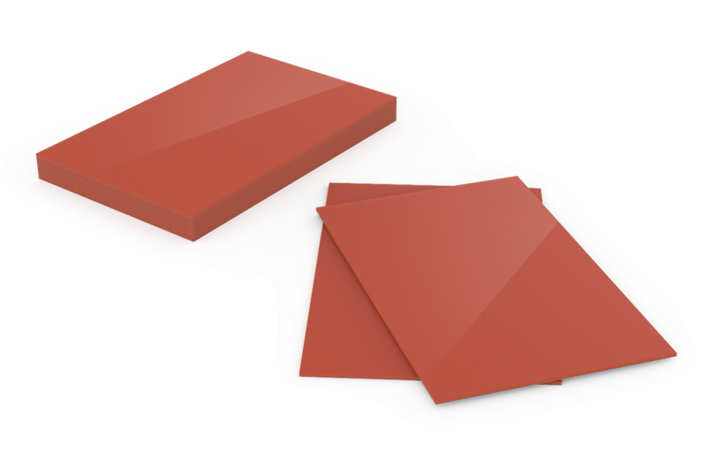

## Thermocycler features

The [Opentrons Thermocycler Module](https://opentrons.com/products/thermocycler-module-1?sku=991-00114) is a fully automated on-deck thermocycler designed for hands-free PCR in a 96-well plate format. It is compatible with other deck-mounted hardware, and is fully supported in the Opentrons OT-2 App and Python API. When used with a reusable rubber seal or single-use PCR plate lid, the module's heated lid provides a tight seal that helps ensure efficient sample heating and minimizes evaporation, crucial for reliable and repeatable experimental results.

!!! info "Additional Documentation"
    For complete instructions on module installation and use, see the [Thermocycler Module Instruction Manual](../../thermocycler/index.md).

### Heating and cooling

The Thermocycler's block can heat and cool, and its lid can heat, with the following temperature profile:

- Thermal block temperature range: 4–99 °C

- Thermal block maximum heating ramp rate: 4.25 °C/s from ambient to 95 °C

- Thermal block maximum cooling ramp rate: 2.0 °C/s from 95 °C to ambient

- Lid temperature range: 37–110 °C

- Lid temperature accuracy: ±1 °C

The automated lid can be opened or closed as needed during protocol execution.

### Thermocycler profiles { #thermocycler-profiles-ot2 }

The Thermocycler can execute *profiles*: automatically cycling through a sequence of block temperatures to perform heat-sensitive reactions.

### Software control

The Thermocycler is fully programmable in [Protocol Designer](../../protocol-designer/index.md) and the [Python Protocol API](../../python-api/index.md).

Outside of protocols, the Opentrons OT-2 App can display the current status of the Thermocycler and can directly control the block temperature, lid temperature, and lid position.

## Thermocycler lid seals

The Thermocycler is compatible with the reuseable [Opentrons rubber automation seals](https://opentrons.com/products/gen2-thermocycler-seals).

These are adhesive-backed ethylene propylene diene monomer (EPDM) seals you manually apply to the Thermocycler lid. Each seal can be reused up to 20 times.

{width="80%"}

## Thermocycler specifications

| Specification | Details |
| :--- | :--- |
| **Dimensions (lid open)** | 244.95 × 172 × 310.1 mm (L/W/H) |
| **Dimensions (lid closed)** | 244.95 × 172 × 170.35 mm (L/W/H) |
| **Weight (including rear duct)** | 8.4 kg |
| **Power adapter input** | 100–240 VAC, 50/60 Hz, 8.5–5 A |
| **Overvoltage** | Category II |
| **Environmental conditions** | Indoor use only |
| **Ambient temperature** | 20–25 °C (ideal); 2–40 °C (acceptable) |
| **Relative humidity** | 30–80%, non-condensing |
| **Altitude** | Up to 2000 m above sea level |
| **Ventilation requirements** | At least 20 cm / 8 in between the unit and a wall |