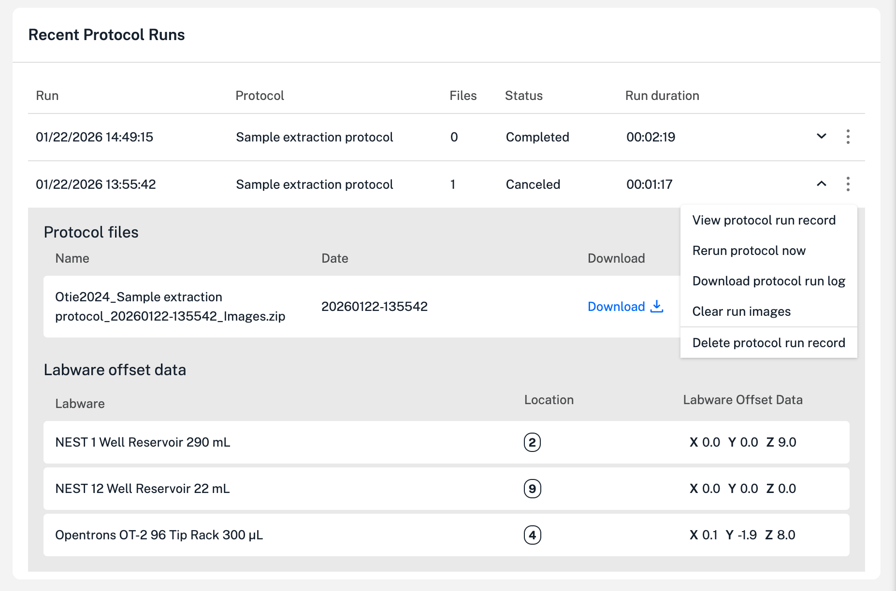

This section provides an overview of the Devices tab in the [Opentrons App](https://opentrons.com/ot-app).

## Devices tab summary

The Devices tab lists all the Opentrons OT-2 and Flex robots on a network. The list displays robots alphabetically by name. Each device summary also shows you how a robot is connected to a network (eithernet, USB, or WiFi), what hardware components are attached, if a software update is available, and other information. You can use this section for an at-a-glance overview of the state of your OT-2 and other networked robots.

<figure class="screenshot" markdown>
{ width="80%" }
</figure>

!!! tip
    If you're using a WiFi connection and the OT-2 you want to use is unavailable, check your WiFi settings. Your OT-2 may be on a different wireless network.

## Device details

You can click on any robot summary tile to expand it for more information about a particular robot. In each section, three-dot (⋮) menus provide context-specific controls for the robot, any attached instruments and modules.

<figure class="screenshot" markdown>

</figure>

### Controlling modules

### Protocol run records

The device details also includes a list of up to 20 protocol run records. These protocol records provide information like run status, duration, labware data, and a download link for images captured during a run.

<figure class="screenshot" markdown>
{ width="80%" }
</figure>

Additionally, another three-dot (⋮) menu protocol-related controls for managing an individual protocols. These options let you view a run record, re-run a protocol, download run logs, clear images captured by the built-in camera, and delete protocols records.

## Robot settings

### Calibration

### Networking

### Camera

### Advanced