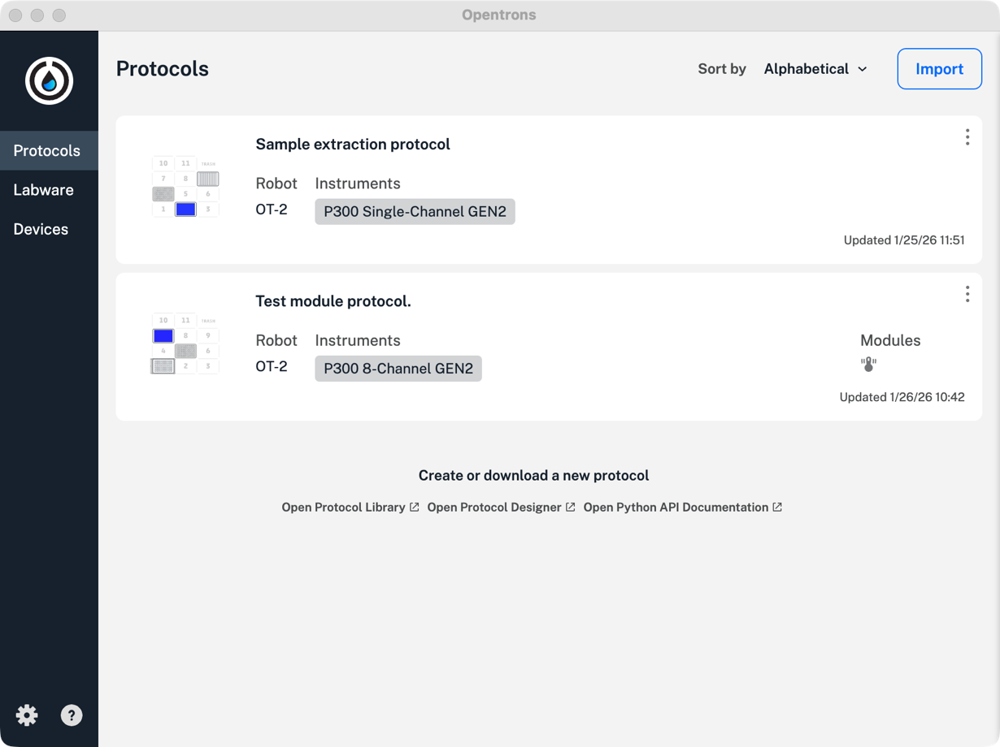
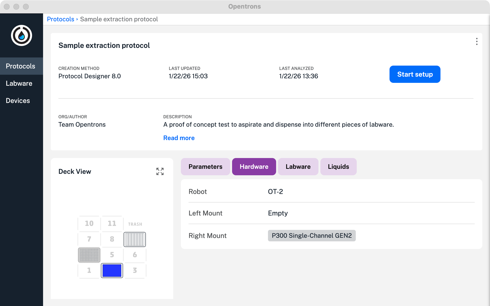
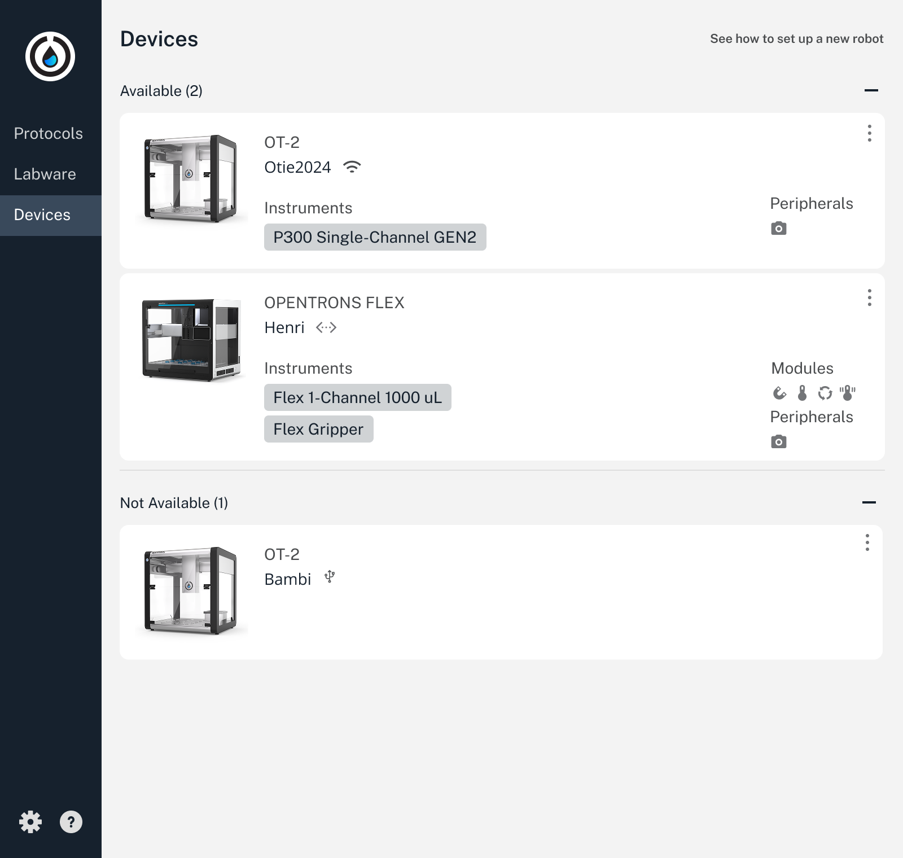
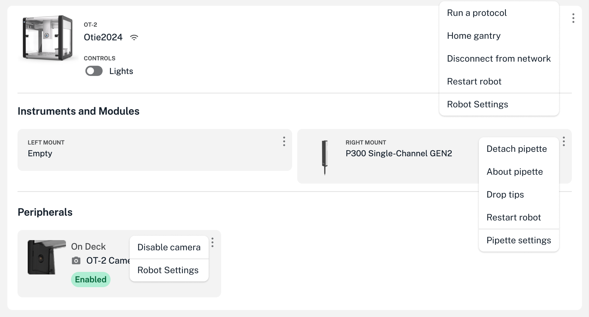
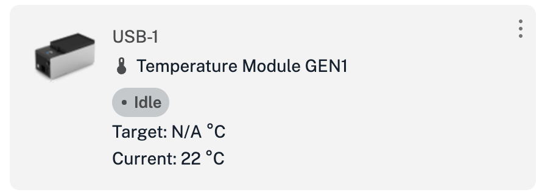
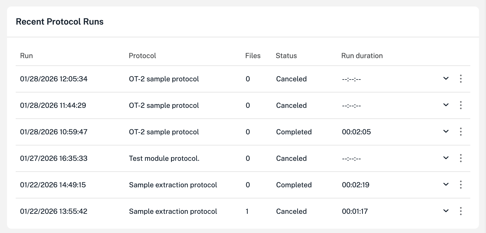

You control the OT-2 using the Opentrons OT-2 App on your computer. This section highlights key features found in the Protocols, Labware, and Devices tabs of the app.

## Protocols tab

The Protocols tab is selected by default when you first launch the app. It includes controls that let you import protocol files and manage saved files.

### Protocols summary

The basic protocol screen displays a summary list of all the protocols stored on your computer.

<figure class="screenshot" markdown>

</figure>

Other screen elements and actions let you sort protocols, assign a protocol to a robot, and expand the protocol summary to see more information about each protocol.

<table>
  <thead>
    <tr>
      <th>Feature</th>
      <th>Description</th>
    </tr>
  </thead>
  <tbody>
    <tr>
      <td>Sort by</td>
      <td>Opens a menu that sorts protocol files. Options include:
        <ul>
            <li>Alphabetical</li>
            <li>Reverse alphabetical</li>
            <li>Most recent updates</li>
            <li>Oldest updates</li>
            <li>Flex protocols first</li>
            <li>OT-2 protocols first</li>
        </ul>
      </td>
    </tr>
    <tr>
      <td>Import button</td>
      <td>Opens a file picker that lets you browse to and upload other saved protocols.</td>
    </tr>
    <tr>
        <td>Three-dot (⋮) menu</td>
        <td>Opens a menu that includes these options:
            <ul>
                <li>Start setup: choose a networked Opentrons robot to run a protocol.</li>
                <li>Reanalyze: runs protocol analysis on a saved or revised protocol.</li>
                <li>Show in folder: opens the file location for stored protocols.</li>
                <li>Delete: deletes a protocol. Tip: Use the "Show in folder" option to delete protocols in bulk.</li>
            </ul>
        </td>
    </tr>
    <tr>
        <td>Create or download a new protocol</td>
        <td>Links to the <a href="https://library.opentrons.com/">Protocol Library</a>, <a href="https://designer.opentrons.com/">Protocol Designer</a>, and the <a href="../../../python-api/">Python API</a>.</td>
    </tr>
  </tbody>
</table>

### Protocol details

You can click on any listed protocol summary to see more information about the protocol.

<figure class="screenshot" markdown>
{ #width="80%" }
</figure>

Click the **Protocols** tab to return to the summary view.

## Labware tab

This tab stores information about labware found in the Labware Library. You can also upload custom labware you create and store it in the app here.

## Devices tab

The Devices tab lists all the discoverable Opentrons robots on a network. This means it will show you OT-2 _and_ Flex robots, if you have different models in your lab. The app lists robots alphabetically by name.

<figure class="screenshot" markdown>

</figure>

Each summary tile provides robot information as shown in the following table.

<table>
  <thead>
    <tr>
      <th>Category</th>
      <th>Description</th>
    </tr>
  </thead>
  <tbody>
    <tr>
      <td><strong>Connectivity</strong></td>
      <td>
        Icons indicate the network connection type used by your OT-2. These are:
        <ul>
          <li>Ethernet </li>
          <li>Wi-Fi </li>
          <li>USB </li>
        </ul>
      </td>
    </tr>
    <tr>
      <td><strong>Instruments</strong></td>
      <td>
        Gray labels show the type of pipette attached to the gantry.
      </td>
    </tr>
    <tr>
      <td><strong>Modules</strong></td>
      <td>
        Icons indicate which powered modules are attached to your OT-2. These include:
        <ul>
          <li>Temperature Module </li>
          <li>Magnetic Module </li>
          <li>Heater-Shaker </li>
          <li>Thermocycler </li>
        </ul>
      </td>
    </tr>
    <tr>
      <td><strong>Peripherals</strong></td>
      <td>
        Other attached and powered components (e.g., built-in camera ).
      </td>
    </tr>
  </tbody>
</table>

!!! tip
    If you're using a Wi-Fi connection and the OT-2 you want to use is unavailable, check your Wi-Fi settings. Your OT-2 may be on a different wireless network.

### Robot details

You can click on any robot summary to see more information about a particular robot. In each section, three-dot (⋮) menus provide context-specific controls for the robot, any attached instruments and modules.

<figure class="screenshot" markdown>

<figcaption>Context menus shown for reference. Only one can be active at a time.</figcaption>
</figure>

### Module status and controls

Use the Opentrons OT-2 App to view the status of modules connected to your OT-2 and control them outside of protocols. Click **Devices** and then click on your OT-2 to view its robot details page. Under Instruments and Modules, there is a card for each attached module. The card shows the type of module, what USB port it is connected to, and its current status.

<figure class="screenshot" markdown>

<figcaption>Module card for the Temperature Module.</figcaption>
</figure>

Click the three-dot menu (⋮) on the module card to choose from a menu of commands. You can always choose **About module** to see the module's firmware version and serial number. (This information is very useful when contacting Opentrons Support!) The other commands depend on the type of module and its current status:

<table>
  <thead>
    <tr>
      <th>Module type</th>
      <th>Commands</th>
    </tr>
  </thead>
  <tbody>
    <tr>
      <td><strong>Heater-Shaker</strong></td>
      <td>
        <ul>
          <li>Set module temperature / Deactivate heater</li>
          <li>Open labware latch / Close labware latch</li>
          <li>Test shake / Deactivate shaker</li>
        </ul>
      </td>
    </tr>
    <tr>
      <td><strong>Magnetic Module</strong></td>
      <td>
        <ul>
          <li>Set engage height/Disengage module</li>
        </ul>
      </td>
    </tr>
     <tr>
      <td><strong>Temperature Module</strong></td>
      <td>
        <ul>
          <li>Set module temperature / Deactivate module</li>
        </ul>
      </td>
    </tr>
    <tr>
      <td><strong>Thermocycler</strong></td>
      <td>
        <ul>
          <li>Set lid temperature / Deactivate lid</li>
          <li>Open lid / Close lid</li>
          <li>Set block temperature / Deactivate block</li>
        </ul>
      </td>
    </tr>
  </tbody>
</table>

### Built-in camera

Every OT-2 comes equipped with a built-in 2-megapixel camera that can capture full HD still images of the deck and working area. When enabled, the camera can take pictures when running a protocol :

- Created using the Python API and includes the [`capture_image`](https://docs.opentrons.com/python-api/reference/protocols/#opentrons.protocol_api.ProtocolContext.capture_image) method.

- Created with Protocol Designer.

- When the OT-2 encounters an error.

Due to limits on processing power and memory, the OT-2 cannot live-stream a protocol run.

### Recent protocol runs

The robot details page also keeps records of recent protocol runs.

<figure class="screenshot" markdown>

</figure>

Each entry in the recent protocol runs list includes the protocol name, its timestamp, whether the run was canceled or completed, and the duration of the run. Click the disclosure triangle next to any run to show its associated labware offset data. Click the three-dot menu (⋮) for related actions:

- **View protocol run record**: Show the protocol run screen as it appeared when the protocol ended (succeeded, failed, or was canceled), including all performed steps.

- **Rerun protocol now**: The same as choosing **Start setup** on the corresponding protocol.

- **Download run log**: Save to your computer a JSON file containing information about the protocol run, including all performed steps.

- **Delete protocol run record**: Delete all information about this protocol run from the robot, including labware offset data. When you choose this option, it's as though the protocol run never happened.

!!! note
    If you need to maintain a comprehensive record of all runs performed on your robot, you must use the **Download run log** feature to save this information to your computer.

- **Download image files**: Save to your computer a `.zip` file containing all the images taken during a protocol run, if the camera was enabled.
