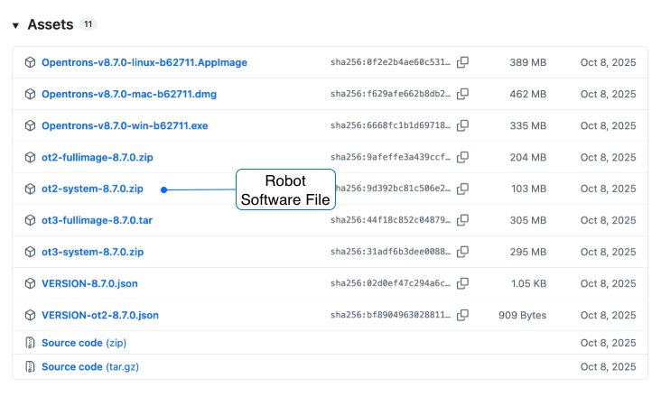
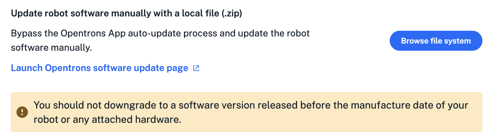
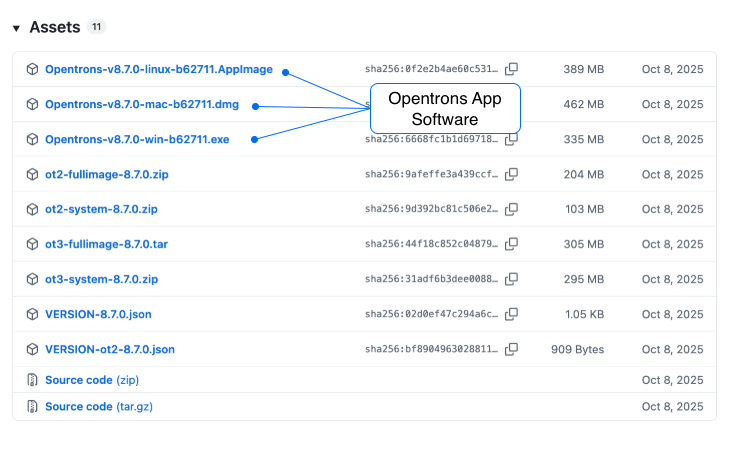

Start here for information and instructions about how to downgrade your Opentrons OT-2 robot and Opentrons App software.

!!! note
    Downgrading robot software should only be done at direction of Opentrons Support for troubleshooting or software compliance purposes.

## Software versions

After v9.0, Opentrons created separate software versions for OT-2 and Flex. This change helps reduce downtime by eliminating shared updates that do not benefit your robot, while transitioning OT-2 software versioning to v26.06.

For downgrading, these separate OT-2 software versions are available on GitHub:

- **v26.06 (and later):** [Opentrons OT-2 releases](https://github.com/Opentrons/opentrons-ot2/releases)
- **v9.0 (and earlier):** [Opentrons releases](https://github.com/Opentrons/opentrons/releases)

## Downgrade paths and saved protocols

Splitting the OT-2 software into separate branches creates two downgrade paths. Whether you need to move your protocols manually depends on which version you are downgrading from and to.

| From version | To version | Move protocol file? |
|----|----|----|
| v26.06 or later | v9.0 or earlier | Yes. You will need to manually move your protocols to use them in the downgraded app. |
| v9.0 | Any earlier version | No. App version 9.0 (and earlier) uses the same file structure. |

The table below shows the default directory paths where the app saves your protocols. You can use these locations to manually copy and paste your files when moving from 26.06 to an earlier version like 9.0. 

<table>
  <thead>
    <tr>
      <th>OS</th>
      <th>v26.06 (or later)</th>
      <th>v9.0 (or earlier)</th>
    </tr>
  </thead>
  <tbody>
    <tr>
      <td>macOS</td>
      <td><code>~/Library/Application Support/Opentrons OT-2/protocols</code></td>
      <td><code>~/Library/Application Support/Opentrons/protocols</code></td>
    </tr>
    <tr>
      <td>Windows</td>
      <td><code>%AppData%\Opentrons OT-2\protocols</code></td>
      <td><code>%AppData%\Opentrons\protocols</code></td>
    </tr>
    <tr>
      <td>Ubuntu</td>
      <td><code>~/.config/Opentrons OT-2/protocols</code></td>
      <td><code>~/.config/Opentrons/protocols</code></td>
    </tr>
  </tbody>
</table>

## Robot downgrade instructions

!!! tip
    - Make sure your OT-2 is idle before downgrading. Some required app features are not available while the robot is running a a protocol.
    - We recommend rolling back to the version closest to latest release.

### Download robot software

1. Find the OT-2 software version you need on GitHUb:
    - v26.06 or later: [Opentrons OT-2 releases](https://github.com/Opentrons/opentrons-ot2/releases)
    - v9.0 or earlier: [Opentrons releases](https://github.com/Opentrons/opentrons/releases)

2. In the **Assets** section of a release, click the triangle (&rtrif;) to expand the software file list.

    <figure class="screenshot" markdown>
    
    </figure>

3. Click the compressed file named `ot2-system-<version number>.zip` to download it. For example, to get OT-2 software version 8.7, click `ot2-system-8.7.0.zip`.

### Install robot software

1.  From the **Devices** tab in the Opentrons App, select the robot you want to work with.

2. Click the three-dot menu (⋮) and then click **Robot Settings**.

3. Click the **Advanced** tab.

4. Find the section labeled "Update robot software manually with a local file."

    <figure class="screenshot" markdown>
    
    </figure>

5. Click **Browse file system** and navigate to saved robot software.

6. Select the downloaded `.zip` file and click **Open**. The software installs automatically and reboots the robot (approx. 15 minutes). After restarting, your OT-2 will be running earlier operating system version.

## App version requirements

To run protocols on a downgraded OT-2, the Opentrons App version must match the robot's software version. While you can interact with an OT-2 using mismatched software, protocol execution requires identical app and robot software versions.

### App download and installation

To install an earlier version of the Opentrons App:

1. Find the OT-2 software version you need on GitHub:
    - v26.06 or later: [Opentrons OT-2 releases](https://github.com/Opentrons/opentrons-ot2/releases)
    - v9.0 or earlier: [Opentrons releases](https://github.com/Opentrons/opentrons/releases)

2. In the **Assets** section of a release, click the triangle (&rtrif;) to expand the software file list.

    <figure class="screenshot" markdown>
    
    </figure>

3. Find the file with the name and extension that matches your computer's operating system and click it to download. Opentrons supports these operating systems and file types:
    - **Linux:** `.AppImage`
    - **macOS:** `.dmg`
    - **Windows:** `.exe`

3. Navigate to the saved file location and double-click the file to install it.

### Managing multiple App versions

Installing multiple Opentrons App versions may cause system conflicts, particularly on Windows.

- **macOS and Linux:** These systems use software encapsulation. You can typically run different versions by renaming the installed application.
- **Windows:** The software integrates deeply with the operating system. Trying to install and run multiple app versions may cause conflicts with shared Windows files.

To avoid version conflicts:

- Uninstall your current Opentrons App before installing a downgraded version.
- Consult your IT team or Opentrons Support if you need to run multiple versions of the Opentrons App.
- Do not attempt to downgrade robot or app software unless directed by Opentrons Support.
