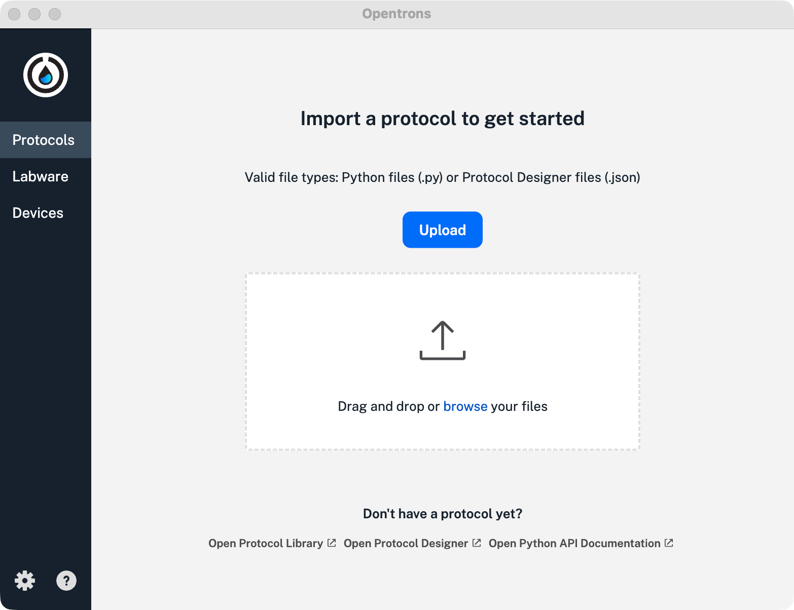
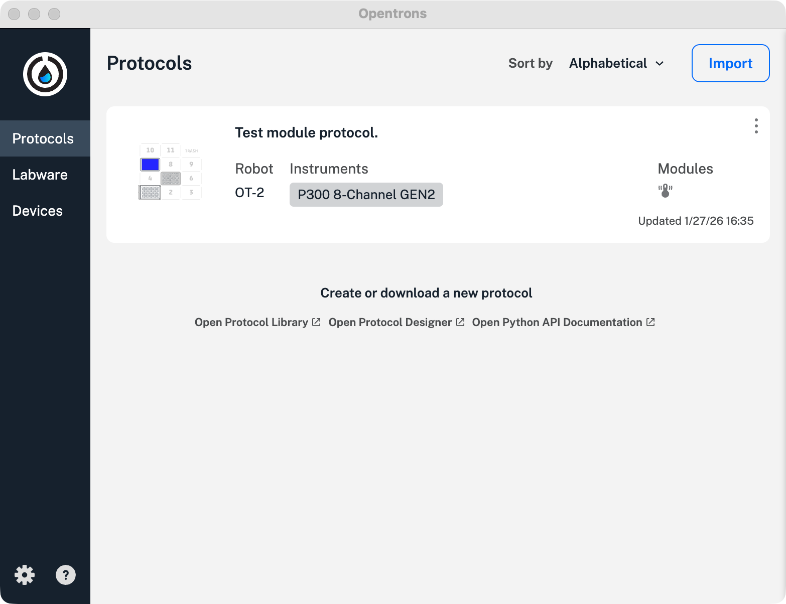

Regardless of how you create them, every protocol begins as a file on your computer. You must import the protocol into the Opentrons OT-2 App to transfer it to your OT-2.

## The Protocols tab

By default, the Opentrons OT-2 App opens to the **Protocols** tab. If you have a new robot and are opening the app for the first time, the app displays the protocol upload screen. If you have already imported protocols, the app displays a summary list.

<figure class="side-by-side screenshot" markdown>

<figcaption>The Protocols tab, before and after importing a protocol.</figcaption>
</figure>

Use the [Opentrons Protocol Designer](https://designer.opentrons.com/) to create a protocol. See the [Protocol Designer Instruction Manual](https://docs.opentrons.com/protocol-designer/) to get started or for more information.

## Uploading a new protocol

If there are no protocols saved in the app, you can: 

- Click **Upload** and browse your computer to find the protocol file.
- Drag and drop a protocol file onto the app window.

## Importing additional protocols

To add another protocol to your existing list, click **Import** in the top right corner of the app. This opens a sidebar that lets you drag and drop or browse your computer to upload a protocol.

## Protocol analysis

The Opentrons OT-2 App analyzes your protocol immediately upon import. _Protocol analysis_ transforms a protocol file (JSON or Python) into a series of robot commands.

The app displays a warning if it detects errors in your protocol file. Correct the errors and re-import the protocol. If the analysis completes without errors, the protocol is ready to run on your OT-2.

## Additional features

See the [Features Summary](./features-summary.md) for more information about other protocol controls and settings in the Opentrons OT-2 App.