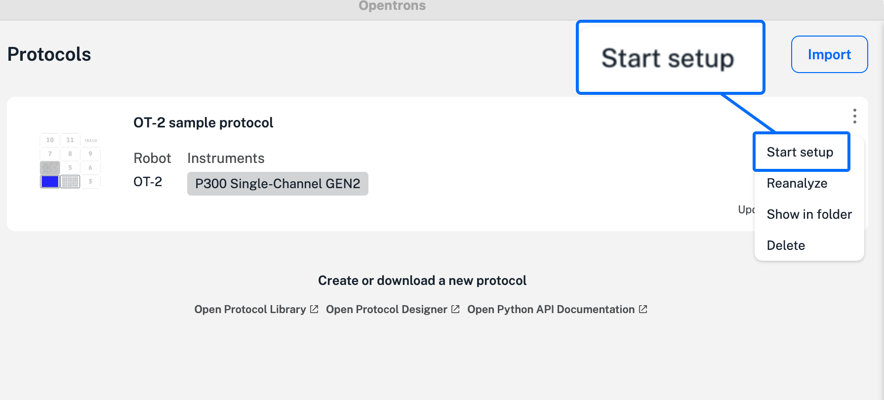
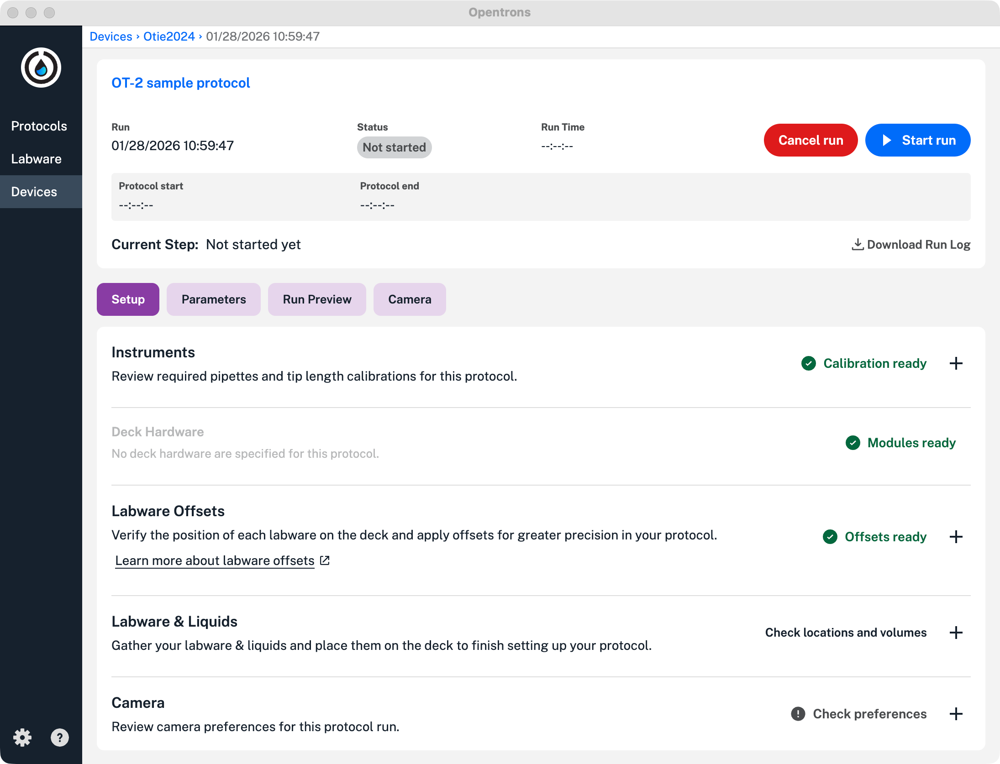
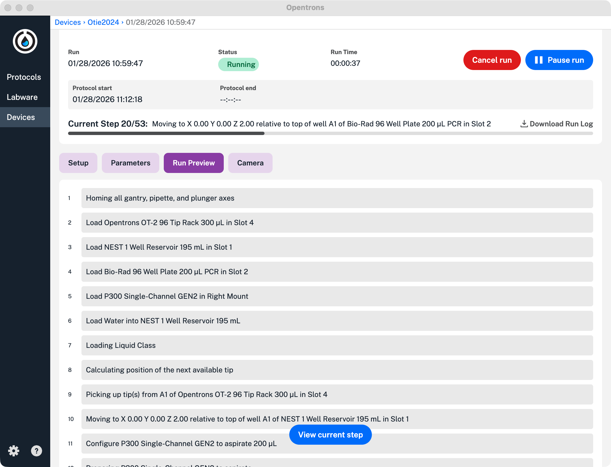
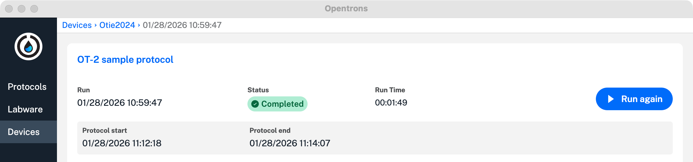

After creating and uploading a protocol, it's time to run it on your OT-2. Follow these instructions to get started.

1. Launch the Opentrons OT-2 App.
2. From the Protocols tab, find the protocol you want to run.
3. Click the three-dot (⋮) menu for that protocol and click **Start setup**.

    <figure class="screenshot" markdown>
    
    </figure>

4. The app will show you a list of available robots. Select the OT-2 that you want to use and click **Proceed to setup**.
5. Review all the instruments and settings used by your protocol. For example, you can calibrate instruments, perform Labware Position Check, turn the camera on or off, and examine your protocol step by step.

    <figure class="screenshot" markdown>
    
    </figure>

6. Click **Start run**. The OT-2 changes its status to "Running" and the app opens the **Run Preview** tab. This feature shows each step in your protocol and which step the robot is currently executing. You can also cancel or pause a protocol during a run.

    <figure class="screenshot" markdown>
    
    </figure>

If the protocol finishes without errors, the app displays the Run Complete screen. You can also run the protocol again, if required.

<figure class="screenshot" markdown>

</figure>

If there are errors during a run, the app will pause the protocol and give you an opportunity to fix the problem or cancel the protocol.